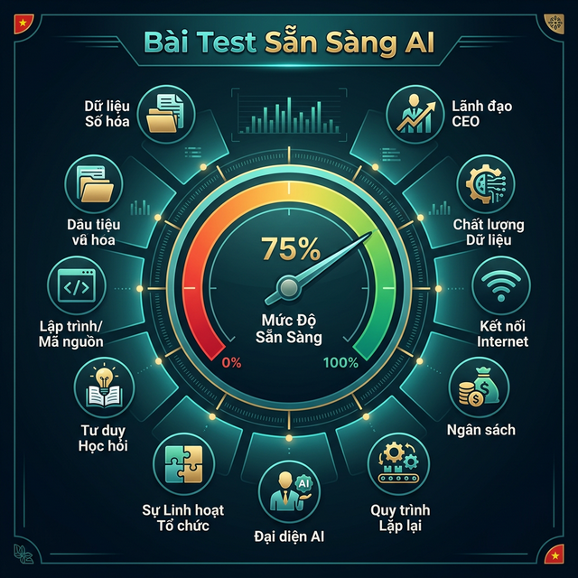
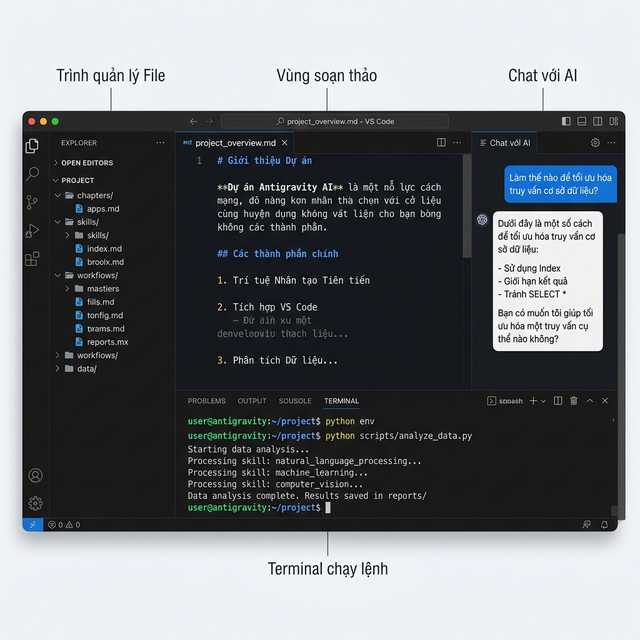
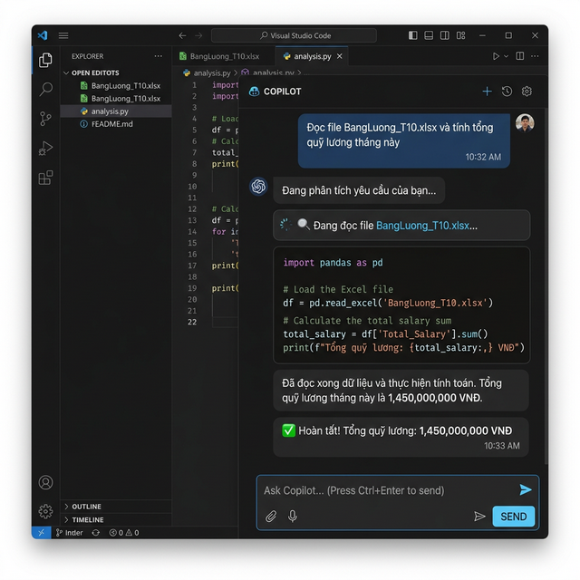
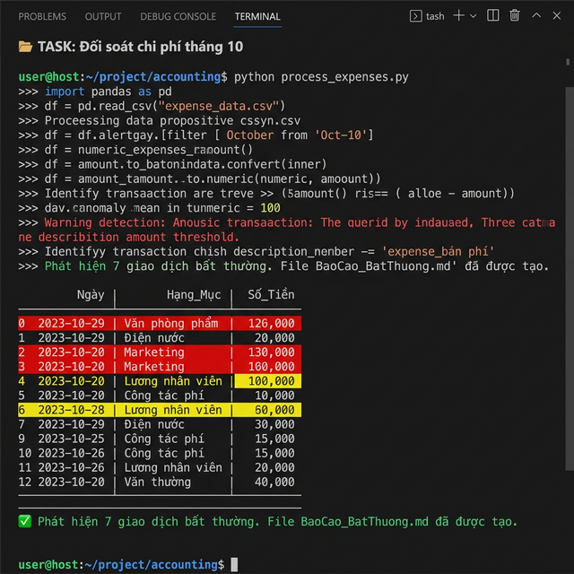
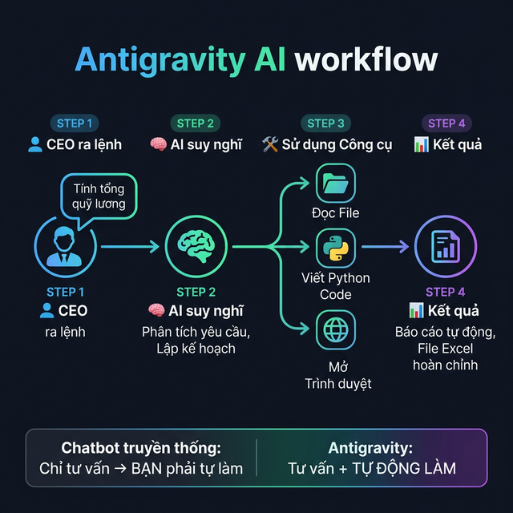

# Chương 0: Giải Mã "Antigravity" — Cú Nhảy Vọt Từ "Cố Vấn Máy" Sang "Nhân Sự Tự Trị"

*(Dành cho những Nhà kiến tạo Doanh nghiệp SME)*

---

## 1. Lời Mở Đầu: Đừng Bị Mê Hoặc Bởi Những Chatbot "Không Chân Không Tay"

### 📖 Câu Chuyện Đau Đớn: Giấc Mộng Chuyển Đổi Số Của Anh Hoàng

Anh Hoàng là Giám đốc điều hành (CEO) của một công ty sản xuất và phân phối nội thất gỗ tại Bình Dương, quy mô 85 nhân sự. Đầu năm 2024, cơn sốt Trí tuệ Nhân tạo (AI) quét qua Việt Nam. Anh Hoàng, người luôn tâm niệm *"Cải tiến lên hay là chết"*, đã mua hàng chục tài khoản ChatGPT Plus và Gemini Advanced cho đội ngũ quản lý.

Tháng đầu tiên, không khí công ty hừng hực. Trưởng phòng Marketing nhập một câu lệnh: *"Viết cho tôi 10 bài đăng Facebook bán ghế sofa"*. Chatbot tuôn ra những dòng văn hoa mỹ. Kế toán trưởng hỏi: *"Giải thích luật Thuế TNDN mới"*. Chatbot phân tích gãy gọn. Ai cũng vỗ tay. Anh Hoàng cười mãn nguyện, tin rằng năng suất công ty sắp nhân đôi, thưởng Tết năm nay sẽ rất ấm.

Nhưng 3 tháng sau, trong phòng họp giao ban:

- Trưởng phòng Kinh doanh than phiền: *"Các em đăng bài Facebook bằng AI rất nhanh, nhưng không chốt được sale vì không có thời gian nhắn tin lại cho 200 inbox mỗi ngày"*.
- Kế toán trưởng nhăn nhó: *"Cuối tháng bên em vẫn phải thức đến 2h sáng để copy từng số liệu hóa đơn đỏ, đối chiếu với 3.000 dòng file sao kê ngân hàng. AI không giúp đối soát được"*.
- Trợ lý Giám đốc báo cáo sai bét nhè số liệu vì phải ngồi thủ công chuyển đổi hàng chục file PDF thành Excel, và AI không giải quyết được việc đó.

Anh Hoàng nhận ra một sự thật nghiệt ngã: Lương nhân viên không giảm, chi phí vận hành tăng (tiền mua tài khoản AI), mà doanh thu giữ nguyên.

**Nghịch Lý Của Công Nghệ: Tại Sao Chatbot Lại Làm Chậm Doanh Nghiệp Của Bạn?**

Bởi vì những Chatbot ngoài kia chỉ đóng vai trò là những **"Vị Cố Vấn" (Generative AI - AI Tạo sinh)**. Chúng được sinh ra để đối thoại, không phải để làm việc.

> 📉 **Thống Kê Đau Lòng:** Theo khảo sát nội bộ, 80% nhân sự văn phòng sau khi dùng ChatGPT 1 tuần sẽ quay lại cách làm cũ. Lý do: Thời gian nghĩ cách hỏi Chatbot, cộng với thời gian copy-paste kết quả vào báo cáo, còn lâu hơn tự làm bằng tay.

Hãy tưởng tượng bạn thuê một Vị giáo sư siêu phàm của Đại học Harvard về công ty. Vị giáo sư này ngồi tĩnh tại trong một căn phòng kính (ô chat trên trình duyệt). Ông ấy cái gì cũng biết:

- Bạn hỏi chiến lược, ông ấy trả lời hay như hát.
- Bạn hỏi công thức Excel, ông ấy viết ra ngay lập tức.
- Bạn nhờ dịch tài liệu, ông ấy dịch chuẩn xác không sai một dấu phẩy.

**Nhưng có một VẤN ĐỀ CHÍ THỬ:** Vị giáo sư này **Không Có Tay, Không Có Chân**.

Ông ấy bị trói buộc sau cửa sổ trình duyệt Web. Ông ấy KHÔNG THỂ vươn tay ra mở file Excel nằm sâu trong ổ `D:/Tai_Chinh/Thang_10.xlsx` của bạn. Ông ấy KHÔNG THỂ tự mở trình duyệt, đăng nhập vào cổng thông tin Thuế, lấy dữ liệu rồi tự gửi email cho đối tác.

Kết quả là gì? Vị cố vấn nói bằng mồm, còn kẻ phải è lưng ra hiện thực hóa những lời đó bằng **sức lao động chân tay**:

- Copy kết quả từ Chatbot.
- Mở bảng Excel lên.
- Dán vào cột A.
- Quay lại Chatbot hỏi hàm tính toán.
- Copy hàm, dán vào cột B.

**Người làm những việc đó vẫn chính là bạn, hoặc nhân viên của bạn.** Bạn mua AI về với kỳ vọng giải phóng sức lao động, nhưng cuối cùng, nhân viên của bạn lại vô tình biến thành "Người hầu" phục vụ cho quá trình Copy-Paste của cái Chatbot đó. Một quy trình nghiệp vụ vốn đã cồng kềnh, nay lại đứt gãy thêm một chặng giao tiếp giữa Người và Máy.

---

## 🩺 Bài Test Sẵn Sàng AI: Công Ty Bạn Có Đủ "Sức Khỏe" Để Tiếp Nhận Antigravity Không?



*Trước khi lao vào 13 chương tiếp theo, hãy dành ĐÚNG 3 PHÚT làm bài tự chấm điểm này. Vòng tròn đáp án, cộng tổng điểm và đọc kết quả bên dưới. Nếu dưới 40 điểm — hãy dừng lại, chữa bệnh nền đã.*

| # | Câu hỏi tự đánh giá | Có (10đ) | Một phần (5đ) | Không (0đ) |
| :---: | :--- | :---: | :---: | :---: |
| 1 | Công ty bạn đã lưu **80% tài liệu** dưới dạng File Mềm (Excel, PDF, Google Sheets) thay vì Giấy tờ/Zalo? | ⬜ | ⬜ | ⬜ |
| 2 | Có ít nhất **1 người** trong công ty biết mở Terminal / Command Prompt trên máy tính? | ⬜ | ⬜ | ⬜ |
| 3 | Sếp Tổng (CEO) **cá nhân ủng hộ** và sẵn sàng tự tay dùng AI trước khi bắt nhân viên dùng? | ⬜ | ⬜ | ⬜ |
| 4 | Các file Excel bán hàng, kế toán có **Mã khách hàng thống nhất** (Unique ID) xuyên suốt giữa các phòng ban? | ⬜ | ⬜ | ⬜ |
| 5 | Công ty có **Internet ổn định** (>10 Mbps) cho máy tính nhân viên? | ⬜ | ⬜ | ⬜ |
| 6 | Sếp sẵn sàng chi **dưới 500,000 VNĐ/tháng** cho phí API Cloud (rẻ hơn 1 bữa nhậu) để chạy AI? | ⬜ | ⬜ | ⬜ |
| 7 | Công ty có Quy trình nào đang **lặp đi lặp lại hàng ngày** khiến nhân viên chán nản (nhập liệu, đối soát, lọc file)? | ⬜ | ⬜ | ⬜ |
| 8 | Sếp có thể **chỉ định 1 người** (IT hoặc Trưởng phòng trẻ) làm "Đại sứ AI" phụ trách triển khai? | ⬜ | ⬜ | ⬜ |
| 9 | Nhân viên của bạn **không bị cấm** dùng công cụ mới mà không cần xin phép 5 cấp quản lý? | ⬜ | ⬜ | ⬜ |
| 10 | Sếp chấp nhận rằng AI **sẽ sai** trong 2 tuần đầu, và xem đó là quá trình Dạy Lính chứ không phải thất bại? | ⬜ | ⬜ | ⬜ |

### Thang Điểm Chẩn Đoán

| Tổng Điểm | Trạng Thái | Kê Đơn |
| :---: | :--- | :--- |
| **80 - 100** | 🟢 **Sẵn sàng tuyệt đối.** | Lật Chương 1 ngay. 30 ngày nữa công ty bạn sẽ lột xác. |
| **50 - 75** | 🟡 **Cần vá vài lỗ thủng.** | Đọc Ebook nhưng tập trung Chương 13 (Lộ Trình) trước. Dành 1 tuần dọn Data rồi mới triển khai. |
| **25 - 45** | 🟠 **Bệnh nền nặng.** | Dừng lại. Số hóa tài liệu cơ bản, dọn Data Silos, thuyết phục Sếp Tổng ủng hộ. Quay lại sau 1 tháng. |
| **0 - 20** | 🔴 **Chưa sẵn sàng.** | AI không thể cứu một doanh nghiệp còn chạy bằng giấy tờ và Zalo. Hãy số hóa trước đã. |

*Lưu Bài Test này lại. Sau 30 ngày triển khai Antigravity, làm lại lần 2. Nếu điểm tăng >20 điểm, Sếp đi đúng hướng.*

---

## 2. Antigravity Là Gì? Kỷ Nguyên Của "Agentic AI" (Đại Lý Tự Trị)

Thứ mà giới Doanh nghiệp hiện đại (SME) cần không phải là một Vị Cố Vấn chỉ tay năm ngón. Thứ bạn đang khắc khoải đi tìm là **"Một Đội Quân Người Máy Chấp Hành"**.

Một nhân sự số không chỉ biết nói, mà còn biết **HÀNH ĐỘNG**. Một thực thể có khả năng tự bật ứng dụng lên, tự chui vào ổ cứng tìm file dữ liệu, dùng thuật toán để xào nấu nó, tự động vẽ ra 1 cái biểu đồ tăng trưởng, và cuối cùng tự soạn 1 cái Email báo cáo gửi cho sếp chỉ thông qua một mệnh lệnh duy nhất.

Đó chính là lúc khái niệm **Agentic AI (Trí tuệ Nhân tạo Dạng Đặc Vụ)** — và đại diện tối ưu nhất là công cụ **ANTIGRAVITY** — xuất hiện.

### 🥊 Trận Chiến Mất Còn: Chatbot vs Agentic AI

Để sếp dễ hình dung sự khác biệt một trời một vực, hãy xem bảng dưới đây. Nếu công ty sếp vẫn đang dùng Cột Trái, doanh nghiệp đang đốt tiền mù quáng.

| Tiêu Chí Sống Còn | ChatGPT / Claude (Chatbot Truyền Thống) | Antigravity (Agentic AI - Đặc Vụ Tự Trị) |
| :--- | :--- | :--- |
| **Bản chất công việc** | Trợ thủ tra cứu Google hạng sang. | Nhân viên kỹ thuật / Kế toán số thực chiến. |
| **Tương tác với File** | Giới hạn (10MB), dễ lỗi tiếng Việt, quên trí nhớ. | Đọc/Ghi trực tiếp vào Ổ cứng `C:/` không giới hạn. |
| **Cách thức Tính Toán** | Dùng từ ngữ để đoán số (Hay bị Ảo giác toán học). | Tự nhúng Code Python để tính đúng tới từng số thập phân. |
| **Khả năng Lướt Web** | Phụ thuộc vào dữ liệu cũ hoặc Search Bing sơ sài. | Giả lập nguyên 1 trình duyệt Chrome để đi cào trộm Data đối thủ. |
| **Kết Quả Cuối Cùng** | Cung cấp lời khuyên. BẠN PHẢI TỰ LÀM. | Hoàn thành Tác vụ. BẠN CHỈ CẦN DUYỆT BÁO CÁO. |

> 🏛️ **ĐỊNH NGHĨA CHUẨN KINH DOANH:**
> Antigravity không phải là một cái Website để chat. Antigravity là một "Siêu Trợ Lý Ảo có Tay Chân" được cài đặt và sống TRỰC TIẾP trong môi trường máy tính (hoặc máy chủ) của công ty bạn.

### 🧠 Cơ Chế Cốt Lõi: Biến Ngôn Từ Thành Hành Động (Action-Oriented)

Nhắc lại một lần nữa: Điểm làm nên sự "Vĩ đại" của Antigravity không nằm ở sự thông minh của não bộ, mà nằm ở việc nó sở hữu **Hệ Thống Công Cụ (Tools)**. Ngành khoa học máy tính gọi đây là *Tool Use* (Khả năng sử dụng công cụ).

Hãy so sánh sự khác biệt giữa hai thế hệ AI qua một mệnh lệnh hành chính của Kế toán:

*Mệnh lệnh: "Tính tổng quỹ lương tháng này giúp tôi"*

| Tiêu Chí | ChatGPT (Generative AI - Thế hệ 2.0) | Antigravity (Agentic AI - Thế hệ 3.0) |
| :--- | :--- | :--- |
| **Phản hồi** | *"Để tính tổng thu nhập, bạn vui lòng copy dữ liệu lương của nhân viên, dán vào đây, hoặc làm theo 5 bước sau trên Excel..."* | *"Rõ thưa sếp. Tôi đang mở thư mục `/HR/BangLuong/`."* |
| **Hành động** | Dừng lại ở mặt văm bản. Đợi người dùng làm. | Tự gọi Tool (Công cụ) rà quét toàn bộ máy tính để tìm File Excel tương ứng. Tự động đọc dữ liệu. |
| **Năng lực tính toán** | Hay bị "Ảo giác" toán học. Tính toán văn bản có thể bị sai. | Tự động viết ra một đoạn Code ngôn ngữ **Python** để cộng số liệu với độ chính xác tuyệt đối 100%. |
| **Kết quả cuối** | Bắt người dùng tự tính. | Báo cáo lại: *"Đã chạy lệnh phân tích. Tổng quỹ lương tháng 10 của 85 nhân sự là 1.450.000.000 VNĐ."* |
| **Tâm lý người dùng** | Cảm thấy mình đang bị AI sai vặt. | Cảm thấy **Quyền Lực** của một vị Tướng quân. |

### 🛠️ Bộ 3 Vũ Khí Tối Thượng (Tay, Mắt, Chân Tự Trị)

Antigravity hoạt động dựa trên bộ "Cơ thể ảo" được mã hóa bằng những dòng lệnh thần thánh. Cụ thể:

#### 1. Đôi Mắt thần thấu thị (`view_file`, `list_dir`, `codebase_search`)

Trong cách dùng AI cổ điển, bạn phải trăn trở nghĩ cách làm sao Upload tài liệu (Giới hạn dung lượng 10MB) lên mạng cho nó đọc. Với Antigravity, **nó đã ở sẵn trong nhà của bạn**. Bạn cấp quyền cho nó "Nhìn" thẳng vào ổ `C:/` hoặc `D:/` máy tính.
Nó có thể lướt qua một thư mục chứa 5.000 hợp đồng PDF, tìm ra 20 khách hàng sắp hết hạn hợp đồng trong vòng 5 giây chớp mắt. Năng lực "Thấu thị" này bỏ xa bộ não của 10 nhân vật cộm cán trong phòng Pháp chế.

#### 2. Đôi Bàn Tay Tạo Tác Bằng Mã Lệnh (`write_to_file`, `run_command`)

Đây là phép thuật thực sự thay đổi luật chơi. Lâu nay ta nghĩ: *Để tạo ra phần mềm hay tự động hoá, ta phải thuê chuyên gia (Lập trình viên) thù lao 3.000 USD/tháng về viết code.*
Ngay bây giờ, **Antigravity chính là một Cao thủ Ngôn ngữ Lập trình**. Khi bạn ra một luồng công việc phức tạp (Ví dụ: Đối chiếu file A và file B), "Đôi bàn tay" của nó sẽ **tự động viết ra một thuật toán Python** tại thời gian thực (Real-time). Sau đó, nó kích hoạt hệ thống tự đẩy nút `Enter` để Chạy cái đoạn mã đó (Runner). Python là ngôn ngữ xử lý số liệu mạnh nhất thế giới. Điều này đồng nghĩa với việc: Bạn - một CEO không biết chữ code nào - vừa sai khiến một cỗ máy tự làm ra một phần mềm mini phục vụ duy nhất 1 công việc của bạn, dùng xong nó tự ném đi.

#### 3. Đôi Chân Lướt Web Mô Phỏng Con Người (`browser_subagent`)

Đây là thứ khiến cho các công ty chuyên "Cào dữ liệu" thương mại (Data Crawling) khiếp sợ. Phòng Marketing của bạn cần biết đối thủ đang bán Bếp Từ giá bao nhiêu để chạy Flash Sale đêm nay.
Thay vì mướn 5 thực tập sinh ngồi dò mắt lướt hằng giờ trên Shopee/Tiki. Antigravity thả một "Bản sao" của nó bước vào trình duyệt Web. Thằng "Bản sao" này tự động lướt web, nhấp chuột, cuộn trang, qua mặt hàng rào chống bot y hệt một người bình thường. Nó lặng lẽ thu gom toàn bộ 1,000 mức giá, dán vào 1 file báo cáo cho bạn. Thời gian: Bằng một ly cà phê ban rạng sáng.

---

## 2.1. Antigravity Trông Như Thế Nào? (Tour Giao Diện Trực Quan)

Đã hiểu lý thuyết, giờ Sếp chắc đang hỏi: *"Nó ở đâu? Tôi bật lên bằng cách nào? Nó trông ra sao?"*

Antigravity **không phải một Website** (như ChatGPT). Nó là một **tiện ích mở rộng (Extension)** được cài đặt và hoạt động bên trong phần mềm **Visual Studio Code (VS Code)** — Trình soạn thảo mã nguồn số 1 thế giới, hoàn toàn MIỄN PHÍ, do Microsoft phát triển.

Khi mở VS Code với Antigravity, bạn sẽ thấy giao diện chia thành **4 vùng chiến lược**:



### 🗂️ Vùng 1 — Trình Quản Lý File (File Explorer - Bên Trái)

Đây là "Tủ hồ sơ Kỹ thuật số" của công ty bạn. Bạn mở thư mục dự án (ví dụ: `D:/Du_An_ABC/`) và toàn bộ cấu trúc thư mục, file Excel, PDF, CSV, hợp đồng... hiện ra như một cây thư mục.

**Điểm mấu chốt:** Antigravity có thể "Nhìn" thẳng vào tủ hồ sơ này. Bạn không cần upload file lên mạng — nó đã ở ngay trên máy của bạn.

### 📝 Vùng 2 — Vùng Soạn Thảo (Editor - Chính Giữa)

Đây là nơi bạn (và AI) đọc, viết, chỉnh sửa tài liệu. Khi AI tạo một file báo cáo Markdown, file Word, hoặc viết một đoạn Code Python — nó sẽ hiện ra ở đây. Bạn có thể xem trực tiếp AI đang "gõ" từng dòng.

### 💬 Vùng 3 — Panel Chat Với AI (Chat Panel - Bên Phải)

Đây chính là **"Phòng Chỉ Huy"** — nơi bạn nhập mệnh lệnh (Prompt) bằng tiếng Việt, và AI trả lời + hành động. Giao diện giống một ứng dụng nhắn tin.



Ví dụ, bạn gõ:

> *"Đọc file BangLuong_T10.xlsx và tính tổng quỹ lương tháng này"*

AI sẽ:

1. ✅ Thông báo đang đọc file
2. ✅ Tự viết code Python để tính toán
3. ✅ Trả về kết quả: *"Tổng quỹ lương: 1,450,000,000 VNĐ"*

Tất cả diễn ra ngay trong panel chat, không cần chuyển tab, không cần copy-paste.

### ⬛ Vùng 4 — Terminal Tích Hợp (Terminal - Phía Dưới)

Đây là "Phòng Máy" — nơi AI chạy các đoạn code mà nó tự viết ra. Bạn sẽ thấy các dòng lệnh Python chạy qua, dữ liệu được xử lý, và kết quả in ra — **tất cả đều tự động**, bạn chỉ ngồi xem.



### 🔄 Quy Trình Vận Hành Tổng Thể

Toàn bộ quy trình từ lúc bạn ra lệnh đến khi có kết quả, tóm gọn như sau:



**So sánh trực quan:**

- **Chatbot truyền thống:** Bạn hỏi → AI trả lời bằng văn bản → **BẠN phải tự tay làm**
- **Antigravity:** Bạn ra lệnh → AI suy nghĩ → AI tự dùng công cụ → **KẾT QUẢ tự động xuất hiện**

---

## 2.2. Cài Đặt & Khởi Động Antigravity Trong 10 Phút

> ⏱️ *Toàn bộ quá trình cài đặt chỉ cần làm 1 LẦN DUY NHẤT. Sau đó mỗi ngày mở lên là dùng.*

### Bước 1: Truy Cập Trang Antigravity

1. Mở trình duyệt, truy cập: **<https://antigravity.google>**
2. Bấm nút **"Get Started"** (Bắt đầu).
3. Đăng nhập bằng **Tài khoản Google** (như đăng nhập Gmail).

> 💡 **Ghi nhớ:** Antigravity có gói **Miễn phí** để trải nghiệm. Bạn có thể nâng cấp lên gói Pro sau khi đã quen thuộc.

### Bước 2: Tạo Workspace (Không Gian Làm Việc)

1. Sau khi đăng nhập, bấm **"New Workspace"** (Tạo không gian mới).
2. Đặt tên dự án (ví dụ: `Du_An_ABC` hoặc `Data_KeToan`).
3. Upload thư mục dữ liệu công ty vào Workspace (kéo thả file Excel, PDF, CSV...).
4. Antigravity sẽ tự động quét và nhận diện toàn bộ file của bạn.

### Bước 3: Mở Panel Chat & Bắt Đầu Ra Lệnh

1. Ở giao diện chính, bạn sẽ thấy **Panel Chat** bên phải — đây là "Phòng Chỉ Huy" của bạn.
2. Gõ câu lệnh đầu tiên: *"Liệt kê toàn bộ file trong thư mục này cho tôi"*.
3. Antigravity sẽ quét Workspace và trả về cây thư mục ngay lập tức.

> 🔐 **Về API Key & Model nâng cao:** Nếu bạn muốn dùng model mạnh hơn (Gemini 3.1 Pro, Opus 4.6), cần thiết lập API Key riêng. Xem chi tiết ở [Chương 8 — So Sánh Model](02-mo-hinh-ai-quyen-luc.md) và [Phụ Lục Cài Đặt Môi Trường](phu-luc-cai-dat-moi-truong.md).

🎉 **Chúc mừng! Bạn đã chính thức sở hữu một "Nhân viên Số" sống ngay trong Workspace!**

---

## 2.3. Thực Hành Đầu Tiên: 5 Lệnh Cơ Bản Cho Người Mới

> 🎯 *Copy và dán 5 prompt dưới đây vào Chat Panel để cảm nhận sức mạnh của Antigravity. Không cần biết code, không cần chuẩn bị gì thêm.*

### Lệnh 1 — 👀 Nhờ AI Liệt Kê File Trong Thư Mục

```
Hãy liệt kê toàn bộ file và thư mục con trong thư mục hiện tại.
Hiển thị dạng cây (tree) cho dễ nhìn.
```

**Kết quả mong đợi:** AI sẽ quét thư mục và in ra một cây thư mục giống như:

```text
📂 Du_An_ABC/
├── 📂 HopDong/
│   ├── HD_001.pdf
│   └── HD_002.pdf
├── 📂 BaoCao/
│   └── DoanhThu_Q1.xlsx
└── 📄 DanhSach_NhanSu.csv
```

### Lệnh 2 — 📖 Nhờ AI Đọc Và Tóm Tắt File

```
Đọc file DanhSach_NhanSu.csv (hoặc tên file bạn có).
Tóm tắt: file có bao nhiêu dòng, bao nhiêu cột, tên các cột là gì.
Liệt kê 5 dòng đầu tiên dạng bảng.
```

**Kết quả mong đợi:** AI tự mở file, phân tích cấu trúc, và trình bày bảng tóm tắt gọn gàng.

### Lệnh 3 — ✍️ Nhờ AI Tạo File Mới

```
Tạo cho tôi 1 file Markdown tên "GhiChu_HopTuan.md" với nội dung:
- Tiêu đề: Biên Bản Họp Tuần
- Ngày: Hôm nay
- Các mục: Vấn đề tồn đọng, Kế hoạch tuần tới, Phân công nhiệm vụ
- Mỗi mục để trống cho tôi điền sau.
```

**Kết quả mong đợi:** AI tạo file mới ngay trong thư mục, bạn thấy nó hiện lên ở Editor.

### Lệnh 4 — 🖥️ Nhờ AI Chạy Lệnh Terminal

```
Mở Terminal và kiểm tra xem máy tính tôi đã cài Python chưa.
Chạy lệnh: python --version
Nếu chưa có, hướng dẫn tôi cài đặt.
```

**Kết quả mong đợi:** AI tự mở Terminal, gõ lệnh, báo lại phiên bản Python hoặc hướng dẫn cài.

### Lệnh 5 — 🌐 Nhờ AI Mở Trình Duyệt Tìm Thông Tin

```
Mở trình duyệt web, truy cập trang shopee.vn.
Tìm giá trung bình của từ khóa "bàn làm việc gỗ".
Liệt kê 5 sản phẩm đầu tiên với tên và giá.
```

**Kết quả mong đợi:** AI điều khiển trình duyệt ẩn, lướt trang, thu thập dữ liệu, và trả về bảng tổng hợp.

### 📋 Bảng Tóm Tắt 5 Lệnh & Công Cụ AI Sử Dụng

| # | Hành Động | Prompt Gợi Ý | Công Cụ AI Dùng | Mức Độ |
| :---: | :--- | :--- | :--- | :---: |
| 1 | Liệt kê file | *"Liệt kê toàn bộ file..."* | `list_dir` (Đôi Mắt) | ⭐ |
| 2 | Đọc & tóm tắt | *"Đọc file X, tóm tắt..."* | `view_file` (Đôi Mắt) | ⭐ |
| 3 | Tạo file mới | *"Tạo file Y với nội dung..."* | `write_to_file` (Bàn Tay) | ⭐⭐ |
| 4 | Chạy Terminal | *"Chạy lệnh Z..."* | `run_command` (Bàn Tay) | ⭐⭐ |
| 5 | Lướt Web | *"Mở trình duyệt, tìm..."* | `browser_subagent` (Đôi Chân) | ⭐⭐⭐ |

> 💡 **Mẹo cho Sếp:** Sau khi thử 5 lệnh trên, bạn đã nắm được 80% thao tác cơ bản. Muốn nâng cao? Xem Khung **SUDO PROMPT** ở [Mục 4](#4-giao-task-delegating-đỉnh-cao-khung-lý-thuyết-sudo-prompt) phía dưới.

---

## 3. Kiến Tạo Khung Tư Duy (Mental Model): Tháp Nhu Cầu Tự Động Hóa SME

Để áp dụng Antigravity một cách vĩ đại, bạn cần phải vứt bỏ tư duy cũ: *"Giống như công cụ Google, chỉ hỏi khi nào mình không biết gì đó"*.

Chúng ta đi theo học thuyết **Tháp Nhu Cầu Tự Động Hóa (The SME Automation Hierarchy)**, tương tự như Tháp Maslow, nhưng áp dụng cho Sinh mệnh của một Doanh nghiệp.

```text
               /\                  \ | / Mức 4: SÁNG TẠO ĐỘT PHÁ
              /  \               --  Tái định hình mô hình kinh doanh --
             / AI \                (Ví dụ: Tạo ra Sản phẩm số hoàn toàn mới bằng AI)
            /Đội Lập\             
           /Trình Nội\         Mức 3: GỠ BỎ TÚI NỢ KỸ THUẬT (Technical Debt)
          /Bộ Của Sếp \      -- Áp dụng cho phòng IT, Dev, Code Khó --
         /-------------\   (Ví dụ: Refactor lại hệ thống app cũ rích, cồng kềnh)
        / QUY TRÌNH HÀNH\ 
       /CHÍNH & ZERO-CODE\         Mức 2: TỰ ĐỘNG HÓA LUỒNG BACK-OFFICE
      /-------------------\      -- Áp dụng cho phòng HCNS, Kế toán, Admin --
     / XÓA BỎ LÀM TAY - CHÂN\  (Dùng Antigravity đọc/so sánh hàng ngàn file Excel, PDF)
    /    (DATA ENTRY)        \     Mức 1: GIẢI CỨU NHÂN SỰ KHỎI VŨNG BÙN
   /--------------------------\  -- Phải làm ngay hôm nay --
```

### Tại Sao Tư Duy "Cố Vấn Máy" Lại Thất Bại?

Bởi vì ở Cấp độ 1 (Công việc Tay chân - Data Entry), doanh nghiệp của chúng ta mắc kẹt trong hàng tỷ thao tác ngớ ngẩn (Mở email -> Load file Excel -> Copy số điện thoại -> Dán vào Zalo để nhắn). Nếu dùng Chatbot (Generative AI), nó chỉ nằm lơ lửng trên tầng Mây, nó không đụng được xuống mặt đất của Tầng 1.

Antigravity là Lưỡi Dao Sắc Nhọn chém đứt rễ của Tầng 1. Với tư duy Mới, bạn không ĐẶT CÂU HỎI. Bạn **GIAO TÁC VỤ (DELEGATING TASK)**.

---

## 4. Giao Task (Delegating) Đỉnh Cao: Khung Lý Thuyết "SUDO PROMPT"

SUDO — Thuật ngữ trong hệ điều hành Linux — Nghĩa là "Hành động dưới quyền của Chúa Tể" *(Superuser DO)*.

Sự khác biệt giữa một Giám đốc điều khiển Antigravity giỏi và một người dùng cùi bắp nằm ở khả năng xây dựng Kiến trúc Ngôn Ngữ Giao Việc. Khi mệnh lệnh phức tạp, bạn phải loại bỏ hoàn toàn việc chat lãng xẹt như: *"Em ơi làm cho anh file này được không?"*.

Máy móc không cần sự Thảo mai. Nó cần Sự Gãy gọn và Ràng buộc Khối lượng.

Một khung **Sudo Prompt (Lời nguyền tác vụ)** Đỉnh cao luôn bao gồm 4 Bức Tường thành:

1. **Role Context (Đóng Đinh Vai Trò):** Lôi AI vào một tư cách cụ thể.
   *Tồi:* *"Tính giùm tôi bảng Excel"*.
   *Đỉnh:* *"Vị thế của bạn lúc này là Kế toán trưởng chuyên ngành Kế toán quản trị sản xuất. Am hiểu chuẩn mực VAS."*
2. **Contextual Grounding (Vị trí Nguyên Vật Liệu):** Chỉ thẳng tay định vị địa chỉ file.
   *Tồi:* *"Lấy hai cái báo cáo trong nhóm Zalo của Cẩm nhé"*.
   *Đỉnh:* *"File dữ liệu gốc: Tôi đã tải nằm trong ổ `D:/Business/BaoCao_Q1.xlsx`."*
3. **Step-by-step Tasking (Lệnh Phân Rã):** Ép não bộ AI suy nghĩ tuần tự. Cấm nhảy vọt.
   *Đỉnh:* *"Nhiệm vụ của bạn gồm 3 bước tịnh tiến tuần tự: [Bước 1]: Đọc cấu trúc cột. [Bước 2]: Viết thuật toán gom nhóm 5 mặt hàng bán chậm nhất. [Bước 3]: Kéo lấy mã khách hàng mua nó."*
4. **Hard Constraints (Hàng Rào Tử Hình):** Những mệnh đề Tuyệt Vực không được phép vi phạm.
   *Tồi:* *"Làm đẹp đẹp tí nha"*.
   *Đỉnh:* *"Luật thép 1: Cấm làm thay đổi hoặc tác động lưu chép xóa vào Cột C (Cột Lương Cứng). Luật thép 2: Phát hiện lỗi, thì in bôi đỏ chữ, tuyệt đối không tự ý đoán mò số liệu lấp vào."*

### 📋 Bài Tập Mẫu Khởi Động Trước Cuộc Đại Chiến

*(Bạn hãy Copy đoạn mã sau để trực tiếp thử Quyền uy của mình trên Antigravity).*

> **SUDO PROMPT: PHÁT HIỆN SỰ BƠM PHỒNG GIÁ CHI PHÍ**
>
> VỊ THẾ: Bạn là Chuyên viên Kiểm toán Nội bộ sắc sảo nhất tập đoàn.
> INPUT: Tại thư mục `/Data_Thang_Nay`, có 1 file tên `ChiPhi_Thang10.csv`.
>
> TIẾN TRÌNH 3 BƯỚC:
> [1] Đọc dòng Header của file, nhận định các cột chi tiêu (Food, Marketing, Gas...).
> [2] Dùng thư viện Python Pandas. Lọc ra toàn bộ các khoản mục chi tiêu nào vượt quá $5,000 trong 1 ngày giao dịch duy nhất.
> [3] Tạo một file tên `BaoCao_BatThuong.md` ngay cạnh đó. Lập bảng Markdown, in chi tiết các giao dịch đó ra.
>
> RANH GIỚI AN TOÀN: Chỉ Read-Only file gốc. Cấm tự tạo thêm giao dịch ảo. Báo cáo lại cho tôi Tên Task này khi hoàn tất trong 1 dòng. Tiến hành đi Bạn của tôi!

### ✅ Kết Quả Mẫu (Expected Output) — AI Sẽ Trả Lời Gì?

Khi bạn dán đoạn Sudo Prompt trên vào Antigravity, đây là những gì sẽ diễn ra trên màn hình của bạn (trình tự):

**Bước 1 — AI đọc file:**
> *"Tôi đã mở file `ChiPhi_Thang10.csv`. File có 1.245 dòng và 8 cột: `Ngày`, `Mã_Phòng_Ban`, `Hạng_Mục`, `Food`, `Marketing`, `Gas`, `Office`, `Tổng_Ngày`. Tôi nhận thấy không có giá trị rỗng (Null) nào."*

**Bước 2 — AI viết và chạy Code Python:**
Antigravity tự động tạo ra một đoạn script Python ngay trên Terminal:

```python
import pandas as pd
df = pd.read_csv('/Data_Thang_Nay/ChiPhi_Thang10.csv')
# Lọc các giao dịch > $5,000 trong 1 ngày
bat_thuong = df[(df['Food'] > 5000) | (df['Marketing'] > 5000) | (df['Gas'] > 5000)]
bat_thuong.to_markdown('/Data_Thang_Nay/BaoCao_BatThuong.md', index=False)
```

**Bước 3 — AI báo cáo hoàn tất:**
> *"Hoàn tất. File `BaoCao_BatThuong.md` đã được tạo. Phát hiện 7 giao dịch bất thường:*
>
> - *Ngày 12/10: Phòng Marketing chi $12,500 mục Quảng cáo (Gấp 2.5x trung bình tháng).*
> - *Ngày 18/10: Chi $8,200 mục Gas cho chi nhánh 3 (Bất thường vì chi nhánh này chỉ có 2 xe)."*

Sếp không cần mở Excel, không cần bấm `Ctrl+F`, không cần nheo mắt. Con số bất thường đã bị lôi cổ ra ánh sáng trong **8 giây**.

### 🔧 Hướng Xử Lý Khi Gặp Trục Trặc (Troubleshooting)

| Lỗi Thường Gặp | Nguyên Nhân | Cách Khắc Phục |
| :--- | :--- | :--- |
| `FileNotFoundError: No such file` | Đường dẫn file sai hoặc file chưa được đặt đúng thư mục. | Kiểm tra lại tên thư mục và tên file trong Prompt. Gõ chính xác đường dẫn tuyệt đối (ví dụ: `/Users/sep/Desktop/Data_Thang_Nay/`). |
| `ModuleNotFoundError: No module named 'pandas'` | Máy tính chưa cài thư viện Python Pandas. | Gõ vào Antigravity: *"Hãy cài thư viện pandas cho tôi bằng lệnh `pip install pandas`"*. Hoặc xem [Phụ lục Cài đặt Môi trường](phu-luc-cai-dat-moi-truong.md). |
| `UnicodeDecodeError` | File CSV không dùng mã hóa UTF-8 (thường gặp với file Excel Việt Nam). | Thêm vào Prompt: *"Lưu ý: File CSV có thể dùng encoding `utf-8-sig` hoặc `cp1252`. Hãy thử đọc với cả 2 encoding."* |
| AI trả kết quả sai hoặc "ảo giác" (Hallucination) | Prompt chưa đủ ràng buộc, AI tự suy diễn số liệu. | Thêm Hàng Rào Tử Hình: *"Cấm đoán mọi hành vi đoán mò (Guess). Nếu cột trống, ghi rõ NULL."* Xem chi tiết ở [Chương 8: Bảo Mật](10-bao-mat.md). |
| Terminal hiện chữ nhưng không có file output | AI chạy Code nhưng bị lỗi quyền ghi file (Permission denied). | Thử di chuyển thư mục Data vào Desktop hoặc Documents (Nơi ít bị hạn chế quyền ghi). |

---

## 5. Bản Đồ Sức Mạnh & Giới Hạn Của Antigravity (SWOT)

Trước khi lao vào cuộc chiến, mọi vị Tướng phải nhìn rõ Bản thân Cỗ Máy mình điều khiển. Agentic AI như Antigravity không phải là Thánh Thần. Nó có những thế mạnh chấn động, nhưng cũng có giới hạn mà Sếp cần biết để **tránh sa bẫy kỳ vọng sai lệch**.

### 💪 Điểm Mạnh Cốt Lõi (Strengths)

| # | Sức Mạnh | Giải Thích Cho Người Không IT |
| :--- | :--- | :--- |
| 1 | **Tự viết Code Python/JS tại chỗ** | Không cần thuê Lập trình viên lương 3,000 USD/tháng. AI tự sinh ra phần mềm mini, chạy xong tự hủy. |
| 2 | **Đọc/Ghi file trực tiếp trên máy** | Không cần Upload lên DropBox hay Google. Nó ngồi ngay trong laptop của bạn, mở file nhanh hơn cả bạn bấm chuột. |
| 3 | **Browser Agent cào Web tự động** | Thay thế cả đội 5 thực tập sinh ngồi lướt Shopee/Tiki copy giá. Nó lướt web, qua CAPTCHA, kéo data về Excel trong vài phút. |
| 4 | **Hệ thống Skill/Workflow** | "Bộ Não Tổ Chức" — ghi nhớ quy trình vĩnh viễn. Nhân sự nghỉ việc, tri thức vẫn ở lại trong file `.md`. |
| 5 | **Chạy Local (Nội bộ)** | Dữ liệu nhạy cảm (Lương, Thuế, Hợp đồng) không rời khỏi laptop. An toàn hơn rất nhiều so với paste lên ChatGPT Web. |
| 6 | **Multi-Agent Phối hợp** | Giải được bài toán phức tạp: Agent 1 dọn dẹp data → Agent 2 phân tích → Agent 3 xuất báo cáo. Một dây chuyền nhà máy tí hon. |

### ⚠️ Điểm Yếu & Giới Hạn Phải Biết (Weaknesses)

| # | Giới Hạn | Hậu Quả Nếu Không Biết | Cách Phòng Tránh |
| :--- | :--- | :--- | :--- |
| 1 | **Cần Internet để gọi API Model** | Nếu mất mạng, AI "chết não" hoàn toàn vì nó cần gọi Gemini/Opus qua Cloud. | Chuẩn bị kết nối mạng ổn định. Không dùng ở nơi WiFi yếu khi chạy tác vụ nặng. |
| 2 | **Opus không nuốt được file lớn** | Ném file Excel 50MB cho Opus → lỗi tràn bộ nhớ. | File lớn phải dùng **Gemini 3.1 Pro** (Context Window 1-2 triệu Token). Xem [Chương 2](02-mo-hinh-ai-quyen-luc.md). |
| 3 | **Prompt tồi = Kết quả tồi** | Giao lệnh mơ hồ kiểu *"Làm đẹp đẹp tí nha"* → AI trả kết quả vớ vẩn. | Luôn áp dụng Khung **SUDO PROMPT** (Vai trò → Vị trí file → Phân rã bước → Hàng rào). |
| 4 | **Không có Giao diện Đồ họa (GUI)** | Nhân sự sợ "Màn hình đen" Terminal, ngại dùng. | Dùng Workflow Slash Command (`/ten-lenh`) để che giấu sự phức tạp. Người dùng chỉ cần gõ 1 lệnh. |
| 5 | **Ảo giác (Hallucination)** | AI bịa số liệu khi dữ liệu không đủ hoặc Prompt thiếu ràng buộc. | Luôn bật "Hàng Rào Tử Hình" trong Prompt: *"Cấm đoán tuyệt đối việc suy diễn/đoán mò"*. Xem [Chương 10](10-bao-mat.md). |
| 6 | **Phụ thuộc Quota API** | Dùng gói Free thì giới hạn 15-50 request/ngày, rất nhanh hết. | Dùng gói Vertex AI Pay-as-you-go hoặc Anthropic API. Xem bảng Quota ở [Chương 2](02-mo-hinh-ai-quyen-luc.md). |

### 🚀 Khả Năng Phát Huy & Cơ Hội (Opportunities)

Antigravity không phải là đích đến, mà là **cánh cổng mở ra hệ sinh thái**. Khi Sếp đã thành thạo các chương trong cuốn sách này, dưới đây là những hướng phát huy tiếp theo mà Antigravity có thể đưa doanh nghiệp của bạn bay xa hơn:

1. **Xây dựng Kho Tri Thức Tổ Chức (Knowledge Management):** Mỗi quy trình nghiệp vụ được đóng gói thành Skill `.md` → nhân sự mới vào công ty chỉ cần gõ lệnh, không cần ai đào tạo. *(Xem chi tiết: [Chương 8 — Skills & Workflows](08-skills-va-workflows.md))*
2. **Tự động hóa Marketing Đa Kênh:** Agent tự cào review khách hàng → phân tích Sentiment → tự soạn Email cá nhân hóa → gửi hàng loạt. *(Xem: [Skill Email Marketing](../skills/email_marketing/SKILL.md), [Skill Phân Tích Review](../skills/phan_tich_review/SKILL.md))*
3. **Hệ thống Cảnh Báo Sớm (Early Warning System):** Agent chạy Job đêm 12h mỗi ngày tự đối soát dòng tiền, phát hiện lệch → gửi cảnh báo qua Telegram/Zalo cho CFO. *(Xem: [Skill Đối Soát Ngân Hàng](../skills/doi_soat_ngan_hang/SKILL.md))*
4. **CI/CD cho Team IT nhỏ:** Agent tự build code, deploy server, chạy test → chỉ cần gõ `/deploy`. *(Xem: [Workflow Kiểm Tra Sức Khỏe Web](../workflows/kiem-tra-suc-khoe-web.md))*
5. **Ra Quyết Định Dựa Trên Data (Data-Driven Decision):** Thay vì tranh cãi bằng cảm tính, CEO ném câu hỏi chiến lược cho AI mô phỏng kịch bản Monte Carlo. *(Xem: [Chương 8 — Ra Quyết Định](07-business-decision-making.md), [Skill Phân Tích Quyết Định](../skills/phan_tich_quyet_dinh/SKILL.md))*

---

## 6. Checklist Kích Hoạt Tư Duy AI-First Sáng Hôm Sau

*Đo cắt lại Tâm thức để sẵn sàng bước sang các Vùng Đất mới trong những chương sau.*

- [ ] (Dừng ngay việc) Đòi Chatbot giải quyết công việc đòi hỏi 3 bước hành động ở Desktop máy tính.
- [ ] (Nhận thức rõ) Antigravity thực sự đã viết Code TỰ ĐỘNG để làm việc cho mình. Mình đang là "Sếp" của một gã Developer Tàng hình vô cực.
- [ ] Biết cách phân biệt điểm mạnh của 3 công cụ cốt tử: Đôi mắt (Tìm kiếm), Bàn Tay (Viết Python xử lý Data), và Đôi Chân (Đi dạo và Copy Web).
- [ ] (Luôn nhớ Rõ) Khung cấu trúc Sudo Prompt (Vai Trò - Cột mốc Dữ Liệu - Phân rã 3 bước - Vòng kim cô An toàn).
- [ ] (Ghi nhớ giới hạn) Antigravity cần Internet, Prompt phải chuẩn, và luôn có Hàng Rào chống Ảo giác.

**Bảng Chuyển Vị Tầm Nhìn Trước & Sau Antigravity:**

| Hạng mục Tự Động Hóa | Của Công Ty Hôm Qua (SME Cũ) | Của Công Ty Hôm Nay (AI-First SME) | Sự Tiết Kiệm Nguồn Năng (ROI) |
| :--- | :--- | :--- | :--- |
| **Bản chất Đầu Tư** | Tìm mua phần mềm SaaS chuyên biệt (Rất đắt, đóng băng luồng dữ liệu). | Dùng Agentic AI tạo ra phần mềm xử lý tức khắc (Dùng Xong Vứt Đi). | -90% Chi phí License hàng năm. |
| **Cách Thức Ra Lệnh** | Quản lý bằng Giao Tác vụ trên Base/Trello, chửi bới nếu sai. | Đóng gói Giao việc bằng SUDO PROMPT cho Cỗ Máy. | Ngủ ngon ban đêm (Tâm lý Manager). |
| **Tốc Độ Thi Hành** | Tính bằng Đơn vị NGÀY (Man-days). | Tính bằng Đơn vị GIÂY (Run-time). | 100 Tờ Hóa Đơn Mất 14 Giây (Thay vì 3h). |

---

Bạn đã sẵn sàng Rũ bỏ sự chậm lụt của một Doanh nghiệp vừa và nhỏ?
Đã đến lúc cất phần mềm phần cứng, rũ bỏ thói quen nhập liệu. Hãy xắn tay áo lên và trở thành **Nhà Thiết Kế Hệ Thống Orchestrator** - Những người đứng trên đỉnh của Kim tự tháp năng suất lao động.

⏭ *(Lật trang sang Chương 1 - Tái sinh lại Nhịp Nhàng của một Lãnh Đạo Cao Cấp vào kỷ nguyên Dữ liệu Phóng Mái).*

---

## 📚 Tài Liệu Tham Khảo

- [Chương 1 — Lãnh đạo AI-First](01-lanh-dao-ai-first.md)
- [Chương 8 — So sánh Gemini vs Opus](02-mo-hinh-ai-quyen-luc.md)
- [Chương 9 — MCP kết nối hệ thống](09-mcp-ket-noi-he-thong.md)
- [Phụ lục — Cài đặt môi trường](phu-luc-cai-dat-moi-truong.md)
- [Dự án mẫu — Demo đối soát COD](../demo-project/README.md)
- [Anthropic — What is Agentic AI](https://www.anthropic.com/research/building-effective-agents)
- [Google DeepMind — Gemini Technical Report](https://deepmind.google/technologies/gemini/)
- [McKinsey — The State of AI in 2025](https://www.mckinsey.com/capabilities/quantumblack/our-insights/the-state-of-ai)
