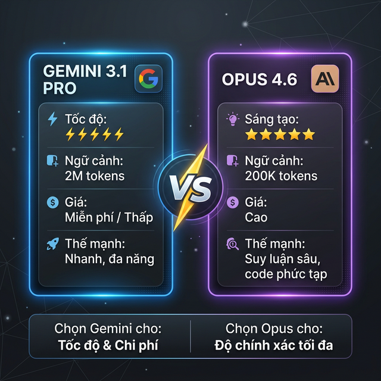

# Chương 2: Lựa Chọn Vũ Khí — Giải Mã Cặp Bài Trùng "Gemini 3.1 Pro" Và "Opus 4.6"

*(Nghệ thuật xài đúng Model cho đúng Bài toán Kinh tế)*

---

## 1. Mở Đầu: Tấn Bi Kịch "Mua Dao Mổ Trâu Đi Giết Gà"

Nhiều Giám đốc mua cả chục tài khoản Trí tuệ Nhân tạo xịn nhất về cho nhân viên, rồi hoang mang khi thấy: *"Sao con AI này giải Toán thì nhanh, mà Viết Code lại hay sinh ra lỗi vặt?"*.

Rất nhiều Lãnh đạo chi sai tiền, mua các gói AI vô tội vạ vì không hiểu một nguyên lý cốt lõi: **Không có một Mô hình AI (Foundation Model) nào giỏi toàn diện mọi thứ!**
Mỗi mô hình AI giống như một "Vị Tướng" đặc nhiệm, có Bộ Não (Cơ chế Huấn luyện) hoàn toàn khác nhau.

Trong hệ sinh thái **Antigravity**, chúng ta trao quyền thao túng hai Quái Vật Khổng Lồ nhất thế giới: **Google Gemini 3.1 Pro** và **Anthropic Opus 4.6**.
Làm Lãnh đạo AI-First, Sếp phải biết lúc nào Xua "Binh Gemini" và lúc nào Gọi "Tướng Opus".

---

## 2. Giải Phẫu Khối Não Kép: Tướng Đa Nhiệm & Thần Đồng Lập Trình

Hãy tưởng tượng bạn đang điều hành một Tập đoàn. Bạn cần 2 nhân sự cấp C-Level.

### 🟢 Vị Tướng Số 1: Google Gemini 3.1 Pro (Bộ Não Đa Nhiệm & Xử Lý Dữ Liệu Lớn)

*Bản chất: Chief Operations Officer (Giám đốc Vận hành Đa Năng).*

Gemini 3.1 Pro là "Cỗ Máy Lật Mở Không Gian". Điểm khủng khiếp nhất của nó là **Cửa Sổ Ngữ Cảnh Tối Thượng (Context Window)**. Nó có thể nhai nuốt một lượng File khổng lồ cùng lúc (Từ 1 Triệu đến 2 Triệu Token).

- **Điểm Mạnh Cốt Lõi:** Nó đọc được File ghi âm cuộc họp dài 3 Tiếng, đọc một video Video Review Sản phẩm, nuốt trọn Báo Cáo Tài Chính 500 trang PDF và 20 Bảng Excel đối soát trong 1 Tích Tắc.
- **Biệt Tài Của Antigravity:** Gemini là lựa chọn hoàn hảo cho **các tác vụ chung thường ngày**: Tóm tắt văn bản dài, viết Email Marketing, phân tích Báo cáo Tài chính, cào dữ liệu Đối thủ, dịch thuật hồ sơ. Khi sếp cần nhồi Hàng Mười Ngàn dòng Lịch sử Kinh doanh, Gemini 3.1 Pro là Cỗ Máy Bơm Luồng (Data Engine) Duy Nhất KHÔNG BAO GIỜ bị Tràn RAM (Quên lú lẫn Dữ liệu Giữa chừng).
- **Điểm Yếu:** Khả năng suy luận Logic tầng sâu và Viết Code phức tạp chưa phải là "Đỉnh của Chóp".

### 🟣 Vị Tướng Số 2: Opus 4.6 (Trí Tuệ Nhân Tạo Siêu Cấp Dành Cho Kỹ Thuật Viên - Coder)

*Bản chất: Chief Technology Officer (Giám đốc Công Nghệ).*

Nếu Gemini là Kẻ thợ cày Dữ liệu, thì Opus 4.6 (Đời Con Đỉnh Nhất do Tập đoàn Anthropic Sinh Ra) chính là **Vị Thần Lập Trình (Coding God)** và là **Chuyên gia Xử lý Logic Phức Tạp**.

- **Điểm Mạnh Cốt Lõi:** Khả năng Tư duy Lập trình (Coding/DevOps) vô song. Hành văn Cực Sắc, cấu trúc Code chặt chẽ, ít khi để lại Bug (Lỗi). Nó sở hữu khả năng Lập Luận Tầng Sâu (Advanced Reasoning), giúp thiết kế hệ thống, tối ưu thuật toán và gỡ rối (Debug) những đoạn mã mà con người phải mất hàng tuần để săm soi.
- **Khi Nào Sếp Dùng Tướng Này:** Để Xây Dựng **Hệ Thống Phần Mềm Lõi, Lên Kịch Bản Mega-Project (Chương 4)**, hoặc viết các đoạn Python script phức tạp để Auto-Deployment. Khi cần một kiến trúc sư giải bài toán hóc búa về DevOps hay Backend, đây là Kẻ vạch định Mọi Lối Thoát.
- **Điểm Yếu:** Ném Cho Nó 1 File Excel 50MB hay bắt nó đọc Video, Nó Sẽ Báo Lỗi Chết Ngạt Ngay. Mức phí chạy API cũng cực kỳ đắt đỏ.

---

## 3. Bản Đồ Quota: Bảng Phân Tách Gói Google Gemini Dành Cho SME

Doanh nghiệp SME muốn chạy Gemini 3.1 Pro qua nền tảng API cho Antigravity hoặc dùng trực tiếp (Web Chat). Sếp phải chọn Lộ Trình Đầu Tư đúng Hạn Mức (Quota).
Google phân mảng Cấu trúc Trí Tuệ theo Tiền Cước như sau:

| Tên Gói Dịch Vụ Google | Đối Tượng SME Sử Dụng | Mức Phí | Hạn Mức (Quota / Limits) Phải Biết Nhớ Đời | Khả năng Cấp Quyền Antigravity/API |
| :--- | :--- | :--- | :--- | :--- |
| **1. Gemini Free (Miễn Phí)** | Nhân viên tập sự trải nghiệm dạo. | 0 USD | Giới hạn 15-50 Yêu Cầu (Reuqests)/Ngày. Bị Google Dùng DATA để Đem Đi Train Tiếp AI. | Rất yếu. Cực dễ Lỗi Chống DDOS. Tối Kị Đưa Data Mật. |
| **2. Gemini Advanced (Gói Cá Nhân Cao Cấp)** | Dành cho Trưởng Phòng Đơn Lẻ Mua App. Dùng Trải Nghiệm Mượt Hơn. | Khoảng 20 USD/ Tháng (Tiếng Việt Đóng 495K/Tháng) | Khung Giới hạn Ngầm (Rate Limit) Tầm 150 Lệnh/Tin Nhắn một Tiếng (Tùy Điểm Peak). Được Dùng Model Đời Mới. Nhét Vừa 1,500 Trang PDF. (Data KHÔNG Bị Bán). | Không cấp Chìa Khóa API Tự Động. Bắt Tay Người Gõ. (Chỉ Chat Trực Tiếp). |
| **3. Google Workspace (Tiện Ích Doanh Nghiệp Cấp Phép)** | Dành Cho SME Chơi Chuẩn, Có Mua Mật Thư Drive + Email Đuôi Doanh Nghiệp Nội Bộ. Đính Kèm Gói Gemini For Workspace Ad-on | 20-30 USD/ User/ Tháng | Tích Hợp Thẳng Cả Thần Trí Tuệ Kép Vào Google Sheets Của Doanh Nghiệp. Gọi Thẳng Data Excel Không Suy Đãng. Rất Cực Êm Bàn Phím. Môi Trường Doanh Nghiệp 100% Bảo Mật Lõ. | Giới hạn Token Chia Tài Nguyên Pool Theo Lượng User Công Ty. Phụ Tuộc SLA Cam Kết Nút Doanh Nghiệp Khung (Enterprise). |
| **4. Google Vertex AI / Tiệm API (Não Nhân Cốt Lõi)** | **CHUYÊN DÙNG CHO CỖ MÁY ANTIGRAVITY** (Kết nối Chìa khóa Hệ Trục). Sếp Không Chạm Web Nữa. Mua Sự Thô Bạo (Usage-based). Đấu Thẳng Backend. | **Trả Theo Dòng Token Cân Kí** (Pay as you go). Tầm Vài Cents / 1 Triệu Từ. Tính Rất Rẻ (Thực Tế Rẻ Hơn Thuê Bao Nếu Dùng Tối Ưu Lệnh Sudo Tiết Kiệm Khung Lặp Của Antigravity). | **Hạn Mức Thượng Đỉnh Hàng Triệu Lượng Req Tùy Sếp Khai Khống Thẻ Tín Dụng Lấp API**. Quota (RPM: Requests Per Minute) Chạy từ 60 đến X000 RPM Tùy Cấp Độ Xác Minh Doanh Nghiệp Google Cloud Tier 1, Hưởng Toàn Bộ Không Gian Rỗng Không Bị Limit Tin Nhắn Bóp Vụn. | Tuyệt Đối 10 Lớn. Máy Trạm Sinh Kế Bạo Liệt Nhất Của Công Cụ Mở Rộng Hệ Thống Máy Chủ Antigravity Tích Điểm Đi Code Rải Trúc Mega-Project! (Không lo Quáng Gà Ảo Đội). |

*Lưu ý: Các mức Quota (RPM - Số Yêu cầu/Phút) của Opus Tương Đối Chặt Và Giá Đắt Đỏ Hơn Gemini Rất Nhiều. Khi Nào Yêu Cầu Code Phần Mềm/DevOps Tối Quan Trọng Khó Nhằn (Như Opus 4.6), Sếp Sẵn Sàng Trả X3 Tiền Trên Nền Tảng Anthropic Console.*

---

## 4. Bảng Chốt Quyền: Ma Trận Chọn Tướng Bắt Tay (Matrix Tooling)

Đừng để Công Việc Vỡ Đứt Giữa Chừng Vì Bóp Sai Não Trí Hệ. Lưu Bảng Này Và In Ra Bếp Hành Trang Trưởng Phòng:

- **Bộ Phận Kế Toán Lôi Sổ (12 Bảng Execl Lệch Check):** Gọi Lệnh /Cài API Mặc Định Lên Cửa Chớp Là Phá Tung **Gemini 3.1 Pro (1 Triệu Token)**. Phả Cháy Đuôi Trắc Lốc Kênh Data Mới Ra Đáp Số Đối Trừ Sai Nào.
- **Ban Nhân Sự Xin Cứu CV Đều Đều Trăm Bản File PDF Quét Dữ:** Vẫn Gọi **Gemini**.
- **Bộ Phận Marketing/Sales Cần Tóm Tắt Khách Hàng - Viết Thư Báo Giá Gấp:** Dùng **Gemini**.
- **Trái Tim Đạo Code Của IT Dựng Môi Trường Khắc Kỷ:** **Opus 4.6**. Hãy Trao Cho Chuyên Gia Kỹ Thuật Này Trọng Trách Sinh Mã Lập Trình (Coding). Băng thông Viết Python, Phác họa Cấu trúc Microservices, Gỡ Rối Hệ Thống Server của Opus là Số 1 Thế Giới. Đừng Bắt Nó Đọc Data, Hãy Bắt Nó Code!

Thấu Hiểu Cỗ Máy Bơm Nhiên Liệu Tầng Đáy Này, Sếp Sẽ Không Gặp Cảnh "Chatbot Nó Báo Em Đạt Hạn Mức Giới Hạn Quota Rồi Ngày Mai Mới Check File Được". SME Đi Tới Tương Lai Cổ Tay Sếp Là Tấm Thẻ Tín Dụng Trả API Tách Độc Lập Khỏi Giới Hạn Trần Tầm Cuộc Chơi Consumer Cổ Điển Nhạt Toẹt Ngoài Kia!

*(Hãy Lật Lại Các Chương Skill Từng Hành Trình Đi Tiếp Xem Chúng Ta Dùng Những Model Đó Nhét Vào Action Màn Hình Từng Bước Ở Chặng Click Giao Diện Tiếp Theo Ở Góc Độ Nào Sau Các Chương Step-By-Step Phía Dưới Cuốn Báo Cáo Kiệt Tác Trí Tuệ)*
