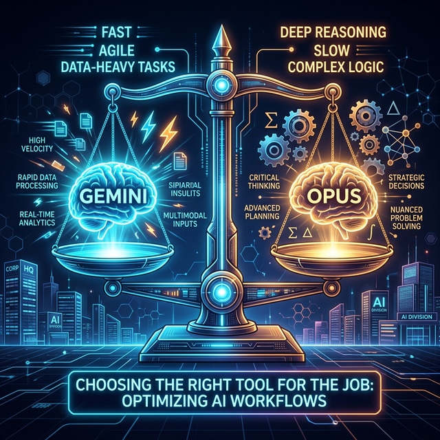
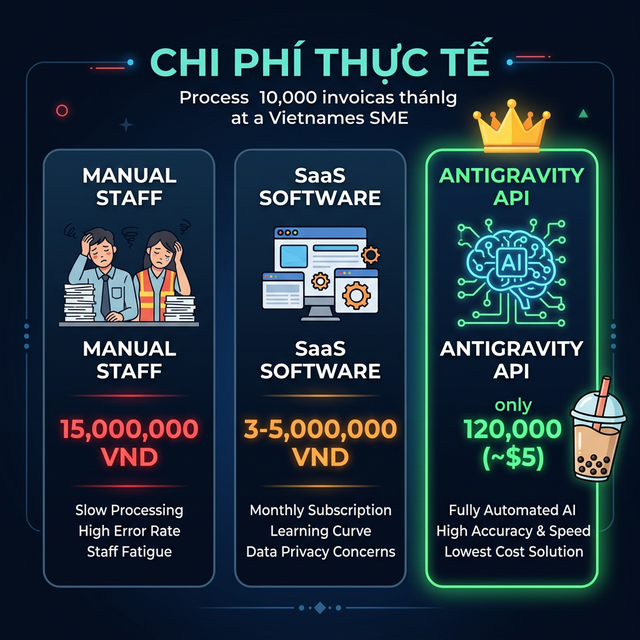

# Chương 2: Lựa Chọn Vũ Khí — Giải Mã Cặp Bài Trùng "Gemini 3.1 Pro" Và "Opus 4.6"

*(Nghệ thuật xài đúng Model cho đúng Bài toán Kinh tế)*

---

## 1. Mở Đầu: Tấn Bi Kịch "Mua Dao Mổ Trâu Đi Giết Gà"

Nhiều Giám đốc mua cả chục tài khoản Trí tuệ Nhân tạo xịn nhất về cho nhân viên, rồi hoang mang khi thấy: *"Sao con AI này giải Toán thì nhanh, mà Viết Code lại hay sinh ra lỗi vặt?"*.

Rất nhiều Lãnh đạo chi sai tiền, mua các gói AI vô tội vạ vì không hiểu hai nguyên lý cốt lõi:

1. **Không có một Mô hình AI (Foundation Model) nào giỏi toàn diện mọi thứ!** Mỗi mô hình AI giống như một "Vị Tướng" đặc nhiệm, có Bộ Não (Cơ chế Huấn luyện) hoàn toàn khác nhau.
2. **AI có Cảm xúc (Nhiệt độ - Temperature).** Nó có thể làm một người nghệ sĩ bay bổng, hoặc một tay kế toán lạnh lùng nguyên tắc, tùy bạn gạt cần số.

Trong hệ sinh thái **Antigravity**, chúng ta được quyền thao túng hai Quái Vật Khổng Lồ nhất thế giới: **Google Gemini 3.1 Pro** và **Anthropic Opus 4.6**.

Làm Lãnh đạo AI-First, Sếp phải biết lúc nào Xua "Binh Gemini", lúc nào Gọi "Tướng Opus", và khi nào nên gạt thanh Nhiệt độ lên hay xuống.

---

## 2. Giải Phẫu Khối Não Kép: Tướng Đa Nhiệm & Thần Đồng Lập Trình

Hãy tưởng tượng bạn đang điều hành một Tập đoàn. Bạn cần 2 nhân sự cấp C-Level.

### 🟢 Vị Tướng Số 1: Google Gemini 3.1 Pro (Bộ Não Đa Nhiệm & Xử Lý Dữ Liệu Lớn)

*Bản chất: Chief Operations Officer (Giám đốc Vận hành Đa Năng).*

Gemini 3.1 Pro là "Cỗ Máy Lật Mở Không Gian". Điểm khủng khiếp nhất của nó là **Cửa Sổ Ngữ Cảnh Tối Thượng (Context Window)**. Nó có thể nhai nuốt một lượng File khổng lồ cùng lúc (Từ 1 Triệu đến 2 Triệu Token).

- **Điểm Mạnh Cốt Lõi:** Nó đọc được File ghi âm cuộc họp dài 3 Tiếng, đọc một video Video Review Sản phẩm, nuốt trọn Báo Cáo Tài Chính 500 trang PDF và 20 Bảng Excel đối soát trong 1 Tích Tắc.
- **Biệt Tài Của Antigravity:** Gemini là lựa chọn hoàn hảo cho **các tác vụ chung thường ngày**: Tóm tắt văn bản dài, viết Email Marketing, phân tích Báo cáo Tài chính, cào dữ liệu Đối thủ, dịch thuật hồ sơ. Khi sếp cần nhồi Hàng Mười Ngàn dòng Lịch sử Kinh doanh, Gemini 3.1 Pro là Cỗ Máy Bơm Luồng (Data Engine) Duy Nhất KHÔNG BAO GIỜ bị Tràn RAM (Quên lú lẫn Dữ liệu Giữa chừng).
- **Điểm Yếu:** Khả năng suy luận Logic tầng sâu và Viết Code phức tạp chưa phải là "Đỉnh của Chóp".

### 🟣 Vị Tướng Số 2: Opus 4.6 (Trí Tuệ Nhân Tạo Siêu Cấp Dành Cho Kỹ Thuật Viên - Coder)

*Bản chất: Chief Technology Officer (Giám đốc Công Nghệ).*

Nếu Gemini là Kẻ thợ cày Dữ liệu, thì Opus 4.6 (Đời Con Đỉnh Nhất do Tập đoàn Anthropic Sinh Ra) chính là **Vị Thần Lập Trình (Coding God)** và là **Chuyên gia Xử lý Logic Phức Tạp**.

- **Điểm Mạnh Cốt Lõi:** Khả năng Tư duy Lập trình (Coding/DevOps) vô song. Hành văn Cực Sắc, cấu trúc Code chặt chẽ, ít khi để lại Bug (Lỗi). Nó sở hữu khả năng Lập Luận Tầng Sâu (Advanced Reasoning), giúp thiết kế hệ thống, tối ưu thuật toán và gỡ rối (Debug) những đoạn mã mà con người phải mất hàng tuần để săm soi.
- **Khi Nào Sếp Dùng Tướng Này:** Để Xây Dựng **Hệ Thống Phần Mềm Lõi, Lên Kịch Bản Mega-Project (Chương 4)**, hoặc viết các đoạn Python script phức tạp để Auto-Deployment. Khi cần một kiến trúc sư giải bài toán hóc búa về DevOps hay Backend, đây là Kẻ vạch định Mọi Lối Thoát.
- **Điểm Yếu:** Ném Cho Nó 1 File Excel 50MB hay bắt nó đọc Video, Nó Sẽ Báo Lỗi Chết Ngạt Ngay. Mức phí chạy API cũng cực kỳ đắt đỏ.

---

## 3. Bản Đồ Quota: Bảng Phân Tách Gói Google Gemini Dành Cho SME

Doanh nghiệp SME muốn chạy Gemini 3.1 Pro qua nền tảng API cho Antigravity hoặc dùng trực tiếp (Web Chat). Sếp phải chọn Lộ Trình Đầu Tư đúng Hạn Mức (Quota).
Google phân mảng Cấu trúc Trí Tuệ theo Tiền Cước như sau:

| Tên Gói Dịch Vụ Google | Đối Tượng SME Sử Dụng | Mức Phí | Hạn Mức (Quota / Limits) Phải Biết Nhớ Đời | Khả năng Cấp Quyền Antigravity/API |
| :--- | :--- | :--- | :--- | :--- |
| **1. Gemini Free (Miễn Phí)** | Nhân viên tập sự trải nghiệm dạo. | 0 USD | Giới hạn 15-50 Yêu Cầu (Reuqests)/Ngày. Bị Google Dùng DATA để Đem Đi Train Tiếp AI. | Rất yếu. Cực dễ Lỗi Chống DDOS. Tối Kị Đưa Data Mật. |
| **2. Gemini Advanced (Gói Cá Nhân Cao Cấp)** | Dành cho Trưởng Phòng Đơn Lẻ Mua App. Dùng Trải Nghiệm Mượt Hơn. | Khoảng 20 USD/ Tháng (Tiếng Việt Đóng 495K/Tháng) | Khung Giới hạn Ngầm (Rate Limit) Tầm 150 Lệnh/Tin Nhắn một Tiếng (Tùy Điểm Peak). Được Dùng Model Đời Mới. Nhét Vừa 1,500 Trang PDF. (Data KHÔNG Bị Bán). | Không cấp Chìa Khóa API Tự Động. Bắt Tay Người Gõ. (Chỉ Chat Trực Tiếp). |
| **3. Google Workspace (Tiện Ích Doanh Nghiệp Cấp Phép)** | Dành Cho SME Chơi Chuẩn, Có Mua Mật Thư Drive + Email Đuôi Doanh Nghiệp Nội Bộ. Đính Kèm Gói Gemini For Workspace Ad-on | 20-30 USD/ User/ Tháng | Tích Hợp Thẳng Cả Thần Trí Tuệ Kép Vào Google Sheets Của Doanh Nghiệp. Gọi Thẳng Data Excel Không Suy Đãng. Rất Cực Êm Bàn Phím. Môi Trường Doanh Nghiệp 100% Bảo Mật Lõ. | Giới hạn Token Chia Tài Nguyên Pool Theo Lượng User Công Ty. Phụ Tuộc SLA Cam Kết Nút Doanh Nghiệp Khung (Enterprise). |
| **4. Google Vertex AI / Tiệm API (Não Nhân Cốt Lõi)** | **CHUYÊN DÙNG CHO CỖ MÁY ANTIGRAVITY** (Kết nối Chìa khóa Hệ Trục). Sếp Không Chạm Web Nữa. Mua Sự Thô Bạo (Usage-based). Đấu Thẳng Backend. | **Trả Theo Dòng Token Cân Kí** (Pay as you go). Tầm Vài Cents / 1 Triệu Từ. Tính Rất Rẻ (Thực Tế Rẻ Hơn Thuê Bao Nếu Dùng Tối Ưu Lệnh Sudo Tiết Kiệm Khung Lặp Của Antigravity). | **Hạn Mức Thượng Đỉnh Hàng Triệu Lượng Req Tùy Sếp Khai Khống Thẻ Tín Dụng Lấp API**. Quota (RPM: Requests Per Minute) Chạy từ 60 đến X000 RPM Tùy Cấp Độ Xác Minh Doanh Nghiệp Google Cloud Tier 1, Hưởng Toàn Bộ Không Gian Rỗng Không Bị Limit Tin Nhắn Bóp Vụn. | Tuyệt Đối 10 Lớn. Máy Trạm Sinh Kế Bạo Liệt Nhất Của Công Cụ Mở Rộng Hệ Thống Máy Chủ Antigravity Tích Điểm Đi Code Rải Trúc Mega-Project! (Không lo Quáng Gà Ảo Đội). |

*Lưu ý: Các mức Quota (RPM - Số Yêu cầu/Phút) của Opus Tương Đối Chặt Và Giá Đắt Đỏ Hơn Gemini Rất Nhiều. Khi Nào Yêu Cầu Code Phần Mềm/DevOps Tối Quan Trọng Khó Nhằn (Như Opus 4.6), Sếp Sẵn Sàng Trả X3 Tiền Trên Nền Tảng Anthropic Console.*

---

## 4. Bảng Khái Toán Chi Phí Thực Tế (The True Cost of AI)

Nhiều Giám đốc SME ngần ngại áp dụng Antigravity vì sợ "Công nghệ AI chắc đắt tiền lắm". Sự thật là: **Chạy API AI rẻ hơn tiền điện văn phòng của bạn.**

Sự khác biệt lớn nhất của việc dùng API (Vertex AI / Anthropic Console) so với mua phần mềm là mô hình **Pay-As-You-Go (Dùng bao nhiêu trả bấy nhiêu)**, tính tiền theo từng "Token" (Âm tiết/Từ).

Hãy thử lấy một bài toán cụ thể: **Xử lý 10.000 tờ Hóa Đơn Mỗi Tháng**.

| Phương Án | Chi Phí Hàng Tháng | Nhược Điểm |
| :--- | :--- | :--- |
| **Tuyển Nhân Sự (Data Entry)** | **15,000,000 VNĐ** (2 Kế toán x 7.5tr) + BHXH. | Chậm, sai sót do mỏi mắt, không làm thứ 7, CN. Cần chỗ ngồi, máy tính, điện nước. |
| **Mua Phần Mềm Kế Toán Điện Tử (SaaS OCR)** | **~3,000,000 - 5,000,000 VNĐ/tháng** (Gói Subscription). | Tiền đóng cố định hàng tháng dù rảnh việc. Nhiều khi phần mềm không khớp Form mẫu đặc thù của công ty. |
| **Antigravity (Chạy API Gemini 1.5 Flash/Pro)** | **Khoảng 2 - 5 USD (~50,000 - 120,000 VNĐ)**. Cụ thể: 10K hóa đơn rớt vào khoảng 20 Triệu Token Input. | Cần học cách thiết lập Sudo Prompt ban đầu (sẽ hướng dẫn cực dễ ở các chương sau). |

**Kết luận đẫm máu:** Tiền trả cho Cỗ máy AI (Brain API) để cày nát lượng công việc của 2 con người trong nguyên 1 tháng RẺ HƠN TIỀN 2 LY TRÀ SỮA GONGCHA.
Bạn không tốn 1 đồng phí duy trì (Fix cost) nào cả. Tháng nào công ty ế khách, số lượng File ít đi $\rightarrow$ Tiền API tự động giảm về 0.

---

## 5. Bảng Chốt Quyền: Ma Trận Chọn Tướng Bắt Tay (Matrix Tooling)

Đừng để Công Việc Vỡ Đứt Giữa Chừng Vì Chọn Sai Não Bộ. Lưu Bảng Này Và In Ra Đặt Trực Tiếp Trên Bàn Trưởng Phòng:

- **Bộ Phận Kế Toán Đối Soát (12 Bảng Excel Lệch Check):** Gọi Lệnh /Cài API Mặc Định Lên Cửa Chớp Là **Gemini 3.1 Pro (2 Triệu Token)**. Đọc nghìn dòng số liệu không bao giờ sót.
- **Ban Nhân Sự Lọc CV Tuyển Dụng (Đọc Hàng Trăm File PDF):** Vẫn Gọi **Gemini**.
- **Bộ Phận Marketing Cần Tóm Tắt Khách Hàng - Viết Thư Báo Giá Gấp:** Dùng **Gemini**. Đậm chất Sáng tạo.
- **Trái Tim Kỹ Thuật IT Dựng Môi Trường:** **Opus 4.6**. Hãy Trao Cho Chuyên Gia Kỹ Thuật Này Trọng Trách Sinh Mã Lập Trình (Coding). Băng thông Viết Python, Phác họa Cấu trúc Microservices, Gỡ Rối Hệ Thống Server của Opus là Số 1 Thế Giới. Đừng Bắt Nó Đọc Khối Lượng Data Lớn, Hãy Bắt Nó Code!

### 🌡️ Bí Thuật Cuối Cùng: Điều Chỉnh Nhiệt Độ Của Máy (Temperature)

Không chỉ chọn đúng Tướng, Sếp phải biết điều chỉnh "Tính Cách" của Tướng đó thông qua tham số `Temperature` (Nhiệt Độ) của API trong các bản Prompt nâng cao.

- **Nhiệt độ = 0 (Tính Xác Định Cực Đoan):** Bắt AI trở thành một Kế toán viên vô cảm. Bắt buộc dùng `Temp=0` khi: Xử lý số liệu Excel, Đối soát đơn hàng, Tính lương, Viết Code chạy Terminal. Cấm AI bịa đặt hay phân tích hoa mỹ.
- **Nhiệt độ = 0.5 (Tính Cân Bằng):** Dùng khi Phân tích Báo cáo, Đọc hiểu văn bản Hợp đồng Pháp lý.
- **Nhiệt độ = 1.0 (Tính Bay Bổng Nghệ Sĩ):** Nhờ AI cởi trói sự sáng tạo. Dùng khi: Viết Facebook Content, Lên Ý tưởng Kinh doanh, Suy nghĩ Catchphrase, Đóng vai Khách hàng khó tính để chửi lại bạn.

Thấu Hiểu Cỗ Máy Bơm Nhiên Liệu Tầng Đáy Này, Doanh nghiệp của Sếp sẽ Tối Ưu Từng Cents Tiền API Mỗi Tháng, Vận Hành Bơm Trơn Tru Cho Mọi Bộ Phận 24/7.

*(Hãy lật sang Chương 3 để chúng ta dập tắt Nỗi đau lớn nhất của phòng HR và Kế toán bằng quyền năng của vị Tướng Gemini 3.1 Pro).*
