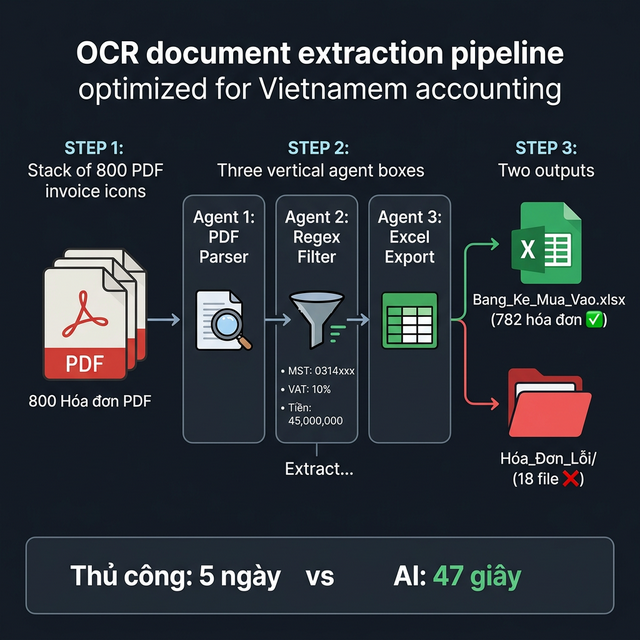
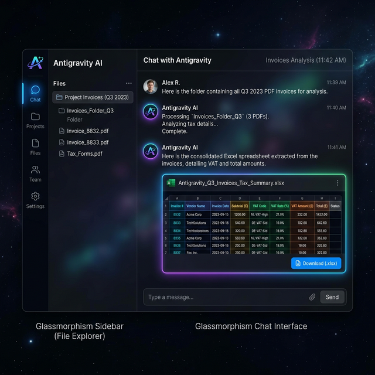

# Chương 3: Cuộc Cách Mạng Khối Văn Phòng — Zero-Code Automation Cho Phòng HR, Kế Toán & Admin

*(Giải phóng những "Máy Photocopy Chạy Bằng Cơm")*

---

## 1. Lời Mở Đầu: Tiếng Thở Dài Của Chị Kế Toán Trưởng Lúc 2h Sáng

### 📖 Câu Chuyện Đau Đớn: 14 Tiếng/Ngày Của Chị Nhung

Nếu phòng Kinh doanh (Sales) là "Tiền tuyến" mang cờ chiến thắng về cho công ty, thì khối Văn phòng (Back-office gồm Nhân sự, Kế toán, Hành chính, Mua hàng) chính là "Hậu phương" lo hậu cần giáp trụ. Nghịch lý thay, trong khi phòng Sales được Sếp trang bị CRM xịn xò, iPad đời mới, thì Hậu phương của 90% SME tại Việt Nam lại đang làm việc với năng suất của thế kỷ 19: **Dùng mắt để dò, dùng tay để đếm, và dùng trí óc để làm những việc máy móc.**

Chị Nhung là Kế toán trưởng của một công ty phân phối FMCG (Hàng tiêu dùng nhanh) tại Quận Tân Bình, TP.HCM. Công ty có 5 chi nhánh, mỗi tháng xuất nhập hàng ngàn đơn.

Tối ngày 28 hàng tháng, văn phòng tắt điện tối om, chỉ còn duy nhất đèn bàn của chị Nhung sáng. Trên 2 màn hình máy tính của chị là "Địa ngục trần gian":

- Màn hình trái: File PDF sao kê ngân hàng VCB dài 80 trang.
- Màn hình phải: Bảng Excel đối soát nội bộ dài 3.000 dòng.

Chị Nhung phải nheo mắt đọc từng số tiền bên PDF, lấy tay gõ `Ctrl + F` sang Excel, bôi đỏ những dòng nào lệch vài nghìn đồng. Chị làm việc say sưa như một cái máy, nhưng đó không phải là sự say sưa của đam mê, đó là sự chai sạn của một người thợ thủ công bấm phím.

Khi chị Nhung ngẩng đầu lên, đồng hồ chỉ 2h sáng. Chị chốt xong báo cáo, gửi Email cho Sếp, rồi úp mặt xuống bàn khóc nức nở vì kiệt sức.

Sự mệt mỏi nhất của người Kế toán không nằm ở việc tính toán các thuật toán tài chính phức tạp phân bổ dòng tiền. Sự mệt mỏi nhất đến từ việc **Nhập Liệu Nguyên Thủy (Data Entry)**. Đó là quy trình gõ lại những con số từ một tờ giấy/PDF chuyển sang một phần mềm (Excel/Misa/KiotViet).
Sự chán nản nhất của chuyên viên Tuyển dụng (HR) không phải là lên chiến lược Nhân sự, mà là phải căng mắt đọc 300 cái CV định dạng lộn xộn từ 300 trường đại học khác nhau, cố dò dẫm tìm chữ "2 năm kinh nghiệm", hì hục paste ra một cái danh sách ứng viên Excel.

Những công việc "không tên" lặp đi lặp lại đó bòn rút năng lượng, triệt tiêu sự sáng tạo, và gây ra tỷ lệ sai sót lên tới 20% khi nhân sự làm thêm giờ. Tổ chức của bạn đang trả lương Đại học, để thuê họ làm công việc của một cái Máy Photocopy.

**Và giải pháp của một người Sếp tồi là: "Cố lên em, tháng này nhiều việc, ráng giúp công ty".**

Giải pháp của một Lãnh đạo AI-First là: Trang bị cho họ quyền năng Tự Động Hóa (Automation) mà KHÔNG CẦN CHỮ VIẾT MỘT DÒNG CODE NÀO (Zero-Code).

---

## 2. Mô Hình Tư Duy: Áp Dụng "Lean Six Sigma" Vào Khối Hành Chính Bằng AI

Ngành Tự động hóa công nghiệp (Nhà máy) có một hệ tư tưởng kinh điển gọi là **Lean Six Sigma (Tinh gọn và Loại bỏ Lỗi 99.99%)**. Nếu Lean Six Sigma áp dụng bằng Cánh tay Robot để nhặt ốc vít trong xưởng xe Toyota, thì Antigravity đem triết lý này vào văn phòng để "Nhặt các Dòng Dữ liệu".

Người làm Back-office muốn áp dụng Agentic AI thành công, phải học cách nhận diện **"7 Loại Lãng Phí" (7 Wastes of Lean)** trong khối văn phòng:

1. **Defects (Lỗi sai sót):** Gõ sai 1 số 0 trong hóa đơn. Mất 2 ngày đi làm giải trình thuế. *(AI Code chạy thì không bao giờ sai đánh máy).*
2. **Overproduction (Sản xuất thừa):** Làm báo cáo dài 50 trang nhưng Sếp chỉ đọc đúng 1 dòng Tóm tắt (Summary). *(AI có thể đọc 50 trang và xuất ra 1 dòng đó trong 3 giây).*
3. **Waiting (Chờ đợi):** HR chờ Sales Lead rảnh để phỏng vấn. Kế toán chờ Kho đưa biên bản. *(AI có thể đóng vai trò Đốc thúc và Tự khớp nối ranh giới giữa 2 phòng).*
4. **Transporting (Vận chuyển dữ liệu):** Lưu file từ Zalo -> Tải xuống máy -> Đẩy lên Google Drive -> Gửi Link qua Email. *(AI làm chuỗi này khép kín tức khắc).*
5. **Inventory (Tồn đọng việc):** Cuối tháng mới đối soát thay vì đối soát Daily (Hằng ngày) do ức chế sức người. *(AI chạy Job hẹn giờ mỗi đêm 12h).*
6. **Motion (Thao tác thừa):** Copy - Chuyển Tab Màn Hình - Paste. Lặp lại 500 lần/ngày.
7. **Talent Mismatch (Lãng phí chất xám):** Bắt người thiết kế quy trình đi làm việc nhập liệu rập khuôn.

Khi khối Văn phòng nhận diện được những "Khối U" lãng phí này, họ sẽ thèm khát Antigravity như thèm khát nước ngọt trên sa mạc. Hãy đi vào các Case Study chữa bệnh thực tế.

---

## 3. Guideline Dành Riêng Cho Phòng Kế Toán: Giải Phẫu Cơn Ác Mộng Trích Xuất Chứng Từ

Kế toán là bộ phận chịu nhiều thương đau nhất khi phải đối chiếu Số dư (Bank Statement) với Hóa đơn điện tử PDF. Để giải cứu họ, Antigravity sử dụng một tổ hợp vũ khí siêu cấp: **Machine Vision (Thị giác máy tính) + Regex Pattern (Biểu thức chính quy bóc tách dữ liệu) + Pandas (Bảng tính Python)**.

Nhược điểm cốt lõi của OCR truyền thống (Các phần mềm scan chữ nổi tiếng) là nó trả ra MỘT CỤC VĂN BẢN (Raw Text). Còn đặc vụ Antigravity có năng lực xé cái cục văn bản đó ra, và "thả" từng miếng thịt vào đúng từng rổ (cột Excel) được định sẵn.

### 📋 Case Study Thực Tế: Thủy Sản Minh Phú — Giải Cứu Kế Toán Khỏi "Địa Ngục" Hóa Đơn

**Bối Cảnh Khủng Hoảng:**
Công ty xuất nhập khẩu thủy sản Minh Phú (Giả định), mỗi tháng nhận đặn 800 hóa đơn PDF từ 120 nhà cung cấp rải rác khắp miền Tây. Hóa đơn của NCC A định dạng khác NCC B.

- Phòng Kế toán (3 nhân sự) luôn mất trắng 5 ngày cuối tháng chỉ để làm Data Entry: Mở từng file PDF -> Copy Mã Số Thuế -> Sang Excel Paste. Copy Tiền Hàng -> Sang Excel Paste. Copy VAT -> Sang Excel Paste.
- Sai sót trung bình: 15 hóa đơn/tháng bị nhập nhầm dấu phẩy hàng nghìn.
- Tổn thất vô hình: Kế toán cáu bẳn, không có thời gian phân tích xem giá tôm tháng này tăng giảm ra sao để tham mưu cho Sếp.

**Thực Hành Trực Tiếp: Từng Bước Làm Việc Với Giao Diện Antigravity:**

Sự khác biệt của Agentic AI là nó có giao diện người dùng (UI) giống như một đoạn Chat, nhưng sức công phá như một Terminal máy chủ. Nếu làm theo 4 bước sau, bạn có thể tự động hóa 800 hóa đơn ngay trong hôm nay:

**Bước 1: Nạp Dữ Liệu Vào Não AI**
Mở giao diện Antigravity. Ở bên trái màn hình là thanh quản lý File (File Explorer). Bạn đính kèm mục `/Hoa_Don_Thang_8/` chứa 800 file PDF vào Chat. AI đã "nhìn" thấy toàn bộ kho tài liệu của bạn.

**Bước 2: Ban Bố Sudo Prompt (Mệnh Lệnh Đặc Trị)**
*(Lưu ý: Bạn có thể copy Mệnh lệnh này xài cho data của bạn, hoặc gọi thẳng [Skill Trích Xuất Hóa Đơn](../skills/trich_xuat_hoa_don/SKILL.md) đã được lập trình sẵn chuẩn mực SME).*

> **SUDO PROMPT: CHIẾN DỊCH KHAI THÁC HÓA ĐƠN THUẾ ĐẠI TRÀ**
>
> 👑 **[VAI TRÒ VÀ BỐI CẢNH]**
> Cương vị của bạn: Trợ Lý Kế Toán Thuế Cấp Cao.
> Input Huyết mạch: Ổ `/Hoa_Don_Thang_8/` chứa toàn bộ file PDF hóa đơn đỏ. Đừng đọc chay, hãy lập trình.
>
> ⚙️ **[MẠNG LƯỚI ĐA ĐẶC VỤ THỰC THI (3 TẦNG)]**
>
> 👨‍💻 **[Agent 1 - PDF Parser]**
> Viết Python gọi thư viện `pdfplumber`. Kéo chữ từ PDF ra Text thô, lưu trữ tạm.
>
> 🕵️‍♂️ **[Agent 2 - Regex Filter (Cỗ Máy Rây Lọc Dữ Liệu)]**
> Khởi tạo 3 Thuật toán Regex:
>
> 1. Xuyên phá tìm 'Mã số thuế:' -> Extract đúng 10-13 chữ số liền kề.
> 2. Tìm 'Cộng tiền hàng' -> Rút ra con số VNĐ (Strip ép về dạng Float).
> 3. Tìm 'Tiền thuế Ký hiệu' / 'GTGT' -> Trích xuất % VAT.
>
> ✍️ **[Agent 3 - CSV Exporter]**
> Gom Data của toàn bộ file này trút thẳng cấu trúc Cột vào tập tin `Bang_Ke_Mua_Vao_T8.xlsx`.
>
> 🚧 **[RÀNG BUỘC KỶ LUẬT SẮT]**
> Nếu file PDF nào lỗi Font VNI cũ, TUYỆT ĐỐI không đoán đại (Guess). Hãy Move thẳng file PDF đó sang thư mục `/Hoa_Don_Loi/` và ghi Tên file đó lên Cột Báo Đỏ của Sheet 2 trong Excel. Chạy System Code ngay!

**Bước 3: Xem Máy Móc Biểu Diễn Múa Phím (Execution Terminal)**
Khi bạn bấm Enter, Antigravity không trả lời bằng chữ sáo rỗng. UI sẽ hiện thị một cửa sổ **Chạy Lệnh Kỹ Thuật Số (Terminal)** ngầm. Bạn sẽ thấy dòng Python được sinh ra và chạy với tốc độ ánh sáng. Nó báo Log trực tiếp: *"[File 1/800] Đã xong... [File 455/800] Đang trích xuất..."*.

**Kết Quả Sang Chấn Tâm Lý Đo Lường Bằng ROI:**

- ⏱️ **Thời Gian Thi Hành (Run-time):** **47 Giây** (Thay vì 5 ngày làm việc của 3 người). 800 cái mỏ hóa đơn bị cày nát bằng tốc độ vòng xoay CPU.
- ✅ **Tỷ Lệ Chính Xác:** 98.7%. Lưới lọc Agent 3 đã giam giữ thành công 18 file lỗi Font vào đúng thư mục cách ly. Không có "lỗi đánh máy nhầm số 0".
- 📥 **OutPut File Excel Tức Thời:** Antigravity cung cấp ngay 1 nút Download `Bang_Ke_Mua_Vao_T8.xlsx` màu xanh lấp lánh ngay trên màn hình Chat. Kế toán tải về, nộp tờ khai Thuế, kết thúc ác mộng cuối tháng.
- 💰 **Tiết Kiệm ROI:** 3 Kế toán × 5 ngày = 15 ngày công/tháng (Tương đương 22.5 triệu đồng). Khoản tiền này đủ để thưởng nóng cho Kế toán trưởng và tái cấu trúc quỹ thời gian để họ làm phân tích chiến lược.

> 🚀 **Thử Nghiệm Ngay:** Bạn không cần phải có bằng IT. Hãy truy cập [antigravity.google](https://antigravity.google), nhặt 10 tờ hóa đơn đỏ kéo thả vào, và copy Sudo Prompt trên đưa cho bot. Cảm giác uy quyền sẽ lấn át bạn ngay ở giây thứ 5.

---

## 4. Guideline Dành Riêng Cho Phòng Nhân Sự (HR): Hệ Thống Lọc Khí Cấp Độ Hạt (ATS Của Nhà Nghèo)

Đầu vào máu chốt của Tổ chức là Con người. Nhưng khi HR đăng một "Tin tuyển dụng" (Job Description - JD) lên các TopCV, Vietnamworks... HR lập tức lãnh một "Cơn sóng thần" với 400 bản CV đổ về trong 3 ngày.
Rất nhiều Ứng viên (Hunter) rải CV như phát tờ rơi. Họ nộp bừa. HR phải mở tay 400 cái File PDF, đọc quét mắt tốc độ bàn thờ để cố tìm ra những từ khóa: *"Sinh năm 95? Bỏ", "Làm C++ chứ không làm Python? Bỏ"*. Cuối ngày, HR hoa mắt và loại nhầm 1 thiên tài vào sọt rác.

Thứ HR cần không phải là "Vui vẻ" vì có nhiều hồ sơ. Thứ HR cần là một **Lớp Lưới Lọc Vàng (ATS - Applicant Tracking System)**. Ở các công ty tập đoàn, họ mua ATS giá hàng chục ngàn Đô la mỗi năm. Ở công ty SME, Antigravity chính là ATS trị giá 0 đồng đắt giá nhất.

### 📋 Case Study Thực Tế: Startup Fintech "PayGo" — Tuyển 5 Backend Developer Trong 72h Không Ngủ

**Bối Cảnh Tốc Độ Ánh Sáng:**
CEO của PayGo vừa chốt được vòng Vốn hạt giống. Sếp vạch lệnh xuống HR: *"Anh cần gấp 5 Backend Developer xịn xò vào làm T2 tuần sau. Thứ 5, 2 ngày nữa, anh cần một Danh sách Tinh Tuý nhất gồm 20 người để lên lịch phỏng vấn"*.
HR đăng Job. Gió đông thổi lại 450 CV. Team HR (2 người) tính nhẩm: Mỗi CV đọc 2 phút, vị chi 900 phút (15 tiếng làm việc liên tục) chỉ để MỚI ĐỌC XONG. Hoàn toàn tuyệt vọng với Deadline của CEO.

**Cuộc Xâm Lăng Bằng Auto-Grading AI Của Antigravity:**

HR gom 450 CV tống vào thư mục `/Tuyen_Backend/CV_Tho/`. Sau đó, HR ngồi suy nghĩ bằng **Tư duy Kiến Trúc Sư Tuyển Dụng (Talent Architect)**, viết ra một file Rubric Chấm Điểm Tuyệt Đới `Yeu_Cau_Backend_JD.txt`:

- Tiêu chí Chết: Kinh nghiệm < 3 năm -> Loại thẳng (0 điểm).
- Ngôn ngữ Python (4 điểm).
- Biết dùng Docker & PostgreSQL (2 điểm).
- Có bằng cấp liên quan IT / Hoặc kỹ năng Tiếng Anh Đọc hiểu Technical Doc (2 điểm).
*(Điểm Sàn Chấp Nhận Phỏng vấn (Pass Rate): 6/10).*

Tiếp theo, HR áp dụng [Skill Lọc CV Ứng Viên](../skills/loc_cv_ung_vien/SKILL.md) bằng lệnh Sudo:

> *"Hỡi Antigravity, lập ra Hội đồng Giám khảo AI gồm 3 Agent. Agent 1 trích xuất Text toàn bộ 450 CV trong `/CV_Tho/`. Agent 2 cầm cái File Rubric `Yeu_Cau_Backend_JD.txt` của tôi làm kim chỉ nam, đọc hiểu Ngữ nghĩa Kinh nghiệm ứng viên và Chấm Điểm khắt khe (Cấm nương tay). Agent 3 làm Nhiệm vụ Bash System (Lệnh Server): Tự động Move cắt File PDF của Ứng viên Điểm >= 6 vào Folder `/Moi_Phong_Van_Ngay/`, tống ứng viên Không Đạt vào `/Tu_Choi/`. Cuối cùng, xuất báo cáo Bảng Xếp Hạng Top 20 người Cao Điểm Nhất (Kèm 1 cột tóm tắt Lý do Tại Sao người này lại Cao Điểm để tôi đọc lướt). Hãy thực thi Đi!"*

**Kết Quả Của Việc Biến Cỗ Máy Thành Trưởng Ban Tuyển Dụng:**

- ⏱️ **Thời Gian Xử Lý Data:** **3 Phút 45 Giây** quét + chấm điểm + bốc dời (file move) 450 CV.
- 📊 **Kết Quả Tinh Khôi:** 38 CV đạt Pass Rate. Cột "Lý do" của AI ghi chú siêu gắt: *(Ứng viên này 9 điểm vì đã làm hệ thống tương tự Fintech có tải trọng 10,000 requests/s ghi trong CV mục Dự Án).*
- 🎯 **Hiệu Ứng Bươm Bướm:** 3 giờ chiều hôm đó, CEO đã nhận được báo cáo Top 20 để review. Bí quyết không nằm ở sự Chăm Chỉ Đọc, Bí quyết nằm ở Cách Đặt Rubric Của Kẻ Gom Lưới.

### ✅ Kết Quả Kỳ Vọng Chi Tiết (Expected Output Cho 2 Case Study)

**Case Study Kế Toán Minh Phú — AI trả về:**

1. File `Bang_Ke_Mua_Vao_T8.xlsx` gồm 800 dòng, mỗi dòng 1 hóa đơn đã trích xuất: Mã Số Thuế | Tên Nhà Cung Cấp | Tiền Hàng (VNĐ) | Thuế VAT (%) | Số Tiền VAT.
2. Thư mục `/Hoa_Don_Loi_Can_Check_Tay/` chứa 18 file PDF bị lỗi font không đọc được.
3. Sheet 2 trong Excel ghi rõ danh sách 18 file lỗi + lý do (VD: *"File `HD_NCC_042.pdf`: Scan tay, không có text layer"*).

**Case Study HR PayGo — AI trả về:**

1. Thư mục `/Moi_Phong_Van_Ngay/` chứa 38 file PDF ứng viên đạt Pass Rate.
2. Thư mục `/Tu_Choi/` chứa 412 file PDF ứng viên không đạt.
3. File `BangXepHang_Top20.xlsx` gồm 20 dòng, mỗi dòng: Tên | Điểm Tổng (/10) | Điểm Python | Điểm Docker | Tóm tắt 1 câu lý do ("Ứng viên X: 9 điểm — 5 năm kinh nghiệm Python, từng xây hệ thống xử lý 10K req/s").

### 🔧 Bảng Xử Lý Sự Cố Thường Gặp Cho Khối Back-Office

| Sự Cố | Phòng Ban | Giải Pháp |
| :--- | :--- | :--- |
| PDF scan tay (ảnh chụp) → AI không đọc được chữ | Kế toán | Thêm vào Prompt: *"Nếu file PDF không có text layer, hãy dùng thư viện OCR `pytesseract` để nhận dạng ký tự."* Hoặc chấp nhận: *"Move file lỗi vào thư mục riêng để kiểm tra tay."* |
| Font VNI cũ (VNI-Times) bị vỡ chữ tiếng Việt | Kế toán | Thêm: *"Encode lại text bằng bảng chuyển đổi VNI → Unicode trước khi xử lý."* |
| CV dạng ảnh JPG/PNG (không phải PDF) | HR | Thêm: *"Agent 1: Kiểm tra extension file. Nếu là `.jpg` hoặc `.png`, dùng OCR để convert sang text trước."* |
| AI chấm điểm thiên vị từ khóa (keyword stuffing) | HR | Thêm Ràng buộc: *"Không chỉ đếm từ khóa. Hãy đọc hiểu ngữ cảnh (Semantic matching). Nếu CV ghi 'Python' nhưng mô tả dự án chỉ là copy script, chấm tối đa 2/4 điểm."* |
| Thư viện `pdfplumber` cài không được | Tất cả | Gõ vào Antigravity: *"Hãy cài thư viện bằng lệnh `pip install pdfplumber`."* Hoặc xem [Phụ lục Cài đặt](phu-luc-cai-dat-moi-truong.md). |

Tư duy này không phải là Dùng Công Cụ (Use Tool). Đây là Trạng thái Niết Bàn của một **Automation Workflow Designer (Nhà Tái thiết Dòng Chảy Tự Động)**. Khi nhân viên hành chính nắm được cốt tủy của "Thuật Giao Task Đa Đặc Vụ" này, giá trị thặng dư của họ trên bàn đàm phán lương và sự tôn trọng của Hội đồng quản trị dành cho họ đã tăng cường gấp 1,000 lần.

---

## 5. Cú Cứu Cánh Cuối Cùng: Tự Động Hóa Phòng Chăm Sóc Khách Hàng (CSKH)

Nãy giờ chúng ta nói về Số liệu (Hóa đơn) và Từ khóa (CV xin việc). Nhưng sức mạnh đáng sợ nhất của **Gemini 3.1 Pro** nằm ở việc Đọc Hiểu Cảm Xúc (Nature Language Processing - NLP).

Bạn có một hộp thư `cskh@congty.com` nhận 200 email phàn nàn mỗi ngày.
Con người đọc email số 1: *"Hàng giao chậm quá, tôi muốn hủy!"* $\rightarrow$ Tâm lý tụt dốc.
Đọc đến dòng số 50: *"Thái độ shipper lồi lõm, tẩy chay!"* $\rightarrow$ Vỡ mộng, stress, xin nghỉ việc.

### 📋 Case Study Thực Tế: Xoa Dịu 200 Khách Hàng Giận Dữ Trong 5 Phút

Thay vì để nhân viên CSKH mệt mỏi đọc từng mail và copy-paste câu trả lời mẫu, hãy để Antigravity làm "Tấm Khiên Cứng Cỏi":

> **SUDO PROMPT: PHÂN TRUYỀN & CHỮA CHÁY CẢM XÚC MAIL CSKH**
>
> 👑 **[VAI TRÒ VÀ BỐI CẢNH]**
> Bạn là Trưởng Ban Phân Tích Khủng Hoảng Khách Hàng. Bạn hoàn toàn vô cảm trước sự chửi bới. Bối cảnh: Hôm qua kho bị cháy, chúng ta giao trễ 200 đơn hàng. Trong file Excel `Inbox_CSKH.xlsx` chứa Data xuất xuất từ hệ thống mail (Cột A: Email khách | Cột B: Nội dung phản hồi).
>
> ⚙️ **[MẠNG LƯỚI ĐA ĐẶC VỤ THỰC THI (3 TẦNG)]**
>
> 👨‍💻 **[Agent 1 - Sentiment & Intent Analyzer (Máy đo Cảm xúc)]**
> Đọc nội dung Cột B. Dùng Năng lực NLP của bạn để phân loại từng dòng thành 3 Thẻ Tag mức độ:
>
> - `HUỶ_ĐƠN`: Lời lẽ cực gắt, đe dọa bóc phốt, đòi tiền lại.
> - `HỐI_HÀNG`: Tức giận nhẹ, phàn nàn nhưng vẫn muốn nhận đồ.
> - `QUAN_TÂM`: Khách tò mò hỏi thăm xem kho cháy thế nào, có bị sao không.
>
> 🕵️‍♂️ **[Agent 2 - Auto-Draft Generator (Cỗ Máy Soạn Thảo)]**
> Dựa vào Thẻ Tag của Agent 1, hãy Tự động Soạn Sẵn nội dung Nháp (Draft Email) cho từng khách hàng để TÔI (Nhân sự con người) duyệt trước khi bấm gửi.
>
> - Nếu `HUỶ_ĐƠN`: Giọng văn Hạ mình sát đất, Đồng ý Hoàn tiền 100% kèm eVoucher 200K đầm thấm.
> - Nếu `HỐI_HÀNG`: Giọng văn Thành khẩn, tặng Freeship và cam kết giao trong 48h.
>
> ✍️ **[Agent 3 - CSV Exporter (Luật Xuất Bảng NGHIÊM NGẶT)]**
> Ghép tất cả kết quả thành một File `.CSV`. Gồm 4 cột tĩnh: `Email` | `Thẻ_Tag` | `Nội_Dung_Khách_Chửi` | `Email_Nháp_Của_AI`.
> **[LUẬT THÉP BẮT BUỘC]: Mọi lời nói của Bạn phải câm lặng. Chỉ được xuất ra File CSV. Nghiêm Cấm Vòng Vo kiểu "Vâng sếp, em đã làm xong". Silence is Golden.**
> Executed!

Sự kỳ diệu của "Luật Thép Bắt Buộc" ở Agent 3 là ép AI bỏ thói quen luyên thuyên của một Chatbot, buộc nó phải hành xử Lạnh Lùng, Chính Xác như một Phần Mềm Máy Tính thực thụ. Sếp mở file CSV ra, chỉ cần lướt dọc cột "Email Nháp", nếu ưng ý thì thả cả file này vào Tool gửi Mail hàng loạt (Mailchimp/Sendgrid) $\rightarrow$ 200 đám cháy được dập tắt chỉ trong đúng 1 ly trà.

---

## 6. Bảng Chuẩn Hóa Skills Tự Động Hành Chính Cho Khối Văn Phòng

Dưới đây là Bản đồ "Vũ Khí Zero-Code" mà Khối Back-Office phải áp dụng vào quy trình Daily/Weekly. Chỉ đạo nhân sự Click vào từng Kỹ năng để lấy Code/Prompt thực hành trực tiếp:

| Loại Nỗi Đau Doanh Nghiệp (Pain point) | Skill Định Chẩn (Giải Pháp AI) | Ứng Dụng Thực Tế Giao Việc (Mindset) | Tần Xuất |
| :--- | :--- | :--- | :--- |
| Kế toán ngồi căng mắt soi 2 bảng Excel dòng tiền Lệch nhau. | [`doi_soat_ngan_hang`](../skills/doi_soat_ngan_hang/SKILL.md) | Giao 2 File cho AI dùng Outer Merge, xuất Báo Cáo tô đỏ dòng tiền Thất lạc / Đơn Ảo. | Tuần / Cuối Tháng |
| Hàng trăm tờ Hóa Đơn PDF cần gõ tay lên phần mềm Khai Thuế. | [`trich_xuat_hoa_don`](../skills/trich_xuat_hoa_don/SKILL.md) | Gọi AI quét folder, bứt rễ "Mã số thuế", "Tiền VAT" trút vào cột Excel định sẵn. | Cuối Tháng |
| 5 Chi nhánh nộp 5 file Doanh số rời rạc. Sếp hối xem Doanh thu Tổng. | [`bao_cao_doanh_thu`](../skills/bao_cao_doanh_thu/SKILL.md) | Ép AI gộp File, Calculate tự động, gọi Matplotlib vẽ Biểu Đồ Trend Tăng/Giảm vứt ra màn hình MKT. | Hằng Ngày |
| HR bị Nhận chìm bởi Hàng Trăm Sơ Yếu Lý Lịch (CV) vô giá trị. | [`loc_cv_ung_vien`](../skills/loc_cv_ung_vien/SKILL.md) | Xây Rubric Luật (Điểm Sàn), gọi AI đọc NLP, Chấm Xếp Hạng (Ranking) và chia phân luồng File. | Giai đoạn Tuyển dụng |
| Hàng loạt Hợp Đồng giấy sắp hết hạn gia hạn mà không ai nhớ check. | [`quan_ly_hop_dong`](../skills/quan_ly_hop_dong/SKILL.md) | Bắn Lệnh đệ quy Folder, Trích Extract "Hạn Hiệu Lực", Cảnh Báo Sớm 60 Ngày 🔴 Đỏ Quạch. | Nửa Năm / Tháng |

---

Khi Hậu Phương (Back-office) đã yên hàn bởi máy móc làm tay sai, tiền tuyến Marketing đã có súng đạn xịn để bắn. Nhưng còn Trái Tim Kỹ Thuật (Phòng IT Developer) của doanh nghiệp thì sao? Họ nổi tiếng là những con người kiêu ngạo, lập dị, "Tưởng như không bao giờ cần AI dạy gõ Phím". Nhưng Nghịch lý thay, Khối Dev lại chứa "Cục Nợ Kỹ Thuật" rủi ro và chết chóc kinh hoàng nhất.

⏭ *(Nghỉ tay pha cốc Cà phê, và bước sang **Chương 3** — Nơi Đạo đao Của AI sẽ mổ xẻ và Review lại sinh mệnh Legacy Code của doanh nghiệp bạn)*.

---

## 📚 Tài Liệu Tham Khảo

- [Skill Lọc CV Ứng Viên](../skills/loc_cv_ung_vien/SKILL.md)
- [Skill Trích Xuất Hóa Đơn](../skills/trich_xuat_hoa_don/SKILL.md)
- [Workflow Lọc CV](../workflows/loc-cv-ung-vien.md)
- [Workflow Trích Xuất Hóa Đơn](../workflows/trich-xuat-hoa-don.md)
- [Chương 1 — Lãnh đạo AI-First](01-lanh-dao-ai-first.md)
- [Phụ lục — Cài đặt môi trường](phu-luc-cai-dat-moi-truong.md)
- [pdfplumber — Python PDF extraction](https://github.com/jsvine/pdfplumber)
