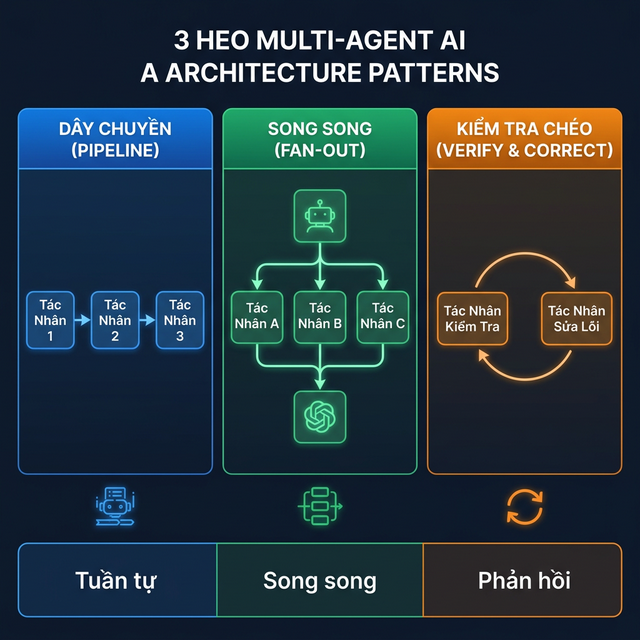
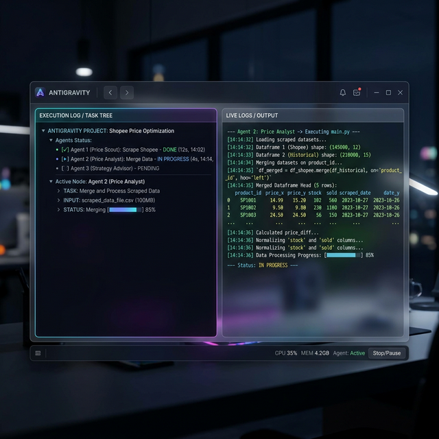

# Chương 4: Nghệ Thuật Điều Binh Đa Đặc Vụ — Khi Một Mệnh Lệnh Kích Hoạt Cả Đạo Quân AI

*(Sức mạnh thực sự của Antigravity nằm ở việc phối hợp nhiều Tác nhân AI cùng lúc)*

---

## 1. Mở Đầu: Tại Sao "Một Mình Một Ngựa" Là Cách Dùng AI Tệ Nhất?

### 📖 Câu Chuyện: Cú Sốc Marketing Của Chị Trang

Chị Trang — Trưởng phòng Marketing của một chuỗi 12 cửa hàng mỹ phẩm tại Đà Nẵng — vừa nhận lệnh từ CEO: *"Xây dựng báo cáo Flash Sale 11/11 trong 2 tiếng: Phân tích giá đối thủ trên Shopee, so sánh với giá nội bộ, đề xuất chiến lược giảm giá, soạn email gửi 500 khách VIP"*.

Chị Trang mở Antigravity lên và gõ: *"Cào giá 50 sản phẩm mỹ phẩm trên Shopee cho tôi"*. AI chạy 3 phút, trả về file Excel. Đẹp.

Nhưng rồi chị phải gõ lệnh thứ 2: *"Đọc file giá nội bộ và so sánh"*. Rồi lệnh thứ 3: *"Đề xuất chiến lược"*. Rồi lệnh thứ 4: *"Soạn email"*.

**4 lệnh riêng rẽ. 4 lần chờ. 4 lần copy-paste kết quả từ lệnh trước sang lệnh sau.**

Chị Trang mất 90 phút — không phải vì AI chậm, mà vì chị đang **dùng AI như một nhân viên duy nhất**, giao việc tuần tự từng bước một.

**Sai Lầm Cốt Lõi: Đó là tư duy "Single Agent" (Một Đặc Vụ Đơn Độc).**

Một vị Tướng giỏi không bao giờ cử một lính trinh sát đi cào tin, rồi đợi anh ta về mới cử lính phân tích, rồi đợi xong mới cử lính viết báo cáo. Vị Tướng giỏi **triển khai cả Tiểu đội cùng lúc**, mỗi người một nhiệm vụ, phối hợp nhịp nhàng.

Đó chính là **Multi-Agent (Đa Đặc Vụ)** — Vũ khí tối thượng của Antigravity.

> 🚀 **Chưa cài Antigravity?** Truy cập [antigravity.google](https://antigravity.google) để tải và cài đặt. Hướng dẫn chi tiết ở [Chương 0 — Cài Đặt 10 Phút](00-gioi-thieu-antigravity.md).

---

## 2. Multi-Agent Là Gì? Giải Mã Bằng Ngôn Ngữ Kinh Doanh

### 🧠 Định Nghĩa Cho Người Không IT

Hãy tưởng tượng bạn đang tổ chức một **Bàn Tiệc Cưới cho 500 khách**:

- **Single Agent (1 AI):** Bạn thuê DUY NHẤT 1 người. Anh ta phải tự tay: đi chợ mua nguyên liệu → nấu 50 món → bày bàn → rót rượu → tiếp khách → dọn dẹp. Kết quả? Khách đói meo, tiệc thất bại.

- **Multi-Agent (Đội AI):** Bạn thuê 1 **Tổng Quản Tiệc** (Orchestrator) điều phối:
  - 👨‍🍳 **Đầu Bếp** (Agent 1): Chuyên nấu ăn.
  - 🍷 **Phục Vụ** (Agent 2): Chuyên bày bàn và rót rượu.
  - 📋 **Thư Ký** (Agent 3): Chuyên ghi chép hóa đơn và thanh toán.

Mỗi Agent có **chuyên môn riêng**, làm **song song**, và kết quả được **nối tiếp** với nhau thành một sản phẩm hoàn chỉnh.

### 📊 Bảng So Sánh: Single Agent vs Multi-Agent

| Tiêu Chí | Single Agent (Lệnh đơn) | Multi-Agent (Đa Đặc vụ) |
| :--- | :--- | :--- |
| **Cách giao việc** | Gõ 1 lệnh → Chờ xong → Gõ lệnh tiếp | Gõ 1 SUDO PROMPT → AI tự chia Agent, tự phối hợp |
| **Tốc độ** | Tuần tự (5 phút × 4 bước = 20 phút) | Song song (5 phút cho cả 4 bước cùng lúc) |
| **Chất lượng** | Não AI bị quá tải vì ôm đồm | Mỗi Agent tập trung 1 việc → Chính xác hơn |
| **Ứng dụng** | Việc đơn giản (hỏi đáp, tạo 1 file) | Dự án phức tạp (đối soát, phân tích, báo cáo tổng hợp) |

---

## 3. Kiến Trúc Multi-Agent Trong Antigravity: 3 Mô Hình Cốt Lõi



Khi bạn viết một SUDO PROMPT có chia Agent, Antigravity tự động áp dụng một trong 3 mô hình sau:

### 🔗 Mô Hình 1: Dây Chuyền (Pipeline)

```text
Agent 1 (Thu thập) → Agent 2 (Xử lý) → Agent 3 (Xuất báo cáo)
```

**Ví dụ:** Đối soát ngân hàng — Agent 1 đọc 2 file → Agent 2 so khớp dữ liệu → Agent 3 xuất Excel tô đỏ.

**Khi nào dùng:** Khi các bước **phụ thuộc tuần tự** vào nhau (bước sau cần kết quả bước trước).

### 🌐 Mô Hình 2: Song Song (Fan-Out)

```text
         ┌→ Agent A (Cào giá Shopee)
Lệnh gốc ┤→ Agent B (Cào giá Tiki)
         └→ Agent C (Cào giá Lazada)
                    ↓
            Agent D (Gộp & So sánh)
```

**Ví dụ:** Giám sát giá đối thủ — 3 Agent cào 3 sàn TMĐT cùng lúc → 1 Agent gộp kết quả.

**Khi nào dùng:** Khi các việc **độc lập** có thể chạy cùng lúc để tiết kiệm thời gian.

### 🔄 Mô Hình 3: Kiểm Tra Chéo (Verify & Correct)

```text
Agent 1 (Làm chính) → Agent 2 (Kiểm tra lỗi) → Nếu lỗi → Agent 1 sửa lại
```

**Ví dụ:** Soạn hợp đồng — Agent 1 soạn nội dung → Agent 2 rà lỗi chính tả, điều khoản thiếu → Agent 1 bổ sung.

**Khi nào dùng:** Khi cần **đảm bảo chất lượng** cao (tài liệu pháp lý, báo cáo tài chính).

---

## 4. Thực Hành: 3 Case Study Multi-Agent Chạy Trên Antigravity

### 📋 Case Study 1: Báo Cáo Flash Sale Tổng Hợp (Dành cho Marketing)

Quay lại câu chuyện Chị Trang. Thay vì gõ 4 lệnh rời rạc, chị viết **1 SUDO PROMPT duy nhất**:

> **SUDO PROMPT: CHIẾN DỊCH PHÂN TÍCH FLASH SALE 11/11**
>
> 👑 **[VAI TRÒ & BỐI CẢNH]**
> Cương vị: Giám đốc Chiến lược Giá (Chief Pricing Officer).
> Mục tiêu: Phân tích giá 50 sản phẩm mỹ phẩm, so sánh với đối thủ, đề xuất chiến lược, soạn email VIP.
> File nội bộ: `/Data/BangGia_NoiBo.xlsx`
>
> ⚙️ **[MẠNG LƯỚI ĐA ĐẶC VỤ (4 TẦNG)]**
>
> 🕸️ **[Agent 1 — Trinh Sát Giá Địch (Price Scout)]**
> Mở trình duyệt, vào Shopee.vn. Tìm 50 sản phẩm mỹ phẩm theo danh sách tên trong file nội bộ. Thu thập: Tên SP, Giá bán, % Giảm giá, Số lượt bán. Lưu kết quả vào biến tạm.
>
> 📊 **[Agent 2 — Phân Tích Gia So Sánh (Price Analyst)]**
> Nhận data từ Agent 1. Đọc file `/Data/BangGia_NoiBo.xlsx`. Dùng Python Pandas merge 2 bảng theo Tên SP. Tính: Chênh lệch giá (%), Mức cạnh tranh (Rẻ hơn / Đắt hơn / Ngang bằng). Đánh dấu đỏ các Cổ phiếu ĐẮNG HƠN đối thủ > 15%.
>
> 🧠 **[Agent 3 — Cố Vấn Chiến Lược (Strategy Advisor)]**
> Nhận bảng so sánh từ Agent 2. Đề xuất 3 kịch bản chiến lược giá cho Flash Sale: (A) Giảm sâu để chiếm thị phần, (B) Giảm vừa để giữ biên lợi nhuận, (C) Giữ nguyên + tặng quà. Mỗi kịch bản kèm ước tính Doanh thu và Biên lãi.
>
> ✉️ **[Agent 4 — Thư Ký Email VIP (Email Composer)]**
> Dựa trên kịch bản được Agent 3 chọn là tối ưu nhất. Soạn 1 email HTML chuyên nghiệp gửi 500 khách VIP. Tiêu đề hấp dẫn. Nội dung cá nhân hóa: *"Chào [Tên Khách], ưu đãi ĐỘC QUYỀN dành riêng cho bạn..."*. Lưu file `Email_FlashSale_11_11.html`.
>
> 🚧 **[RÀNG BUỘC]**
> Cấm đoán ảo giác giá. Nếu không tìm thấy SP trên Shopee, ghi "N/A". File nội bộ chỉ Đọc, cấm sửa. Thông báo khi hoàn tất.

**Trả Lời Căn Bản 5-Whys Giúp Sếp Trở Thành Thống Soái Đa Nhiệm:**

1. **Làm gì?** Biến một quy trình cồng kềnh 90 phút qua tay 4 người thành 1 luồng thực thi liên hoàn tự động.
2. **Tại sao không dùng 1 Agent?** Vì xử lý 50 sản phẩm cần bộ nhớ dồi dào. Ép 1 con AI vừa cào Web (Browser), vừa tính toán Pandas, vừa xuất HTML là ép nó bị Mãn Tiết (Overload Context) đẫn tới Ảo Giác Bịa Số.
3. **Data đi đường nào?** Lớp 1 nhai Web ra Text. Lớp 2 lấy Text nhồi DataFrames. Lớp 3 lấy Tín Hiệu Margin Phân Tích. Lớp 4 ôm Báo Cáo đẩy Code Giao diện HTML.
4. **Trường hợp lỗi?** Agent 1 cào không được sẽ ghi "N/A". Dữ liệu đi mượt không gãy gập các bước sau.
5. **Tiền sinh ra ở đâu?** Cắt lìa hoàn toàn khâu Lên kế hoạch giá Giá Trị Thấp. Agent làm xong trong 8 phút. Chị Trang rảnh tay 82 phút còn lại để đi Bơm Ads thực thi ngay chiến dịch thay vì vùi đầu làm Báo Cáo.

**Thực Hành Trực Tiếp: Từng Bước Điều Binh Trên Antigravity**

**Bước 1: Nạp Dữ Liệu & Gửi Sudo Prompt**
Chị Trang mở [antigravity.google](https://antigravity.google). Cửa sổ File Explorer bên trái, chị kéo thả `/Data/BangGia_NoiBo.xlsx` vào. Cửa sổ Chat bên phải, chị paste toàn bộ SUDO PROMPT trên và ấn nút Gửi (Send).

**Bước 2: Màn Hình Cất Cánh Đa Đặc Vụ (Multi-Agent Terminal)**
Khác với ChatGPT thông thường chỉ có một bong bóng chat trả lời, Antigravity sẽ chia đôi màn hình:

- **Khung cây thư mục rẽ nhánh (Agent Tree Log):** Bạn sẽ thấy 4 con Agent bắt đầu nhấp nháy đèn báo hiệu `IN PROGRESS`. Agent 1 chạy trước, Agent 2 đứng `PENDING` chờ đợi.
- **Khung Log Kỹ Thuật (Live Terminal):** Từng dòng Python trôi cuồn cuộn trên màn hình:
  `[14:14] Agent 1: Scrape_Shopee_Done (50 items)`
  `[14:15] Agent 2: Pandas_Merge_Tables (Vlookup Completed)`



**Kết Quả Trả Về Nhất Quán (The Ultimate Deliverables):**
Thay vì 90 phút đi gõ 4 lệnh lóc cóc hay dùng Excel kéo VLOOKUP bằng tay, chị Trang nhận được **toàn bộ 4 siêu kết quả trong 1 lần chạy duy nhất** (mất chừng 5-8 phút):

1. File `BangGia_SoSanh_NoiBo_Va_Shopee.xlsx` với các ô đỏ cảnh báo điểm giá thua lỗ.
2. File `Chien_Luoc_Gia_3_Kich_Ban.md` báo cáo cặn kẽ đường cong doanh thu dự kiến.
3. File `Email_FlashSale_11_11.html` sẵn sàng để Import vào hệ thống MailChimp bắn đi.

Chị Trang giờ không còn là một nhân viên Marketing quèn chuyên đi dò giá, chị đã trở thành **Giám Đốc Trí Tuệ Marketing (Marketing AI Architect)** điều binh 4 lính đánh thuê.

### 📋 Case Study 2: Đánh Giá Nhà Cung Cấp Hàng Quý (Dành cho Mua Hàng / Supply Chain)

> **SUDO PROMPT: CHIẾN DỊCH XẾP HẠNG NHÀ CUNG CẤP QUÝ 3**
>
> 👑 **[VAI TRÒ & BỐI CẢNH]**
> Bạn là Trưởng Ban Đánh Giá Chuỗi Cung Ứng. Mục tiêu: Chấm điểm 25 Nhà Cung Cấp (NCC) theo 4 tiêu chí.
> File: `/MuaHang/DanhGia_NCC_Q3.xlsx` (Dữ liệu giao hàng 3 tháng).
>
> ⚙️ **[MẠNG LƯỚI ĐA ĐẶC VỤ (3 TẦNG)]**
>
> 📈 **[Agent 1 — Thống Kê Gia (Data Cruncher)]**
> Đọc file. Tính cho từng NCC: Tỷ lệ giao đúng hạn (%), Tỷ lệ hàng lỗi (%), Giá trung bình so với thị trường, Thời gian phản hồi khiếu nại (ngày).
>
> ⚖️ **[Agent 2 — Hội Đồng Chấm Điểm (Scoring Engine)]**
> Nhận data Agent 1. Áp dụng trọng số chấm điểm: Giao đúng hạn (40%) + Hàng lỗi (30%) + Giá (20%) + Phản hồi (10%). Tổng điểm /100. Xếp hạng A/B/C/D.
>
> 📄 **[Agent 3 — Báo Cáo Tổng Quan (Report Builder)]**
> Xuất file `XepHang_NCC_Q3.xlsx` gồm: Sheet 1: Bảng xếp hạng. Sheet 2: Biểu đồ cột so sánh. Sheet 3: Danh sách NCC hạng D (Cần cắt hợp đồng).
>
> 🚧 Cấm sửa file gốc. Ghi "NULL" nếu thiếu dữ liệu. Thông báo khi xong.

### 📋 Case Study 3: Onboard Nhân Viên Mới Tự Động (Dành cho HR)

> **SUDO PROMPT: QUY TRÌNH TIẾP NHẬN NHÂN SỰ MỚI TỰ ĐỘNG**
>
> 👑 **[VAI TRÒ & BỐI CẢNH]**
> Bạn là Trợ Lý HR Kỹ Thuật Số. Nhân viên mới tên Minh Anh, vị trí: Chuyên viên Marketing, ngày vào: 15/03/2026.
> Template hợp đồng: `/HR/Template_HopDong_ThuViec.docx`
> Danh sách đào tạo: `/HR/Checklist_Onboard.md`
>
> ⚙️ **[MẠNG LƯỚI ĐA ĐẶC VỤ (3 TẦNG)]**
>
> 📝 **[Agent 1 — Soạn Hợp Đồng (Contract Generator)]**
> Đọc template hợp đồng. Thay thế placeholder: `{{TEN}}` = "Nguyễn Minh Anh", `{{VI_TRI}}` = "Chuyên viên Marketing", `{{NGAY_VAO}}` = "15/03/2026", `{{LUONG_THU_VIEC}}` = "12,000,000 VNĐ". Xuất file `HopDong_NguyenMinhAnh.docx`.
>
> 📋 **[Agent 2 — Lập Kế Hoạch Đào Tạo (Training Planner)]**
> Đọc file Checklist Onboard. Tạo lịch đào tạo 2 tuần đầu dạng bảng Markdown: Ngày | Nội dung | Người hướng dẫn | Tài liệu đọc. Lưu file `KH_DaoTao_MinhAnh.md`.
>
> ✉️ **[Agent 3 — Email Chào Mừng (Welcome Composer)]**
> Soạn email chào mừng gửi Minh Anh. Kèm: Lịch đào tạo tuần 1, link tài liệu nội bộ, thông tin người mentor. Giọng văn thân thiện, chuyên nghiệp. Lưu file `Email_ChaoMung_MinhAnh.md`.
>
> 🚧 Thông tin lương là Mật. Chỉ ghi trong file hợp đồng, KHÔNG ghi trong email.

---

## 5. Nút Thắt Cổ Chai (Bottleneck): Vấn Đề Chết Người Khi Các Siêu Đặc Vụ Giao Tiếp

Bạn có 2 nhân viên xuất sắc nhất hành tinh. Nhưng nếu người Nam chỉ biết tiếng Việt, người Nữ chỉ biết tiếng Ả Rập, thì họ làm việc chung sẽ sinh ra thảm họa.

Trong Multi-Agent của Antigravity, **"Chỗ dễ gãy nhất không phải là Năng lực của AI, mà là Khúc Giao Quyền (Handoff) giữa Agent A và Agent B"**.

### ⚠️ Bi Kịch Định Dạng Dữ Liệu (Data Serialization)

Giả sử bạn lệnh:

- **Agent A (Tìm Kim Cương):** Trích xuất danh sách 10 khách hàng chi tiêu cao nhất từ file PDF.
- **Agent B (Viết Thư):** Viết thư Cảm ơn gửi cho 10 khách hàng đó.

**Kịch bản thất bại:** Agent A đọc xong, cao hứng viết một bài văn tự sự lưu vào bộ nhớ tạm: *"Dạ bẩm sếp, em tìm ra 10 VIP rồi ạ. Đứng đầu là anh Trần Văn A với doanh số tỷ rưỡi. Thứ hai là..."*.
Khi Agent B nhận "bài văn tự sự" này, não trạng của nó chập chờn vì nó không biết đâu là Tên, đâu là Email. Nó viết 1 cái thư gửi nhầm tiền cho người khác. Đứt gãy toàn hệ thống!

### 🔧 Ràng Buộc Luật Thép Bằng "Dữ Liệu Có Cấu Trúc" (JSON/Markdown)

Bí quyết tối cao của một **AI Orchestrator** khi viết Sudo Prompt là bắt các Agent "nói chuyện" với nhau bằng Khối Dữ Liệu Toán Học Cứng, chứ không phải văn xuôi.

Để khắc phục Bottleneck, bạn chỉ việc gài thêm Đúng 1 Dòng Mệnh Lệnh Ràng Buộc vào Cổ họng Agent A:

> **[Lệnh Gốc]:** Agent A trích xuất 10 khách VIP.
> **[Ràng buộc Chống Nút Thắt - Ép Serialization]:** "Agent A KHÔNG ĐƯỢC GIẢI THÍCH (No yapping). Output dữ liệu Trực tiếp ra file định dạng JSON nghiêm ngặt với cấu trúc: `[{"HoTen": "...", "Email":"...", "Tier":"VIP1"}]`. Agent B CHỈ ĐỌC file JSON này để viết Email."

Khi Agent A nhả ra một cục JSON/CSV cứng ngắc, Agent B nuốt vào trơn tru 100%. Lưới Multi-Agent của công ty bạn sẽ trở thành Bất khả chiến bại.

---

## 6. Quy Tắc Vàng Khi Viết SUDO PROMPT Đa Đặc Vụ

Sau khi hiểu về Bottleneck và thực hành các Case Study trên, hãy ghi nhớ 5 nguyên tắc này:

| # | Quy Tắc | Sai | Đúng |
| :---: | :--- | :--- | :--- |
| 1 | **Đặt tên Agent rõ vai trò** | *"Agent 1, Agent 2"* | *"Agent 1 — Trinh Sát Giá Địch"* |
| 2 | **Chỉ rõ Input/Output mỗi Agent** | *"Lấy data rồi phân tích"* | *"Nhận data JSON từ Agent 1. Dùng Pandas merge..."* |
| 3 | **Tách biệt: Thu thập → Xử lý → Xuất** | Ném tất cả vào 1 Agent | Chia thành ít nhất 3 Agent chuyên biệt |
| 4 | **Có Ràng Buộc Handoff cho Agent** | Để AI nói văn xuôi với nhau | Ép Output Tạm Thời bằng JSON, CSV, Markdown |
| 5 | **Nối kết quả bằng lệnh rõ ràng** | *"Dùng kết quả ở trên"* | *"Nhận Output của Agent 2 là biến `bao_dong`..."* |

### 🔧 Troubleshooting Multi-Agent

| Sự Cố | Nguyên Nhân | Giải Pháp |
| :--- | :--- | :--- |
| Agent 2 không nhận được data của Agent 1 | Prompt không chỉ rõ cách truyền data giữa Agent | Thêm: *"Agent 1: Lưu kết quả vào file tạm `/tmp/data_agent1.csv`. Agent 2: Đọc file `/tmp/data_agent1.csv`."* |
| AI bỏ qua 1 Agent, nhảy thẳng đến kết quả | Prompt quá dài, AI tự "tối ưu" | Thêm ràng buộc: *"Thi hành TUẦN TỰ từng Agent. Cấm bỏ qua bước nào. Báo cáo khi hoàn tất mỗi Agent."* |
| Kết quả Agent cuối bị sai số liệu | Lỗi tích lũy qua nhiều tầng (Error propagation) | Thêm Agent kiểm tra: *"Agent Cuối cùng: So sánh ngược kết quả với file gốc. Nếu lệch > 1%, báo cảnh báo."* |
| Browser Agent bị block khi cào web | Website chống bot (CAPTCHA, rate limit) | Thêm: *"Nếu bị chặn, đợi 5 giây rồi thử lại. Tối đa 3 lần. Nếu vẫn lỗi, ghi nhận URL bị chặn và bỏ qua."* |

---

## 7. Checklist Tốt Nghiệp Multi-Agent Cho Lãnh Đạo

- [ ] **Nhận diện bài toán Multi-Agent:** Bất cứ khi nào công việc có từ 3 bước trở lên (Thu thập → Xử lý → Xuất), đó là bài toán Multi-Agent.
- [ ] **Viết được SUDO PROMPT 3 Agent:** Copy mẫu Case Study 1 ở trên, thay tên file và dữ liệu của công ty bạn.
- [ ] **Phân biệt 3 mô hình:** Pipeline (tuần tự), Fan-Out (song song), Verify (kiểm tra chéo).
- [ ] **Luôn có Agent kiểm tra:** Ở mỗi dự án quan trọng, thêm 1 Agent cuối cùng chuyên rà soát lỗi.

| Năng Lực | Dùng AI Kiểu Cũ (Single Agent) | Dùng AI Kiểu Mới (Multi-Agent) | ROI |
| :--- | :--- | :--- | :--- |
| **Tốc Độ Ra Báo Cáo** | 90 phút (gõ 4 lệnh tuần tự) | 8 phút (1 SUDO PROMPT) | Nhanh hơn **11x** |
| **Chất Lượng** | AI ôm đồm, dễ bỏ sót bước | Mỗi Agent chuyên 1 việc, kết quả chính xác hơn | Giảm **80% sai sót** |
| **Tái Sử Dụng** | Phải gõ lại từ đầu mỗi lần | Lưu SUDO PROMPT thành Skill/Workflow, dùng mãi | Tiết kiệm **100% thời gian lần 2** |

> 💡 **Mẹo cao thủ:** Lưu các SUDO PROMPT Multi-Agent hay nhất thành file **Skill** (`.md`) trong thư mục `skills/`. Lần sau chỉ cần gõ tên Skill, Antigravity tự đọc và chạy. Xem chi tiết ở [Chương 8 — Skills & Workflows](08-skills-va-workflows.md).

---

⏭ *(Bạn đã nắm được cách điều binh Đa Đặc Vụ. Chương 4 tiếp theo sẽ đưa bạn vào thực chiến với **3 Mega Projects** kiếm tiền thật — Cào Data B2B, Lọc Lead Zalo, và Báo Cáo CEO Tự Động.)*

---

## 📚 Tài Liệu Tham Khảo

- [🚀 Antigravity — Tải và Cài đặt công cụ](https://antigravity.google)
- [Chương 0 — Giới thiệu Antigravity](00-gioi-thieu-antigravity.md)
- [Chương 8 — Mega Projects B2B](05-mega-projects.md)
- [Chương 8 — Skills & Workflows](08-skills-va-workflows.md)
- [Skill Đối Soát Ngân Hàng](../skills/doi_soat_ngan_hang/SKILL.md)
- [Workflow Soạn Hợp Đồng](../workflows/soan-hop-dong.md)
- [Anthropic — Building Effective Agents](https://www.anthropic.com/research/building-effective-agents)
- [Google DeepMind — Multi-Agent Systems](https://deepmind.google/research/)
