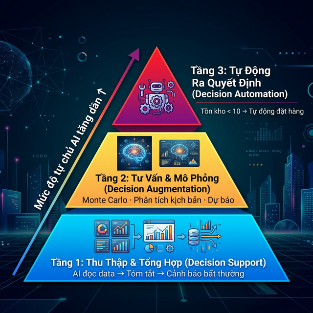

# Chương 6: Cố Vấn Định Mệnh — Ứng Dụng AI Trong Việc Ra Quyết Định Kinh Doanh (Decision Support System)

*(Từ "Cảm tính đắt đỏ" đến "Trí tuệ Nhân tạo dựa trên Dữ liệu")*

---

## 1. Mở Đầu: Phòng Họp Cuối Năm Và "Thuế Cảm Tính" Của Lãnh Đạo

### 📖 Câu Chuyện Thực Trạng: "Ông Vua Đệm" Và Quyết Định Cắt Giảm 1 Tỷ Đồng

Công ty Cổ phần Đệm Thái Dương (Giả định) là một hãng sản xuất đệm lớn khu vực phía Bắc. Vừa trải qua một mùa hè ế ẩm, Giám đốc điều hành (CEO) tên Thắng triệu tập cuộc họp Khẩn cấp toàn ban Giám đốc vào tháng 10.
Nhìn vào bản báo cáo doanh thu đỏ chót, Thắng gõ tay lên bàn, quyết định chớp nhoáng: *"Ngay lập tức cắt giảm 1 tỷ đồng quỹ Quảng cáo ngưng chạy Facebook Ads. Tháng sau chúng ta tung chương trình Mua 1 Tặng 1 để đẩy tồn kho"*.

Trưởng phòng Marketing rụt rè định can ngăn, nhưng nhìn vẻ mặt đanh thép của Sếp, anh đành nuốt lời.

Tháng 11 ập đến, chương trình Mua 1 Tặng 1 khởi chạy rầm rộ tại cửa hàng. Nhưng doanh thu vẫn tiếp tục lao dốc thêm 20%. Không những thế, đối thủ cạnh tranh là Đệm Ngọc Tú thừa cơ "chết sóng" Quảng cáo của Thái Dương, đã tung ra dòng Đệm Bông Ép Mới chiếm trọn khách hàng tìm kiếm trên mạng. Thái Dương mất trắng thị phần.

**Tại sao CEO Thắng lại đưa ra quyết định chết người đó?**

Bởi vì anh đang mắc phải 3 loại **Định Biến Thẩm Định (Cognitive Biases - Sai Lệch Nhận Thức)** kinh điển trong Kinh Tế Học Hành Vi (Behavioral Economics):

1. **Action Bias (Bệnh Phải-Hành-Động):** Đứng trước khủng hoảng, thay vì bình tĩnh đi tìm nguyên nhân (Cần khảo sát vì sao Khách không mua). CEO thường vội vã đưa ra quyết định "Cắt giảm" hoặc "Khuyến mãi" cho có cảm giác mình Đang Kiểm Soát Tình Hình.
2. **Sunk-Cost Fallacy (Chi phí chìm):** Ôm một đống hàng Tồn, không dám bán lỗ 10%, mà quyết định "Tặng 1" (Bán lỗ tỷ lệ lớn hơn) vì ảo tưởng thu hồi vốn.
3. **Availability Heuristic (Bẫy Sự Sẵn Có):** Nghe bạn bè Sếp bảo: "Quảng cáo FB dạo này đắt lắm, chạy kém". Sếp lập tức vin vào đó để cắt ngân sách Marketing, bất chấp việc Dữ liệu Khách hàng mua đệm của công ty lại đến 80% từ kênh Facebook.

Sự thật khốc liệt là: **Hơn 70% quyết định của Giám Đốc SME Việt Nam được đưa ra hoàn toàn bằng Cảm Giác (Gut Feeling) và Trải nghiệm Cá nhân (Past Experience).**

Doanh nghiệp đóng đô trên "Thuế Cảm Tính". Mỗi một quyết định sai lầm, Lãnh đạo lại trả thuế bằng xương máu của hàng ngàn nhân sự. Giải pháp duy nhất là phải chuyển dịch từ **"Trực Giác"** sang **"Lá Chắn Dữ Liệu" (Data-Driven Decision Making - DDDM)**.

Nhưng Sếp hay xua tay: *"Thôi em ơi, SME Data lằng nhằng rác rưới thế này, lấy đâu ra phòng Data Scientist lương 40 triệu mà phân với chả tích?"*

Đây chính là mảnh đất Dụng Võ Huyền Thoại nhất của **Antigravity**. Agentic AI không chỉ là Công nhân Gõ chữ. Ở Chương này, bạn sẽ học cách biến nó thành một **Luật Sư Ác Quỷ (Devil's Advocate)** — Một Cỗ máy Phản biện Quyết định Lạnh Lùng, Cầm Cân Nảy Mực Dựa Trên Số Liệu Tuyệt Vực.

---

## 2. Tháp Trí Tuệ Quyết Định: 3 Tầng Giao Phó Cho Đại Lý AI (Agentic DSS)

Giới Kinh tế học Phương Tây (như Gartner) đã khuyên: Đừng bao giờ giao cho AI Quyền bấm nút Bắn tên lửa (Full Autonomy). Thay vào đó, hãy phân loại cấp độ Tương tác Giữa Não Sếp và Máy tính.

### 🛡️ Tầng 1: Lọc Phễu Và Bơm Thông Tin (Decision Delegation)

*Cách mạng hóa quá trình: Ai mới là người nhìn ra vấn đề sớm nhất?*

Mỗi ngày, bạn nhận được 5 file Excel doanh số và rụng luôn 100 email của đại lý báo cáo. Bộ não con người rất lười biếng, bạn thường lướt xuống Dòng Cuối Cùng xem "Tổng Tiền" để phán: *"Tháng này ổn"*. Bạn đã bỏ qua Hàng loạt Còi Hú Nho Nhỏ.

**Giao thức AI:**
Đừng dùng trí óc để Scan (Quét) rác. Bạn ra lệnh cho Agentic AI cắm 1 cái Script (Mã chạy tự động) 21h00 mỗi tối. AI dùng thuật toán `K-Means Clustering` và Toán học Thống kê (Standard Deviation) quét ngầm.
Nó sẽ hốt các thông tin Thập Cẩm, lọc sạch rác và Bơm Lên Màn Hình Sếp đúng 2 gạch đầu dòng báo động:
*"Báo cáo Sếp: Tổng tiền giữ nguyên, NHƯNG: Chi nhánh 3 sụt giảm 15% trong 5 ngày liên tiếp; Trong khi Cửa hàng 1 lại tăng vọt 30% một cách bất thường (Nguy cơ hết hàng cục bộ)."*
Sếp đọc Màn Tóm Tắt này và Quyết định Đổi Quản Lý Trạm 3 ngay lập tức. Đây gọi là Lọc Phễu.

### 🛡️ Tầng 2: Cố Vấn Tăng Cường Tầm Nhìn (Decision Augmentation)

*Thay vì Gọi cấp dưới vào phòng họp để "Gật đầu", Hãy Gọi AI vào để nó Cãi Lại.*

Nhược điểm kinh điển của hệ thống Nhân Sự Cấp Trung là họ Rất Sợ Làm Mất Lòng Sếp. Nếu Sếp Thắng hỏi: *"Cắt giảm Quảng cáo FB có ổn không em?"*, nhân viên xoa tay: *"Dạ, em thấy thị trường cũng bảo hòa, Cắt để tiết kiệm cũng tốt sếp ạ"*. Nhân sự chỉ nói những điều Sếp Thích Nghe (Confirmation Bias).

**Giao thức AI:**
Tại đây, Antigravity chính là "Kẻ Phản Biện Hoàn Hảo". Nó Không Nhận Lương, Không Sợ Bị Đuổi Việc, và NÓ NÓI BẰNG TOÁN HỌC. Bạn đưa Ý tưởng Tăng Giá/Giảm Giá của bạn cho AI. Bắt nó Phân tích Rủi ro Mô phỏng. Khoe Lạc Quan Trăm Triệu, Đọc Xong Quyết Định Sẽ Lành Lạnh Đáy Lòng. (Xem cách Setup ở Dưới).

### 🛡️ Tầng 3: Tự Động Hóa 100% (Decision Automation)

*Giao quyền Giết Sát cho những Việc rập khuôn không còn giá trị Thêm Nghĩ.*

Sếp là Vua. Vua thì không đi kiểm tra xem Trong bếp còn bao nhiêu bó Rau Cái.
Nếu Sếp mở chuỗi Food/F&B. Cứ Khách mua 10 Ly Trà Sữa là Hết 2Kg Trân Châu. Khi Trân Châu trong kho chạm mốc 5Kg (Mức Min_Inventory_Level).
Sếp KHÔNG ĐƯỢC PHÉP NHÍCH TAY VÀO QUYẾT ĐỊNH MUA HÀNG NỮA.
Cài đặt cho Bộ Mắt Xích KiotViet + API Antigravity: Cứ Hàng chạm ngưỡng Min, Script Python tự động nã Email hoặc Chat Zalo Bot cho Đại Lý Bán Sỉ: *"Cho cửa hàng Nam Giao thêm 50kg Trân châu chiều nay"*. Điểm Chạm Sinh Tử (Closed-Loop Procurement) Đã Bị Xóa Bỏ. Giải Thoát cho Ban Giám Đốc.

---

## 3. Guideline Giao Việc Đỉnh Cao: Sudo Prompt Ép AI Vẽ Kịch Bản Tăng Giá Sự Cố (Pricing Dilemma)

Bức Cung AI là nghệ thuật để nó nhả ra Căn Cứ Trí Tuệ. Trở lại Vị Sếp Bán Máy Lọc Nước. Mùa Lạnh đang đến, Sếp kẹt trong Bế Tắc: *"Tính Toán Tăng Giá Lõi Lọc Thêm 12% Bù Trượt Giá Lạm Phát, Nhưng Rất Sợ Khách Đi Mua Chỗ Lõi Khá Khác Rẻ Hơn."*

Thay vì tung đồng xu, Sếp mở Antigravity lên và cắm Quyền Uy Nhập Thế:

> **SUDO PROMPT: CHIẾN DỊCH KIỂM TOÁN CHÍNH SÁCH NHẢY GIÁ (DECISION SUPPORT SYSTEM)**
>
> 👑 **[VAI TRÒ & NGỮ CẢNH]**
> Cương Vị Của Bạn: Trưởng Ban Cố Vấn Định Giá Chuyên Sâu (Senior Pricing Strategist) - Kẻ mang trong mình Hệ tư tưởng Của Lý thuyết Trò Chơi (Game Theory).
> Thách thức Vĩ Mô: Tôi định MÀO HIỂM nhấp lệnh Tăng Giá 12% Phụ kiện Lõi Lọc từ ngày 01/11. File dữ liệu Hành vi Khách quá khứ (5 năm) đang nằm tại: `/Data_DoanhNghiep/Lich_Su_Ban_Khach.csv`.
>
> ⚙️ **[MẠNG LƯỚI 3 ẢI KIỂM CHIẾU QUYẾT ĐỊNH (DATA AUGMENTATION)]**
>
> 👨‍💻 **[Agent 1 - Máy Tính Hệ Số Co Giãn Nhu Cầu - Price Elasticity Của Toán Học]**
> Chạy Thư Viện OLS (Ordinary Least Squares) bằng Python Thống Kê. Nhai Nuốt 50.000 Giao dịch Lịch sử của File Input.
> Nhiệm Viện: Chạy Mô Hình Hồi Quy (Regression Model). Khám Phá xem: Từng Có Đợt nào tôi đã tăng/giảm Lõi Lọc chưa? Hãy Trả Lời Biến Số Cô Đọng: "Hệ số Elasticy Của Lõi Lọc Của Công Ty Tôi Bằng Mấy? (Nếu Elasticity < -1: Đồng nghĩa Tăng 1% Giá => Lượng Khách Rụng Lớn Hơn 1%).
>
> 🕵️‍♂️ **[Agent 2 - Cỗ Máy Đoán Viễn Cảnh Tương Lai (Monte Carlo Simulation)]**
> Lấy Hệ Số Co Giãn Từ Thằng Agent 1 về. Lập Trình Giả Lập Tương Lai: Nếu Tôi Nhấn Nút Tăng 12% Giá Thì:
> Giả định (Scenario) A: Đối thủ giữ nguyên giá -> Khách Của Tôi Rụng Bao Nhiêu %?
> Giả định (Scenario) B: Khách rụng nhưng Biên Lợi Nhuận Gộp Trêm Tiền (Margin) Chênh Giá Cao -> Vậy Bức Thư Lợi Nhuận Tổng Cuối Tháng Là Xanh (Lãi Kép Thêm) Hay Đỏ (Lỗ Thảm Trọng Mất Thị Phần Yêu Thương)?
>
> ✍️ **[Agent 3 - Kẻ Tuyên Án Cuối Cùng (The Final Advisor)]**
> Dùng Matplotlib Vẽ 2 Đường Cong Xu Hướng Cắt Nhau Hình Chữ X Biểu Diễn "Đường Biến Thiên Định Giá" Và "Đường Thu Nhập Trực Tiếp Giảm". Xuất Tệp Hình Ảnh `Decision_Pricing_Matrix.png`.
> Dùng Tính Năng Báo Cáo Ephemeral Nã Xuống Notification Terminal Máy Tôi: Khuyến Nghị: **LÀM, CHỜ, HAY HỦY? CHỨNG MINH 1 CÂU! LÀM ĐI ĐẶC VỤ YÊU QUÝ!**

12 Giây Sau. Lịch sử Doanh nghiệp rùng mình. Antigravity nhồi Thư Viện Toán Khủng lướt qua hàng Vạn Dòng Số Liệu Vỡ Vuợn mà Excel con người Không Thể Tính.
Bức ảnh `Decision_Pricing_Matrix.png` hiện lên Cực Gắt Có Ghi Chú Của AI: *"Đừng dại Khởi động Lệnh Tăng 12%. Hệ Số Elastic_Score của Sếp là -1.8. Cứ Nhích Giá 10%, Lượng Bán Sụt Gần 20%. Tổng Lãi Lỗ cuối tháng Sẽ Giảm Ít Nhất 88 Triệu Nếu Đối Thủ Ở Yên. HỦY KẾ HOẠCH NÀY TRUÓC KHI ĐỐI THỦ ĐÁNH CHẶN!"*

Dây Thần Kinh Của Sếp Mới Thực Sự Đoạt Quyền Cảm Tính Của Đám Đông Hội Đồng Quản Trị.

### ✅ Kết Quả Mẫu (Expected Output)

Sau khi Antigravity chạy xong Sudo Prompt ở trên, Sếp sẽ nhận được:

**File 1: `Decision_Pricing_Matrix.png`**

- Biểu đồ 2 đường cong cắt nhau hình chữ X:
  - Đường Xanh: "Biên lợi nhuận gộp" — tăng khi giá tăng.
  - Đường Đỏ: "Lượng khách hàng" — giảm khi giá tăng.
  - Điểm cắt nhau (Break-even) ở mức tăng 6.5% giá.

**Phản hồi AI (in đậm trên Terminal):**
> *"📊 KẾT QUẢ MÔ PHỎNG MONTE CARLO (10.000 lần giả lập):*
>
> - *Hệ số Elasticity Lõi Lọc: **-1.8** (Elastic → Tăng giá sẽ mất nhiều khách).*
> - *Scenario A (Đối thủ giữ giá): Tăng 12% → Lượng bán sụt ~20% → Lỗ ròng 88 triệu/tháng.*
> - *Scenario B (Đối thủ cũng tăng): Tăng 12% → Lượng bán sụt ~8% → Lãi thêm 12 triệu.*
> - *🔴 KHUYẾN NGHỊ: **HỦY kế hoạch tăng 12%**. Nếu muốn tăng, mức an toàn tối đa là **6%** (break-even point)."*

*(Xem thêm: [Skill Phân Tích Quyết Định](../skills/phan_tich_quyet_dinh/SKILL.md) — Skill được thiết kế sẵn cho nghiệp vụ Decision Support System.)*

### 🔧 Troubleshooting Ra Quyết Định Bằng AI

| Sự Cố | Nguyên Nhân | Giải Pháp |
| :--- | :--- | :--- |
| Hệ số Elasticity ra kết quả vô lý (VD: +5.0) | Dữ liệu lịch sử quá ít (<100 giao dịch) hoặc có outlier | Thêm: *"Trước khi chạy Regression, hãy loại bỏ outlier (giá trị nằm ngoài 3 σ). Nếu data < 200 dòng, cảnh báo: 'Dữ liệu chưa đủ tin cậy'."* |
| Monte Carlo cho kết quả khác nhau mỗi lần chạy | Bản chất của simulation ngẫu nhiên (stochastic) | Thêm: *"Set random seed `np.random.seed(42)` để kết quả reproducible. Chạy ít nhất 10.000 iterations."* |
| Biểu đồ không hiện được trên Terminal | Matplotlib cần display backend | Thêm: *"Dùng `plt.savefig()` lưu file PNG thay vì `plt.show()`. AI sẽ lưu file và thông báo đường dẫn."* |
| AI đưa ra khuyến nghị quá tự tin ("Chắc chắn lãi") | Thiếu ràng buộc về độ tin cậy (confidence interval) | Thêm Hàng rào: *"Luôn in kèm Confidence Interval 95%. Nếu khoảng CI quá rộng, ghi rõ: 'Kết quả không đủ tin cậy để ra quyết định'."* |

---

## 4. Checklist Quyền Lực Dành Cho Board Of Directors (BOD)

Sếp à, Đôi khi thứ Giữ Sự Ổn Đinh Phát Triển Bền Vững (Sustainalibity) Lại Đến Từ Việc Không Ra Quyết Định Chẳng Đi Về Đâu Nào.

**Khi Tranh Cãi Xảy Ra Trong Cuộc Họp Giám Đốc Trưa Nay (Nên Mở Đại Lý Hoặc Chạy Ads 500tr?):**

- **[ ] Dừng Tranh Cãi Bằng Mồm Cảm Tính.** Ai cũng cho mình đúng bằng "Trực giác Mười Năm Kinh Nghiệm". Yêu cầu Nhân sự Xuất File Raw (Tiến trình File Thô) Lịch Sử Quá Khứ của Công Ty Ra Ngay Bàn.
- **[ ] Chạy Mô Hình Khảo Cứu Rủi Ro Ngược Giao Cho AI (Reverse Risk Validation).** Thay vì hỏi AI "Làm cách này lãi thế nào?". HÃY HỎI NÓ: *"Cùng File số liệu này. Giả sử tao mở Quán Tiền Gốc này, Mày tìm cho tao Góc Thê Thảm Nhất Có Thể Sai Là Gì? Biến X Nào Mày Tính Ra Tao Chưa Chú Ý? Nghĩ Kiểu Kẻ Thu Của Tao Coi Mày!"*.
- **[ ] Tách Ranh Giới Việc Của Não (Não Tướng) VS Việc Của Cơ Bắp Toán Rập Khuôn (Tay Máy AI).** Sếp quyết định bằng Tầm nhìn Trái tim của Ngành Hàng, Nhưng Không Thể Tính Bất Chấp Định Luật Con Số. "Đưa AI Vẽ Dashboard Đường Cắt BI Đỏ Cảnh Báo" là cách Cố Vấn Rắn Và Sang Lì Lợm Nhất Mà Cổ đông Bạn Trả Tiền Cho Nó Mua Giải Pháp Này Cho Công Ty Sếp.

Đừng làm Tướng Gặp Thời. Hãy làm Khổng Minh Đo Quẻ Đo Trận Bằng Toán Có Căn Cứ Antigravity Hệ Số Chắc Ăn 80%. Nhờ Bộ Bọc Nhớ Kiến Thức Trăm Năm (Knowledge Bases - RAG).

⏭ *(Chúng ta Sẽ Tổ chức Hệ Sinh Thái "Công Cụ Có Sẵn - Nhấn Là Ăn Xổi" - Siêu Thư Viện **Workflows & Skills Module** Ở Chương 7 Kế Bên. Nơi Không Có Sudo Mệt Não Mọi Lúc, Ở Đây Kho Chứa Đóng Gói Nhập Viện Chỉ Chờ Bạn Pick Nhạc Khởi Động Trại Cày Số Đỏ Của Doanh Nghiệp Của Bạn).*

---

## 📚 Tài Liệu Tham Khảo
