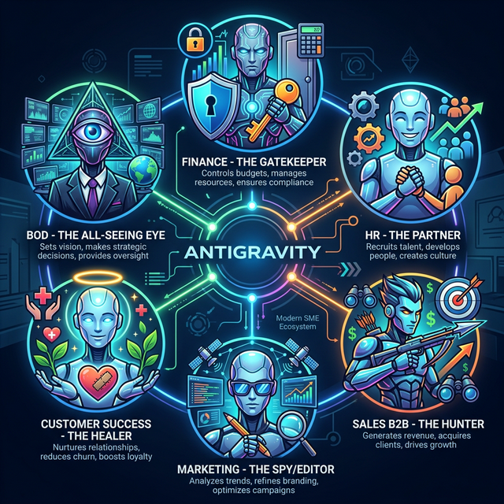

# Chương 6: Ma Trận Nhân Sự Ảo — Tái Định Nghĩa Khối Văn Phòng Bằng Các "Đặc Vụ Số"

*(Khi AI không còn là Công Cụ (Tool), mà trở thành một Nguồn Lực Nhân Sự thứ hai (Workforce) nhận Mệnh lệnh và lĩnh KPIs)*

---

## 6.1. Bảng Tiêu Chuẩn Giới Hạn Của Chương

> [!IMPORTANT]
> Chương này là bản đồ thực thi: Chuyển dịch từ việc "Sếp làm tất cả" sang "Sếp chỉ huy dàn nhạc Đặc vụ số" (Orchestration).

- **🎯 [Mục Tiêu Chương] (Objective):** Đập bỏ quy trình vận hành giấy tờ mục nát. Cấy ghép trực tiếp Antigravity vào 6 phòng ban cốt lõi (Finance, HR, Sales, MKT, CS, BOD) như một Trưởng phòng Data thứ hai.
- **📥 [Đầu Vào] (Input):** Yêu cầu Trưởng phòng Liệt kê 3 quy trình tốn nhiều thời gian nhất (Data Entry).
- **🚀 [Đầu Ra] (Output):** Sở hữu 6 Bảng Mô tả công việc (Job Description) chi tiết gán cho AI, kèm file Sudo Prompt để chạy tức thì.

---

## 6.2. Mở Đầu: Chấm Dứt Kỷ Nguyên "Lấy Cần Cù Bù Công Nghệ"

Rất nhiều Lãnh đạo SME đang sai lầm khi nhìn nhận AI như một phần mềm tiện ích, kiểu như "Mua thêm một bản Microsoft Word xịn hơn để nhân viên gõ chữ". Sự thật tàn khốc là: AI hiện đại (Agentic AI) được vận hành bằng Antigravity **không phải là Công Cụ**, nó là **Nhân Sự**.

Thay vì mua một cái búa để báo Khối Văn phòng gõ đinh nhanh hơn, bạn đang cấp cho nhân viên một "Cỗ máy cơ khí tự động" biết tự cầm cái búa đi gõ đinh hằng ngày.

Để tận dụng triệt để Quyền lực của Antigravity, Lãnh đạo doanh nghiệp phải đập bỏ tư duy "Dùng AI để Hỏi đáp văn thơ" và thiết lập một **Ma Trận Nhân Sự Ảo (AI Department Matrix)**.
Nghĩa là: Giao cho AI một vị trí, một Chức danh (Job Title), và ép nó gánh vác một nhóm công việc cố định với ROI đo lường được bằng tiền mặt.

Dưới đây là Bản vẽ Cấu trúc 6 Phòng Ban cốt lõi của một SME, và cách Máy móc "ngồi" vào từng bộ phận để san bằng những rào cản vận hành mục nát.

> [!WARNING]
> **Cảnh báo sinh tử:** Theo McKinsey Q1/2025, 50% Giao dịch Back-Office toàn cầu đã được tiếp quản bởi Agentic AI. Doanh nghiệp của bạn sẽ chết ngộp trong giấy tờ hay bay vọt lên Đám mây? Câu trả lời nằm ở khả năng "chuyển xác" nhân sự từ Nhập liệu sang Kiểm duyệt.

---

## 6.3. [Cách Làm Chi Tiết & Hướng Dẫn] Giải Phẫu Ma Trận Nhân Sự AI Trong 6 Phòng Ban Cốt Lõi



### 🏦 2.1. Phòng Kế Toán & Tài Chính (Finance) - "Người Gác Cổng Dữ Liệu Lạnh Lùng"

**Ý nghĩa chiến lược:**
Kế toán là chốt chặn cuối cùng của dòng tiền, nhưng cũng là nơi dễ tổn thương nhất bởi "Lỗi gõ nhầm số 0 rụng rời" và sự mệt mỏi lúc 2h sáng (vào mùa quyết toán). AI sẽ đảm nhận vai trò **Data Gatekeeper (Người Gác Cổng)**, vô cảm, chính xác tuyệt đối, và không bao giờ thỏa hiệp trước sự chênh lệch (Lệch dù chỉ 1,000 Đồng cũng báo cáo).

**Nhiệm vụ gán cho AI (Job Description & Lệnh thực thi):**

- **Sát Thủ Nhập Liệu (Auto-OCR):** Đọc quét hàng ngàn file Hóa đơn đỏ (PDF/Bản chụp Scan) hàng cuối tháng. Xé rách văn bản để bóc tách **Mã Số Thuế, Tiền Hàng, VAT** và nhả thẳng thừng thành các cột Tự động trên File Excel/MISA. *(Vũ khí: Hệ thống Vision Agent)*.
- **Thanh Tra Đối Soát Cước:** So khớp chéo chằng chịt hàng chục ngàn dòng giữa File Hãng Giao Hàng (J&T/GHN/Viettel) với Sao kê Ngân hàng (Bank Statement). File nào lỗi, dòng Data nào thiếu 5,000đ, lệnh cho AI tự động bôi nển Excel màu Đỏ Quạch và gửi thẳng về cho Kế toán trưởng duyệt cắt. *(Đọc chi tiết tại **Chương 6 - Data Pipeline**).*
- **Đốc Công Nhắc Nợ Tự Động:** Quét toàn bộ Công nợ Đáo hạn Lãi Ngân hàng / Nhà cung cấp và Lập trình Email bắn thẳng thông báo báo động cho Sếp trước 7 Ngày.

> 💻 **SUDO PROMPT BỎ TÚI CHO PHÒNG KẾ TOÁN**
> Đừng bắt Kế toán gõ lệnh dài dòng. Hãy cho họ lưu mẫu lệnh này thành file Workflow `/doi-soat-cong-no` để dùng hàng tháng:
>
> ```yaml
> "Nhập vai Kế toán trưởng 10 năm kinh nghiệm. Đọc file Sao_ke_Thang_10.csv và file Giao_hang_T10.xlsx. 
> 1. Tìm ngẫu nhiên tất cả các Mã Vận Đơn bị Lệch Tiền. 
> 2. Tính lại Giá cước (Trừ đi 5% phí trả kho). 
> 3. Xuất kết quả ra 1 bảng Markdown gồm các cột: [Mã Vận Đơn] | [Tiền Chênh Lệch] | [Lý Do Nghi Vấn Lệch]. 
> Nếu phát hiện dòng nào thiếu đúng 12.000đ, hãy flag ĐỎ (Bôi đậm) dòng đó vì 90% là sót phí Đóng Gói."
> ```

### 👥 2.2. Phòng Nhân Sự & Hành Chính (HR/Admin) - "Đối Tác Chiến Lược Không Cần Ngủ"

**Ý nghĩa chiến lược:**
Giải phóng bộ phận HR (Nhân sự) khỏi cảnh "Đầu tắt mặt tối ngồi dọn rác thủ tục giấy tờ" để tiến thân thành Đối tác Chiến lược của Giám đốc (HRBP). Ngừng việc trả lương 15 Triệu/T để bắt Cử nhân đi làm những thao tác bấm máy lặp đi lặp lại.

### 👣 Quy trình 3 bước "Khai tử" rác hồ sơ Tuyển dụng bằng AI

**Bước 1: Quy hoạch Barem (Rubric)**

- 📋 Soạn một file văn bản liệt kê 5 tiêu chí sếp cần (Kinh nghiệm > 2 năm, Biết SQL, Ưu tiên ở gần công ty...).

**Bước 2: Triệu hồi "Thợ săn CV"**

- 📁 Nạp toàn bộ CV (PDF/Image) vào một thư mục trên máy. Mở Antigravity và gọi lệnh lọc:
  > *"Đọc 500 CV này, chấm điểm theo Barem đã cho. In ra 50 người cao điểm nhất kèm lý do lựa chọn."*

**Bước 3: Tự động hóa tiếp nối**

- 🚀 AI sẽ vứt các ứng viên "vàng" vào thư mục `/To_Interview/` và tự động gửi Email mời phỏng vấn cho họ qua MCP Gmail.

### 🗡️ 2.3. Phòng Sales B2B & Phát Triển Kinh</br>Doanh - "Thợ Săn Hủy Diệt Cõi Mạng"

**Ý nghĩa chiến lược:**
Bộ phận Sales là mũi nhọn của công ty (Sự sống còn của SME). Nỗi trăn trở lớn nhất của Cấp quản lý Sales không phải là lính mình Chốt sale kém, mà là **KHÔNG CÓ LEAD ĐỂ MÀ GỌI**. Antigravity sẽ trở thành **Thợ Săn Hủy Diệt (Mass-Hunter)** mang về vô tận nguồn Data.

**Nhiệm vụ gán cho AI (Job Description & Lệnh thực thi):**

- **Binh Đoàn Cào Data Xuyên Đêm:** Ban lệnh dùng Sub-Agent Browser vác cuốc xẻng âm thầm rảo quanh Website Danh bạ Doanh nghiệp, LinkedIn, Yellow Pages. Nhặt nhạnh hàng loạt Tên Giám Đốc, Quy mô vốn, SĐT, Email của các Doanh nghiệp Mục tiêu trên thị trường Đổ thành File Excel Giao Cho Salesman "Bào Số". *(Đọc chi tiết tại **Chương 5 - Mega Projects**).*
- **Kho Pháo Cold Email Trích Lọc Đích Danh:** Tự động phát động chiến dịch "Email Lạnh" Bủa Vây Hàng nghìn đối tác mới. Mỗi email viết ra đều chèn tinh vi Tên Riêng, Tên Công Ty và Ngành Nghề của Đối Tác (AI Tự Build Context). Súng liên thanh nhưng Đạn là Của Riêng Từng Người Nhận.
- **Robot Gen Báo Giá Tức Thời:** Khách hàng quăng File Excel hàng hóa Nhập Khẩu phức tạp. AI quét, Lookup Giá Nội bộ Công ty Cấp Chiết Khấu Định Danh và Nhả File Báo Giá PDF Tuyệt Vời chưa đầy 60 giây. Thắng thầu bằng Tốc độ Phản Hồi Điện Xẹt.

> 💻 **SUDO PROMPT BỎ TÚI CHO KHỐI SALE B2B**
> Hãy cắm lệnh này vào Browser Agent trước khi tan làm, sáng hôm sau Sales đã có khách để gọi:
>
> ```yaml
> "Vào google.com.vn, tìm cụm từ 'Công ty may mặc xuất khẩu tại bình dương'. 
> Mở 20 kết quả đầu tiên. Đọc trang Liên hệ/About Us của từng công ty. 
> Trích xuất [Tên Công Ty], [Email người đại diện], [Số Điện Thoại]. 
> Bỏ qua các trang vàng (Trang Vàng VN). 
> Dùng module Mail của bạn, tự động gửi 1 Cold Email mẫu số 1 chào bán Dịch Vụ Vận Tải Logistics cho các Email quét được. Chèn chính xác Tên Công Ty của họ vào Tiêu đề Email."
> ```

### 📢 2.4. Phòng Marketing & Truyền Thông (Growth) - "Tổng Biên Tập Kiêm Điệp Viên Cài Cắm"

**Ý nghĩa chiến lược:**
Content Marketing là ngành dễ bị AI lấy mất chén cơm nhất, nhưng cũng là ngành hưởng lợi siêu ngạch thặng dư to nhất. AI tại Marketing không chỉ "Viết văn dạo đẻ chữ rẻ tiền", AI đóng chức **Spy (Điệp viên)** & **Editor (Trưởng ban Cắt Gọt)**.

**Nhiệm vụ gán cho AI (Job Description & Lệnh thực thi):**

- **Điệp Viên Tình Báo Đạp Giá (Price Tracker):** Bắt AI chạy Cảnh vệ Mạng (Web Watcher) quét sạch Cửa hàng Shopee, Tiki, Lazada của Đại lỳ Đối thủ. Giật ngay 1 tin cảnh báo Đỏ Quạch ném vào Group Chat Slack nếu phát hiện Đối Thủ Dám "Flash Sale Đạp Giá Giá Trần" trong đêm.
- **Auto-Content Engine (Máy Bơm SEO Bài Viết Đại Trà):** Cáo biệt việc bỏ Tỷ Đồng Mua Traffic Phễu. Ra lệnh Nuốt Dàn ý Bài viết Top 1, Top 2 Google của Website Mạnh Nhất Ngành. Tự động Phản Biện lại và đẻ ra Bản "Móc Họng Đối Thủ" Dài 3,000 Từ Nhét Đầy Backlink/Keywords Thượng Hạng Cắm Rễ lên Khung Trăng Lên Top 0 Bing/Google.
- **Cỗ Máy Bắt Mạch Sentiment Dư Luận:** Phân tích Sentiment Review. Cào toàn bộ 1,000 Cái Đánh Giá Chửi Rủa 1 Sao Trên Google Maps/Facebook Page. Ném cho LLM đọc và nhả về Bản Tóm Tắt 1 Dòng Duy Nhất: *"Khách Dám Chửi Vì Nhân Viên Giao Hàng Quá Xấc Xược"*.

### 🛡️ 2.5. Phòng Chăm Sóc Khách Hàng (Customer Success) - "Luồng Gió Chữa Lành Thần Tốc"

**Ý nghĩa chiến lược:**
Khách hàng Giận dữ vì Chất Lượng Kém Hàng Lỗi Rất Ít, mà đa số Họ Gào Thét Giận Dữ Vì Bị Bỏ Rơi Không Trả Lời. Việc đẩy Tốc độ Phản hồi CSKH (Response Time) Về Mức **Miniseconds (Phần Nghìn Giây)** giúp Doanh nghiệp thoát mọi án Khủng Hoảng Truyền Thông Ác Tính Nhất.

**Nhiệm vụ gán cho AI (Job Description & Lệnh thực thi):**

- **Sức Mạnh Tự Nhận Thức Lỗi Đánh Máy:** AI Tự chữa lành (Cognitive Automation). Khách hàng cộc cằn gõ Zalo: *"Cái ĐCM đơn 5H mã 139A44 bị hư miển gữi trả hở shop"* (Viết tắt bậy rát, sai lỗi chính tả nát bét). AI vẫn tự thấu kết Ngữ Nghĩa (Intent), chọc Vận Đơn và Đảo Phản hồi Dạ Thưa Xoa Dịu Hoàn Hảo. *(Đọc chi tiết tại **Chương 10 - Tự Động Hóa Nhận Thức**).*
- **Đội Phân Truyền Chữa Cháy (Auto Draft):** Kho bị cháy nổ. Email đổ dồn đe dọa. AI đọc 300 Mail chửi bới, đẻ ra 300 Thư Trả Lời Xoa Dịu Giọng Văn Hạ Mình Sát Đất (Chèn Gấp E-Voucher Xin Lỗi Mềm Mỏng). Sếp duyệt List Excel Xong, Hệ thống Auto-Send Trả Lại Lòng Tin Lập Tức.
- **Trảm Đứt Ác Ý Khách Lừa Đảo Bằng Lằn Ranh Veto:** Nếu bắt chẩn đoán được 1 "Khách Bùng Lừa Đảo Ép Hoàn Tiền", Luật Bọc Đạo Đức (Ethic Veto Guardrail) của Máy dứt khoát Khóa Hoàn Tiền. Đẩy Lệnh Hỏa Tốc cho Phán Xử Cấp Cao (Manager). *(Tận Hưởng Quyền Lực Chặn Lỗ Đất Lớn ở **Chương 12 - Đạo Đức AI**).*

### 👑 2.6. Ban Giám Đốc (BOD) & Vận Hành Khối (IT/COO) - "Nhãn Quan Thấu Thị (Omniscience)"

**Ý nghĩa chiến lược:**
Mục đích của Giám Đốc Cài đặt AI không phải để Thu Dọn Mớ Rác Vụn Thao Tác Chuột của Nhân Viên. **Tầm Nhìn Cấp BOD Là Cầm Ngai Vàng Ra Quyết Định Kinh Doanh To Lớn Dựa Trên Dữ Liệu Tươi Ròng (Live Data)**. Triệt tiêu hoàn toàn Khái Niệm *"Vâng Báo cáo của Sếp Ngày 5 Cuối Tháng Mới Có Ạ"*.

**Nhiệm vụ gán cho AI (Job Description & Lệnh thực thi):**

- **Cổng Hút Máu Trực Tiếp MCP (Live BI Dashboard):** Dùng Giao Diện Chat để Đặt Câu Hỏi Dữ Liệu. AI Trực tiếp dùng Cần Cẩu Database (MySQL / Redis) Rút Báo Cáo. Phun ra Hình Biểu Đồ Thống Kê Doanh Thu Đổ Sập Ngay Tại Giao Diện Terminal Chỉ Bằng 1 Lệnh Prompt Chữ Đơn Sơ Của Sếp Mù Code. *(Chuyên Sâu Tại **Chương 9 - MCP Giao Hiệp Kết Nối Hệ Thống**).*
- **Phản Biện Kinh Doanh Tàn Bảo Khốc Liệt (Devil's Advocate):** Ném Bản Kế Hoạch 100 Cửa Hàng Nhượng Quyền Vào Cho Máy. Xài Nút Lệnh Gắn Mác LLM Mày Hãy Làm "Tên Dã Thú Đối Điểm Đâm Nháp Bản Kế Hoạch". Máy bẽ đôi Kế Hoạch Và Vạch Trần 4 Điểm Đứt Gãy Rỗng Ruột Chết Người Tưởng Ngon Nhưng Thực Chào Máu Lãnh Địa Của Ngân Hàng.
- **Mô Phỏng Tài Trợ Sống Chết (Monte Carlo Risk Assess):** Nếu Sếp Đạp Giá Trảm 10% Bắt Trận Đại Dịch Mới Hậu Covid. Thì Công Ty Cầm Cự Được Mấy Tháng Trước Khi Phát Động Cắt Lương Nhân Sư? Trò Chơi Xác Suất Đỉnh Cao Mô Phỏng 10,000 Kết Quả Khả Dĩ Để Né Khe Cửa Sập Cháy Túi Tiền Công Ty. *(Bùng Nổ Tiện Ích Ở **Chương 7 - AI Múa Dữ Liệu Bàn Cờ Tướng BOD**).*
- **Đội Trưởng Lạnh DevOps Kỹ Thuật (Sạch Lỗi Code):** 2h Sáng Đêm T7 Đuối Code Mỏi. Đánh Slash Command `/deploy-server` trên Giao Điện Hệ Thống. AI Thức Giấc. Commit Build Kéo Chập Nhất Docker. Pushing Image Lên EC2. Kiểm Test Nhanh. Slack Tin Báo Đỏ Rực Ổn Định Lên Cho Nhóm Dev.

---

## 6.4. [Kết Quả Đầu Ra & Processing] Bảng Năng Suất Nghiệm Thu Bằng Số Liệu

Sau khi ốp Khung Ma Trận này vào 6 Phòng Ban, đây là kết quả SME của bạn sẽ thu về được (Expected Processing Output):

> [!TIP]
> **ROI Thực Tế:** Một SME điển hình có thể tiết kiệm tới **140 giờ công/tháng** chỉ bằng cách áp dụng 3 quy trình cốt lõi ở Kế toán, HR và Sales. Đây không phải là viễn tưởng, đây là toán học.

---

## 6.5. [Kết Luận & Action Items] Lời Tuyên Hệ Của Cải Cách Vận Hành

Toàn bộ Kịch Bản 6 Ma Trận Trên không hề Hư Cấu. Mọi Cấu Trúc Khối Lệnh Bóc Cứng Hóa Đơn, Cú Soát Excel, Vét Data LinkedIn Đều Đã Nạp Khóa Ở Thực Tiễn.

Cuộc Cải Cách Vĩ Đại Máy Tính Không Nhắm Tới Việc Cắt Giảm Chi Phí Sa Thải Toàn Bộ Nhân Viên Con Người. Cuộc Cải cách Chôn vùi Đi Lớp "Chân Sai Vặt", Nhập Liệu Thừa Mứa Chuyển Xác Khối Các "Trợ Lý Bấm Phím Mù" Lên Tầm Các Nhà Điều Quân (Human Command Manager) Phân Giao Chỉ Tiêu Hưởng KPI Tối Thượng Với Hàng Bình Pháo Đặc Vụ Đã Nhét Kín Ở Hậu Tuyến.

SME Nhờ Lớp Ma Trận AI Này Sở Hữu Lại Sự Nhỏ Gọn Bén Nhanh, Không Chết Bởi Chi Phí Thuê Bãi Bề Thế Công Kềnh Trì Trệ.

⏭ *(Tiếp theo: **Chương 07: Skills & Workflows** - Nơi chúng ta bắt đầu xây dựng đập thủy điện cho dòng chảy dữ liệu của bạn).*

---

## 📚 Tài Liệu Dẫn Theo Mạch Kế Hoạch

- Muốn Xài Các Khối Skills Nhai Bốc CV HR, Giữ Báo Cáo: Vào [Phụ Lục Prompt Bắn Mẫu Đỉnh Cao](phu-luc-prompt-multi-agent.md).
- Thử Lần Chạy Antigravity Tốt Nhất Xem Xem Có Nhập Chắn Nhanh Được Tại: [Bài 0 Mở Đầu](00-gioi-thieu-antigravity.md).
