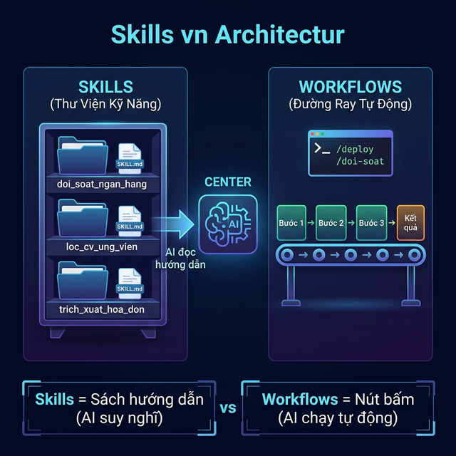
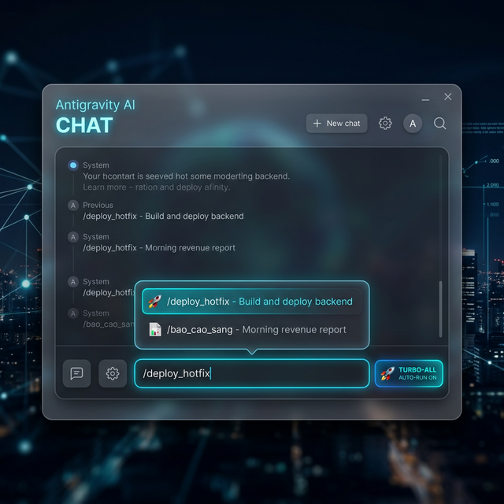

# Chương 8: Cảnh Giới Của Sự Bất Tử — Đóng Gói "Trí Nhớ Tổ Chức" Bằng Hệ Thống Skills & Workflows

---

## 1. Lời Mở Đầu: Tội Ác Của Việc "Mất Trí Nhớ Cục Bộ" Môi Trường Làm Việc

### 📖 Câu Chuyện Thực Tế: Di Sản Của Anh Trưởng Phòng Nghỉ Việc

Một công ty Truyền thông G có anh Trưởng phòng Media tên Kiên. Kiên rất giỏi. Mỗi khi Sếp yêu cầu: *"Kiên, làm báo cáo chiến dịch tuần này"*, Kiên chỉ mất 30 phút. Anh ta biết phải tải số liệu Ads từ 3 nguồn (Facebook, Google, TikTok), biết dùng hàm Excel nào để lọc Data rác, và biết dùng phần mềm nào để vẽ ra một cái Biểu đồ đẹp mắt.

Một ngày nọ, Kiên nghỉ việc vì được đối thủ săn đón.

Người thay thế là cậu Junior mới ra trường. Sếp vẫn giao yêu cầu cũ: *"Làm báo cáo chiến dịch tuần này"*. Cậu Junior loay hoay mất 3 ngày. Báo cáo làm ra sai bét nhè, biểu đồ xấu xí. Sếp nổi điên.

**Vấn đề ở đây là gì?**
Công ty G đang trả lương cho "Não bộ của anh Kiên", chứ không phải xây dựng "Não bộ của Công ty". Khi anh Kiên bước ra khỏi cửa, anh ta mang theo toàn bộ **Trí Nhớ Cơ Bắp (Muscle Memory)** và **Bí Típ Nghề Nghiệp (Know-How)** đi mất. Công ty lại "Mất Trí Nhớ", phải học lại từ đầu với nhân sự mới.

Điều này đang lặp lại Y HỆT với cách các doanh nghiệp dùng Trí Tuệ Nhân Tạo (AI) hiện nay.

Hầu hết mọi người khi dùng ChatGPT/Claude đều mắc một sai lầm: **Giao việc theo kiểu "Mất Trí Nhớ"**.
Thứ Hai, bạn gõ 1 cái Prompt dài 1 trang A4: *"AI ơi, tôi có tệp Data này. Hãy làm sạch nó theo 5 Bước sau... Bước 1: Rút ruột Cột A... Bước 2: Dọn dẹp Cột B..."*. AI làm rất tốt.
Đến Thứ Hai tuần sau, bạn có một tệp Data mới. Bạn lại lóc cóc Copy Paste lại nguyên cái Prompt 1 trang A4 đó để dạy AI thêm một lần nữa.

Đó giống như bạn có một nhà máy hiện đại, nhưng mỗi buổi sáng sếp phải xuống xưởng dạy lại cho Robot cách vặn từng con ốc. Hệ thống AI của bạn không hề học được gì sau mỗi lần thực thi.

Với **Antigravity**, chúng tôi từ chối sự Ngu dốt đó. Chúng tôi mang đến cho bạn quyền năng lưu trữ "Chất Tủy" của doanh nghiệp vĩnh viễn thông qua 2 Cấu trúc Tối Toàn: **SKILLS (Kỹ năng Dạy AI Suy Nghĩ)** và **WORKFLOWS (Quy trình Dạy AI Bấm Nút).**

### 🏢 Ma Trận Nhân Sự Ảo Đa Phòng Ban

Thay vì miêu tả AI chung chung, hãy nhìn cách hệ thống Agent được "cắm" chốt chặn vào đúng từng vị trí thiết yếu trong công ty, để giải quyết một chuỗi hành động xuyên suốt (Workflow Chaining):

* **Bộ phận Sales/Kinh doanh (Người chốt đơn):** AI không chỉ trả lời câu hỏi vu vơ mà biết đi đọc trực tiếp các bảng giá (`san_pham.xlsx`, `chiet_khau.xlsx`), tự động ráp công thức biên độ VAT, chiết khấu theo hạng khách hàng, và lập tức tạo ra file PDF/Excel chuẩn Form công ty. Sales con người thoát cảnh bấm máy tính nhầm giá. Khách chốt deal $\rightarrow$ **Agent 1** (Tạo Báo Giá) nhả file.
* **Bộ phận Marketing/CSKH (Người giữ chân khách):** Kế thừa kết quả từ Sales, **Agent 2** (Email Marketing) nhận file báo giá kèm chân dung khách hàng $\rightarrow$ tự động lên nháp Email đính kèm file, cá nhân hóa lời chào gọi đúng tên khách. Cùng lúc đó, **Agent 3** (Phân tích Review) cào dữ liệu Shopee/Google vẽ ra Word Cloud để theo dõi xem tệp khách này đang Khen gì/Chê gì. Khách chê $\rightarrow$ Agent Auto gửi Mail đính kèm Voucher xoa dịu.
* **Ban Giám Đốc/CFO (Người cầm lái):** Số liệu được đổ dồn về Dashboard. Sếp không cần đọc số lắt nhắt, chỉ cần ném ra 1 giả thuyết: *"Nếu tháng sau tăng giá bán lên 10% thì sao?"*. **Agent 4** (Hỗ trợ ra quyết định) sẽ không đoán mò, nó sẽ kéo Data 6 tháng qua đi qua mô hình Monte Carlo, hồi quy tuyến tính (Regression) để trả về 3 phân cảnh rõ ràng: Kịch bản Lạc Quan, Trung Bình, và Rủi Ro Xấu Nhất. Tất cả được chạy hoàn toàn tự động bằng Python trong vài chục giây.

---

## 2. SKILLS (Thư Viện Kỹ Năng): Đúc Khuôn "Nhân Tài Dữ Liệu"



### Giải Phẫu Khái Niệm Business

Hãy nghĩ về **Skills** như một **"Lệnh Bài Cẩm Nang"**. Khi bạn tuyển một Tạp vụ mới, bạn đưa cho cô ấy một cuốn sổ tay: *"Lúc 8h lau bàn, lúc 9h đổ rác"*. Tạp vụ chỉ cần giở sổ ra cắm cúi làm, bạn không cần phải tháp tùng cô ấy.
Skills là Các Thư Mục (Folder) Cẩm nang chứa các Tệp Báo Cáo Markdown (`SKILL.md`) hướng dẫn AI cách làm một nghiệp vụ khó.

Ở tổ chức cũ, bạn có 4 Nhân sự chủ chốt. Ở tổ chức AI-First, bạn có **4 Bộ Skills Cốt Lõi**:

| Phòng Ban SME | Tên Mã Skill AI | Dòng Chảy Hành Vi Của Skill | Điểm Cắt Lỗ Của Công Ty (ROI) |
| :--- | :--- | :--- | :--- |
| **Nhân Sự (HR)** | `loc_cv_ung_vien` | Quét Thư mục CV -> Đọc Rubric Điểm (JD) -> Scan Text PDF -> Gán Điểm Lọc Đạt/Không Đạt. | Không còn tuyển nhầm người nói phét. Tiết kiệm 45 tiếng đọc CV hàng tháng. |
| **Kế Toán** | `doi_soat_ngan_hang` | Đọc Sao Kê (PDF) vs Phần mềm Bán Hàng (CSV) -> Quét Mã -> Cảnh Báo Lệch Tiền Tô Màu Đỏ | CFO ngủ ngon vì 100% Tiền Rụng được phát hiện tự động. |
| **Marketing (Data)** | `cao_gia_doi_thu` | Tự kích hoạt Browser Subagent lướt Shopee/Tiki -> Kéo Data Đối thủ -> Alert giá Flash Sale | Quyết định Vận động Giá theo chiến thuật Arbitrage thời gian thực. |
| **Marketing (Nội dung)** | `viet_bai_chuan_seo` | Đọc File Từ Khóa -> Quét Top 10 Google qua MCP -> Viết Bài 2000 chữ -> Nhúng Ảnh Mô tả | Tiết kiệm 10,000,000 VNĐ tiền thuê Content Freelancer mỗi tháng. |
| **Marketing (Growth)** | `nuoi_duong_lead_crm` | Lọc Data Khách Lạnh CRM -> Phân tích Insight theo Ngành -> Sinh Chuỗi 3 Email Thuyết Phục | Tăng tỷ lệ mở Email lên 40%, kéo Data rác thành Cuộc gọi Tư vấn. |
| **Sales B2B** | `lap_bao_gia_auto` | Khách nhắn tên món -> AI Tính biên độ Lợi nhuận sàn -> Generate File PDF gửi Mộc Hợp Đồng | Chu kỳ chốt đơn (Sales Cycle) giảm từ 5 Ngày xuống 1 Phút. |

Cái Đỉnh Cao của Hệ thống này: Sếp chỉ cần thuê 1 Cố vấn thiết kế 4 cái Tệp tin Skill này MỘT LẦN DUY NHẤT. Sau đó lưu vào Kho Mạng (Folder `/skills/`).
Từ đó về sau chục năm, cô Kế toán chỉ cần nói 1 câu cụt lủn với Antigravity: *"Em ơi, chạy Skill Đối Soát Ngân Hàng cho chị nhé!"*. Cỗ máy tính tự mở Sổ Tay ra đọc, và viết Python phay nát đống Số liệu. Dù cô Kế Toán 5 năm kinh nghiệm có nghỉ việc, cô Kế Toán 1 tháng rưỡi Vào Làm Cũng Kích Hoạt Được Cỗ Máy Xử Lý Thuế Thần Tốc Này. **Đó mới là Quản Trị Tri Thức (Knowledge Management).**

💡 **Sự Cẩn Trọng Chết Mệnh Của Skill**:
Điều làm cho những hệ thống Skill này có lợi thế tuyệt đối ở doanh nghiệp thực tế là **Nguyên Tắc "Human-in-the-loop" (Luôn Đi Kèm Sự Cho Phép Chốt Điểm Của Con Người)**.

* Agent Phân Tích Quyết Định chỉ chạy giả lập số liệu và in ra Cảnh Báo Lạc Quan - Bi Quan, quy định sinh tử là: *"Chỉ Đưa Ra Khuyến Nghị, Quyền Chốt Quyết Định Xuống Tiền Hoàn Toàn Do Lãnh Đạo Con Người Khớp Phiên"*.
* Agent Email Marketing được chốt cấu trúc Code phải tự động nhét *"Nút Hủy Đăng Ký (Unsubscribe)"* theo Đạo Luật Chống Spam để bảo vệ an toàn danh tiếng miền Doanh Nghiệp. Agent Làm Báo Giá bị gán điều khoản Bất Khả Thể Xóa: *"Luôn Phải Append Dòng Chữ (Giá Chào Hàng Này Chỉ Có Hiệu Lực Tính Tạm Ra 15 Ngày)"*. Máy móc chạy hoàn toàn trong hành lang An sinh Pháp Lý Gắt Gao Của Con Người!

### ✍️ Sudo Prompt Điển Điển: Sai Việc AI Tự Viết "Sổ Tay Skill" Cho Mình

Cái hay nhất: Sếp không phải tự xắn tay Viết File Cẩm Nang. Sếp Gọi AI tự định nghĩa Lại Nó.

> **SUDO PROMPT: LẬP TRÌNH NHÂN CÁCH VÀ KỸ NĂNG VĨNH CỬU**
>
> 👑 **[QUYỀN LỰC VÀ MỤC TIÊU CỐT LÕI]**
> Cương Vị Xuyên Suốt: Kiến Trúc Sư Tri Thức Tổ Chức.
> Hành Động: Bạn hãy Tự Đẻ ra Cẩm nang Dạy chính Mạng lưới AI Tương lai của Bạn.
>
> ⚙️ **[MẠNG LƯỚI KHỞI TẠO LUẬT (SKILL FORGE)]**
>
> **[Agent Lõi]**
> Hãy dùng lệnh Code tạo ngay cho tôi một thư mục `/skills/cham_soc_vip_rfm/`. Trong đó đẻ ra 1 tệp `SKILL.md`.
> **Nội dung Sổ tay (File .md do bạn sinh ra phải chứa cấu trúc sau):**
>
> 1. [Khung Tiêu Đề Frontmatter]: Khai báo Tên Kỹ năng "Phân tích Khách Hàng VIP Độc Nhất Vô Nhị". Mô tả rõ để AI hiểu.
> 2. [Vùng Hành Động Lõi]: Dạy AI cách Dùng Công cụ Đọc File Giao dịch Nội Bộ. Sau đó Dạy nó cách áp dụng Mô hình Toán Học R.F.M (Recency - Frequency - Monetary). (Hãy ghi rõ Công thức Hướng Dẫn Kính Nghiệp Cụ Thể của RFM ra để Lứa AI sau Đọc Cẩm nang hiểu Chấm điểm Số 5 là Vip, Điểm 1 là Chết).
> 3. [Output Bắt Buộc]: Dạy nó xuất Data Excel tô Xanh Khách Mua Hàng Siêu VIP, Lập Danh sách Khách sắp Mất để Cứu vớt.
> Ranh Giới: Viết Sổ tay cực kỳ Chuyên Sâu, Nghiêm Túc Bằng Markdown để Trí Tuệ Sau Này Có Thể Dựa Vào Đó Tái Tạo Môi Trường Python Thành Công 100%.

Máy chủ báo Ping. File `SKILL.md` ra đời. Năng Lực Trí Não của Giám Đốc Sales Vừa Được Bất Tử Hóa Thành Mã Lệnh Truyền Đời Của Công Ty SME.

**Vạch Trần "5 Whys" Của Cấu Trúc Khai Lập Trí Nhớ Này:**

1. **Làm gì?** Biến Trí tuệ của 1 Cá nhân Xuất sắc thành Tài sản Vĩnh cửu của Công ty định dạng `.md`.
2. **Tại sao AI lại tự đẻ ra AI?** Con người viết Prompt thường lan man thiếu logic hệ thống cấu trúc mảng. Gọi Agent Sinh Code chuyên nghiệp tự đúc Cẩm Nang Markdown sẽ tạo ra Hệ Sinh Thái Tự Hành chuẩn xác nhất.
3. **Tại sao có Ranh Giới?** Ngăn chặn Ảo Giác Máy: RFM tính sai đi 1 điểm sẽ hủy diệt tài khoản Khách VIP. Sổ tay SKILL phải là Sắt Đá Không Cảm Xúc.
4. **Trường hợp lỗi?** Nhân viên gọi nhầm File SKILL. Máy sẽ từ chối chạy nếu Data Input không khớp với chuẩn đầu vào trong Cẩm Nang.
5. **Dòng Tiền đến từ đâu?** Kế thừa Nguyên Chóp Kỹ Năng Nhân Viên Cũ Mất Việc Bỏ Lại. Nhân sự Mới vào làm chỉ Cần Nhấn Chạy SKILL mà Không cần Phải Mọc Não. Giảm 100% Phí Đào Tạo (Training Cost).

---

## 3. WORKFLOWS (Đường Ray Tự Động): Phép Lưỡi Dao "Slash Command" Một Chạm

Nếu SKILLS là Bách khoa Toàn Thư (Bắt AI Phân tích Nghĩ suy), thì **WORKFLOWS là Công Tắc Điện (Bắt AI Bấm Nút Không Quan Não).**

Đây là sự Lười Biếng Cực Đoan Của Nhà Quản Trị Hệ Thống.
Bạn thiết lập Một Đường Ray chạy Tự Động Đầu cuối Đầu (End-to-end Pipeline). Lưu dưới Đường dẫn `workflows/{ten_lenh}.md` (hoặc đường dẫn ẩn `.agents/workflows/{ten_lenh}.md`).
Sáng hôm sau, Bạn Chỉ mở giao diện Antigravity Gõ đúng 1 Nút Tắt (Slash Command): `/bao_cao_sang`. Phần còn Lại Máy tự lo Lệnh Diễn Tiến.

### Bí Típ Thiết Kế Xương Sống Workflow Chuẩn Mực Bằng Lệnh Khóa Hãm: `// turbo-all`

Để Antigravity Chạy Bằng Vận Tốc Của Sấm Sét Mà Không Bị Hỏi Lại ("Sếp ơi em chạy Script này có được không?"). Bạn Đính kèm Bùa Chú Khai Ấn Khóa: `// turbo-all`.

### Cấu Trúc Lõi Của 1 File Workflow Giá Trị Tỷ Đồng (Ví dụ Auto Deploy Code)

*(Được thiết kế bởi Trưởng Bộ Phận DevOps IT nhằm Giải thoát Team Khỏi Các Việc Đóng Gói Thủ Công)*

```markdown
---
description: [THẦN CHÚ] Nút Bấm Xây Dựng Và Phát Hành Server Không Downtime Tiêu Chuẩn 5 Sao
---

# Lộ Trình Sắt Đá: Cấm Hỏi Lại, Thi Hành Gấp Cho Máy Chủ Đích

// turbo-all (Đây là Ấn Chú Xác Thực Sếp Cấp Phép Cho AI Cày Lệnh System Hành Tội Bất Chấp Không Cần Xin Lệnh Mở Rào).

Chào Tướng Quân Thực Thi AI Của Tôi. Khi tôi Đụng Lệnh Gọi Triệu Hồi Workflow Này, Máy Lập Tức Thi Hành Án Theo Trật Tự 4 Bước Tử Trận Dưới Hầm Mỏ Terminal:

1. Lao Thẳng Khung Trấn Vào Mảng Backend Dự Án Lõi Của Công ty:
   `cd /applications/commerce_v2`
2. Kéo (Pull Branch Mới) Lực Lượng Code Giao Kết Tại Bản Đích Mới Nhất Và Build Phiên Bản: 
   `git pull origin master && npm i --silent && npm run build:prod`
3. Gọi Docker Phán Giải Bản Cũ Bằng Docker-Compose:
   `docker-compose up -d --build --remove-orphans web_backend`
4. Cảnh Báo An Toàn Thành Cáo Hệ Thống (Notify):
   Hãy Hướng Hệ Thống Bàn Giao Terminal Đẩy Cửa Sổ Ephemeral Alert Xuống Màn Hình Antigravity: "BÁO CÁO CỤNG LY: SERVER STAGING ĐÃ ĐƯỢC MỜI CHÀO UPDATE 100%!".
```

**Thực Hành Trực Tiếp Mệnh Lệnh Phím Tắt (Slash Command) Bằng Giao Diện Chat**

**Bước 1: Gọi Hồn Workflow Bằng Dấu Gạch Chéo**
Bạn vào khung Chat của [Antigravity](https://antigravity.google). Gõ dấu `/` (Slash). Ngay lập tức, một Menu Menu xổ lên (Autocomplete) gợi ý mọi Workflow đang có trong tổ chức của bạn.
Giám đốc Công nghệ bấm chọn `/deploy_hotfix`. Xung quanh ô nhập văn bản có hiện nút xanh nhỏ: `TURBO-ALL: AUTO-RUN ON`.
Nhấn Enter.



**Bước 2: Mỏ Neo Turbo Toàn Năng (Sự Tin Tưởng Bậc Cao Đầu Cuối)**
Bởi vì file Workflow ở trên có Bùa chú Khai ấn `// turbo-all`, Chatbot không hề hỏi lại: *"Sếp có chắc chắn muốn Tắt Server Cũ Không?"*.
Nó Im lặng, và Live Terminal nhả ra 4 dòng Log xanh mượt:

* `cd /applications/commerce_v2`
* `git pull origin master... DONE`
* `docker-compose up -d... DONE`
Hệ thống bắn về một khung Nhắn Tin (Alert): *"BÁO CÁO CỤNG LY: SERVER STAGING ĐÃ ĐƯỢC MỜI CHÀO UPDATE 100%!"*

**Kết Quả Chuyển Hóa Cán Cân Tổ Chức:**

* **Trước đây:** Máy chủ Lỗi Khẩn Cấp. Sếp Bốc điện thoại réo gọi Dev đang đi team-building ở Sapa lúc 2h sáng bắt mở Laptop dò Code hằng giờ.
* **Bây Giờ:** Sếp tự mở điện thoại, truy cập Antigravity, gõ đúng chữ `/deploy_hotfix`. AI Sửa xong Lỗi Server Trong Vòng 8 Giây Đêm Tối. Quyền năng khôi phục hệ thống giờ nằm Tối cao trong tay Nhà Lãnh Đạo Kỹ Thuật Số. Sự phụ thuộc con người kết thúc!

### Sư Phân Cực: KHI NÀO SẾP XÀI "SKILLS" - KHI NÀO DÙNG "WORKFLOWS"?

Đừng Đem Dao Mổ Trâu Đi Giết Gà. Ghi Nhớ Sách Lược Hai Dao Phương Thức:

| Vạch Ranh Giới Chiến Dịch | Đạo Cụ: THE SKILLS (Kỹ năng Lõi) | Cỗ Xe Tăng: THE WORKFLOWS (Slash Commands) |
| :--- | :--- | :--- |
| **Độ Tự Do Của AI (Autonomy)** | AI Có Quyền "Sáng Tạo Ngữ Cảnh" (Tự Nghĩ Hàm Code Python Tuỳ Tình Hình Trạng Data). | Bị Xích Chân. Cấm Suy Nghĩ Lệch Nền. Dăm Dắp Bước 1, Bước 2, Bước 3 Kiểu Bash/CLI Script. |
| **Khi Nào Thì Kích Hoạt Nổi?** | Hệ Cơ Chế Suy Luận Hoàn Hảo (Nó Tự Biết Cần Chạy Cẩm Nang Nào Khi Nghe Lệnh Giao Task Của Bạn Ở Dạng Text Tư Duy). | Sếp Bắt Buộc Gõ Nút Enter /Lệnh_Này Thì Máy Mới Khởi Trận Đánh Bằng Công Tắc Vật Lí Điện Tử. |
| **Vai Trò Áp Dụng Điển Hình Cấp Bách** | Kế Toán Phân Tích Lỗ/Lãi Nhiều Biến. Tuyển Dụng Nhân Sự Chấm Điểm Ứng Viên Nghệ Thuật Ngữ Nghĩa (NLP). Dĩ nhiên Rất Thông Sinh Động. | Đẩy Source Code GitHub. Làm Lệnh Chạy Báo Cáo Sáng Gửi Tin Nhắn API Lên Telegram Mọi Chuyện Lập Đi Lặp Lại Hoàn Trọng Hoàn Thiện. |

---

### Hướng Dẫn Kích Hoạt & Cách Sử Dụng Workflow

Để biến Antigravity thành một cỗ máy chạy tự động theo lệnh, bạn chỉ cần thực hiện 3 bước đơn giản:

1. **Tạo Thư Mục Chứa Lệnh:** Trong thư mục dự án của bạn, thiết lập một folder tên là `workflows/` (hoặc `.agents/workflows/` nếu muốn ẩn đi).
2. **Khai Báo Kịch Bản (Workflow File):** Tạo các file Markdown (`.md`) chứa quy trình thực hiện. Ví dụ: `bao-cao-tuan.md`, `kiem-tra-chat-luong.md`. **Tên file này (viết thường, dùng dấu gạch ngang) chính là câu lệnh bạn sẽ gọi**. Trong file, hãy dùng định dạng YAML frontmatter để mô tả (`description: ...`).
3. **Kích Hoạt Bằng "Slash Command":** Bất cứ khi nào cần chạy, bạn chỉ cần gõ `/ten-file` (ví dụ: `/bao-cao-tuan`) vào khung chat. Hệ thống sẽ tự động tìm đúng file đó và buộc Agent phải thi hành từng bước một như một Mệnh Lệnh Quân Sự.

**💡 Mẹo Pro (Quyền Lực Turbo):**

* Khi Agent chạy một lệnh Terminal (Bash command) can thiệp vào hệ thống, nó thường rụt rè dừng lại và hỏi bạn: *"Sếp có cho chạy lệnh này không?"*.
* Để phá bỏ rào cản này, hãy thêm dòng chữ `// turbo` ngay phía trên bước chứa lệnh Terminal mà bạn muốn tự động chạy.
* Nếu muốn **Toàn quyền Tự động (Auto-run All)** mọi lệnh trong xuyên suốt toàn bộ Workflow mà chẳng muốn bị làm phiền phút nào, hãy chép bùa chú `// turbo-all` vào bất kỳ đâu trong file (thường đặt ở đầu file).

---

### Danh Sách Workflows Mẫu Cho Doanh Nghiệp SME

Dưới đây là một số ý tưởng Workflow "ăn tiền" mà các Giám đốc/Trưởng phòng có thể ném ngay vào Antigravity để tiết kiệm hàng trăm giờ đồng hồ mỗi tháng:

**1. Workflow: `/onboard-nhan-vien` — Mời AI Làm Giám Đốc Đào Tạo (Trainer)**

* **Mục đích:** Khởi tạo không gian làm việc và Đào tạo chuyên môn cho nhân sự mới trong 3 ngày đầu mà Sếp không cần tốn một phút mở lời.
* **Tiến trình AI thực thi:**
  1. Chạy Script Bash khởi tạo tài khoản Email nội bộ công ty $\rightarrow$ Cấp quyền truy cập 3 thư mục dự án trên Google Drive.
  2. Auto-gửi Email chào mừng đính kèm *Sổ tay Văn hóa* và *Bộ Quy chuẩn KPI*.
  3. **Đỉnh cao của AI Onboarding:** AI tự đóng vai trò là "Người hướng dẫn". Nó gửi tin nhắn cho nhân viên mới: *"Chào em, anh là Bot Quản lý Khối Sales. Kế hoạch tuần 1 của em là đọc File A, File B. Em hãy đọc xong và trả lời 3 câu hỏi Test sau cho anh..."*.
  4. Nếu nhân viên trả lời sai $\rightarrow$ AI kiên nhẫn giải thích lại kiến thức lịch sử sản phẩm. Trả lời đúng $\rightarrow$ AI Cấp quyền truy cập vào Hệ thống CRM.
  5. Sếp chỉ nhận được 1 báo cáo cuối tuần: *"Nhân sự mới Nguyễn Văn A đã vượt qua bài Test Văn hóa, tốc độ hòa nhập: Xuất sắc"*.

**2. Workflow: `/phan-tich-doanh-thu` (Dành cho Kế Toán/CFO)**

* **Mục đích:** Chốt số liệu và vẽ biểu đồ kinh doanh cuối tháng nhanh gọn nhẹ.
* **Tiến trình AI thực thi:** Quét sạch thư mục chứa các file Data (CSV/Excel) trút từ máy POS $\rightarrow$ Gom nhóm doanh thu theo khu vực, đại lý $\rightarrow$ Chạy Python (Matplotlib) để vẽ 3 biểu đồ (Tròn, Cột, Line Chart xu hướng) $\rightarrow$ Trích xuất báo cáo Markdown đưa ra Cảnh báo các mã hàng Tồn Kho/Lỗ ròng.

**3. Workflow: `/tao-proposal` (Dành cho Sales B2B)**

* **Mục đích:** Tự động sinh Hồ sơ Năng lực (Pitch Deck) Tùy chỉnh theo Từng Khách hàng.
* **Tiến trình AI thực thi:** Nhận tên Khách hàng mục tiêu từ bạn $\rightarrow$ Bật Browser Subagent đi dò la Website khách hàng $\rightarrow$ Kéo thông tin Ngành nghề, Vấn đề của khách trộn với File Template Proposal sẵn có $\rightarrow$ Thay Logo, Sửa chữ $\rightarrow$ Xuất ngay File PDF hoặc Docs sạch sẽ tinh tươm để Sale gửi đi chốt deal.

**4. Workflow: `/kiem-tra-suc-khoe-web` (Dành cho IT/Marketing)**

* **Mục đích:** Giám sát Website công ty xem có bị "chết" (downtime) hay vỡ giao diện không.
* **Tiến trình AI thực thi:** Ping đến URL website trang chủ $\rightarrow$ Dùng Browser Agent truy cập và chụp ảnh màn hình Landing Page $\rightarrow$ Kiểm tra các thẻ SEO, quét tốc độ load trang cơ bản $\rightarrow$ Báo cáo tổng thể xem có lỗi 404 (Không tìm thấy) hay đứt gãy kết nối không.

**5. Workflow: `/dang-bai-social` (Dành cho Content/Media)**

* **Mục đích:** Tự động "Xào nấu" nội dung và Phân phối Đa nền tảng.
* **Tiến trình AI thực thi:** Đọc tệp Bài viết Dài (Long-form) từ file Draft $\rightarrow$ Triệu hồi Mô hình AI nhằm Convert bài gốc thành 3 phiên bản: *Version Facebook* (ngắn, chèn Emoji icon), *Version LinkedIn* (cấu trúc nghiêm túc, chuyên môn), *Version TikTok* (Kịch bản Video ngắn) $\rightarrow$ Lưu ra 3 file Markdown riêng biệt.

**6. Workflow: `/phan-tich-doi-thu` (Dành cho Trưởng phòng Marketing)**

* **Mục đích:** Bắt AI làm Điệp viên Tình báo, mổ xẻ chiến lược mồi nhử của Đối thủ cạnh tranh trực tiếp.
* **Tiến trình AI thực thi:**
  1. Yêu cầu bạn nhập URL Landing Page của Đối thủ.
  2. Kích hoạt *Browser Agent* truy cập vào Landing Page đó. Đọc trọn vẹn Nội dung Sales Page, Bảng Giá, và Lời hứa (USPs - Unique Selling Propositions).
  3. Mở file `san_pham_cong_ty_minh.md` để đối chiếu chéo.
  4. Trả về báo cáo Cảnh giác: *"Đối thủ đang đánh mạnh vào chính sách Bảo hành 5 năm, trong khi mình chỉ có 2 năm. Tuy nhiên giá họ cao hơn 15%. Đề xuất chiến dịch Tháng này: Chạy Ads dập vào Điểm Mù Giá Cả của họ!"*.

**7. Workflow: `/chien-dich-cold-email` (Dành cho Marketing B2B / Growth Hacker)**

* **Mục đích:** Lục lọi Data Khách hàng rác để đào vàng, tự sinh chuỗi Email mồi câu không người can thiệp.
* **Tiến trình AI thực thi:**
  1. Trích xuất file `danh-sach-khach-hang-fail-thang-truoc.csv`.
  2. AI tự động chia nhóm (Segment): Nhóm Rớt vì Giá, Nhóm Rớt vì Tính Năng.
  3. Dùng Skill NLP (Xử lý Ngôn ngữ Tự nhiên) lập tức soạn ra 1 Chuỗi **3 Email Nuôi dưỡng (Drip Campaign) được cá nhân hóa** cho từng tập Khách:
     * *Email 1 (Tri ân)*: Thay vì chèo kéo, gửi tặng họ một Ebook/Báo cáo ngành nghề miễn phí.
     * *Email 2 (Gãi đúng chỗ ngứa)*: Đề cập khéo léo đến nỗi đau Giá/Tính năng của đợt trước và đưa ra giải pháp mới.
     * *Email 3 (Kích Giật Thần Kinh Call-To-Action)*: Hối thúc Book lịch họp Demo 15 phút với Voucher Trợ Giá 20% chỉ có giá trị 24h.
  4. Quăng 3 File Email này chuẩn bị sẵn sàng lên Folder Outbox. Sales gật đầu là tự động vút bay đi bằng cổng SendGrid.

**8. Workflow: `/seo-masterclass` (Dành cho SEOers / Content Marketing)**

* **Mục đích:** Đẻ ra một Bài viết Bách khoa Toàn thư Top 1 Google từ một Từ Khóa Tiếng Việt Cộc Lốc.
* **Tiến trình AI thực thi:**
  1. Bạn nhập lệnh `/seo-masterclass "Máy Xúc Lật"`.
  2. AI gọi MCP Cào Dữ Liệu lấy Top 10 bài viết đang rank cao nhất Google Việt Nam về cụm từ này. Phân tích Dàn Ý (Heading Structure) của đối thủ.
  3. AI gom nhóm (Clustering) Dàn ý, tự nhận diện "Khoảng trống Nội dung" mà đối thủ thiếu (Ví dụ: Đối thủ quên phân tích chi phí tiêu hao nhiên liệu).
  4. Bắt đầu phiên viết bài Dài Hơi (2000+ từ): Chèn thẻ Alt Text cho Hình ảnh, Nhét Semantic Keywords rải rác.
  5. Đánh giá kiểm duyệt nội dung (Check Plagiarism & AI Voice) ngay trên Trạm cục bộ trước khi ném nguyên File HTML sạch bóng cho bạn dán vào WordPress.

Sự sáng tạo là Vô Hạn. Chỉ cần **Bạn đúc kết được một Quy trình thành Văn bản (SOP)**, Antigravity sẽ chuyển hóa nó thành **Slash Command (Lệnh Gạch Chéo)**, túc trực phục vụ Bạn 24/7.

---

### 🔧 Troubleshooting Skills & Workflows (Giải Cứu Khi Kẹt Lệnh)

Đôi khi, Đâm lao theo luồng tự động (Workflow) sẽ vấp phải khúc gỗ giữa dòng. Đây là cách Sếp bắt bệnh nhanh khi AI bị kẹt ở màn hình Terminal đen thui:

| Bệnh Lý (Triệu Chứng Terminal) | Nguyên Nhân Cốt Lõi | Thuốc Giải (Lệnh Trị Thương) |
| :--- | :--- | :--- |
| **Workflow chạy tuột luốt, bỏ qua Bước 2** | AI bị "ảo giác tốc độ", tự cho mình quyền lướt bỏ lệnh Bash phức tạp | Thêm câu thần chú vào Markdown ranh giới: *"Cấm tuyệt đối bỏ qua bước này. Bắt buộc đợi Terminal trả về dòng `[SUCCESS]` MỚI ĐƯỢC CHẠY TIẾP lệnh số 3."* |
| **Terminal in ra lỗi Chữ Đỏ (Error Code 1) rồi đứng im** | File đầu vào bị sai đường dẫn, hoặc Thư viện Python chưa cài (`ModuleNotFoundError`) | Đừng hoảng hốt, gõ thẳng vào cửa sổ chat: *"Khắc phục lỗi này ngay lập tức, tự đọc Log và cài thư viện thiếu, sau đó chạy lại Bước số 3."*. AI sẽ gật đầu và tự sửa. |
| **AI báo: "Không tìm thấy Slash Command này"`** | File Markdown chưa nằm trong đúng thư mục `.agents/workflows/` | Kiểm tra lại cấu trúc Tệp tin. Chắc chắn rằng đuôi file là `.md` và bạn đã reload (tải lại) Antigravity để Bot nhận diện File mới. |
| **Cờ `// turbo-all` không có tác dụng, AI vẫn hỏi** | Bùa chú đặt sai vị trí hoặc vướng luật AI Governance chặn lệnh nguy hiểm (`sudo rm -rf`) | Chuyển chữ `// turbo-all` lên dòng đầu tiên. Hãy chắc chắn trong Prompt Cấu Hình hệ thống Sếp cài tính năng `SafeToAutoRun=True` cho các thư mục nghiệp vụ hằng ngày. |

---

## 4. Tổng Kết Cửa Giao Mùa

"Antigravity Không Sở Hữu Trí Nhớ Giới Hạn Của Ram Máy Tính. Nó Cấp Phép Cho Con Người Chúng Ta Mọc Thêm Một Não Bộ Bất Bại Trữ Của Công Ty".
Khi Thư mục `workflows/` và `/skills/` của Sếp Chứa Được Hàng Trăm Tệp Lập Lệnh Kỹ Trì Chuyện Ngành - Thì Dù Công ty Có Nghỉ Việc Một Nửa Nhân Sự Hỗ Trợ, Đội Giám Đốc Của Bạn Vẫn Hoạt Động Cỗ Máy Đều Như Vắt Chanh Bằng Sức Hoạt Động Không Giờ Nghỉ Của Nhân Sự 0 Đồng Của Siêu Thể.

Nhưng Với Kho Chứa Dữ Liệu Khủng Lồ (Từ Bản Khai Thuế, Hệ Thống Khách VIP... Cho Đến Source Code). Sếp Chắc Quỵ Lụyt Tâm Hồn Trăn Trở: *"Lẽ nào Con Trí Tuệ AI Này Nó Gửi Hết Data Mật Mất Lương Phạt Khách Hàng Mình Lên Máy Chủ Đám Mây Mạng Gốc (Cloud/OpenAI) À? Liệu Nó Bị Chọc Rỗng Ruột Bởi Prompt Injection Hacker Trộm File Thì Tôi Tiêu Tán Sự Nghiệp Thành Số 0"*?

⏭ *(Lật Cánh Cửa Bí Mật Sang **Chương 8: Luật Lệ Lõi - Bảo Mật Tuyệt Tôn Không Thể Sang Nhượng Bức Tường Lửa (AI Governance)** — Bài Mổ Phanh Rò Rỉ Data Giữ Kín Cửa Hầm Kim Cương Của Sếp Của Năm Sự Nghiệp Đời Trọng).*
