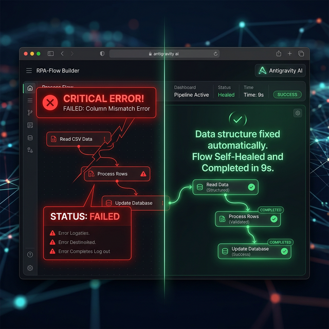

# Chương 10: Tự Động Hóa Nhận Thức (Cognitive Automation) — Kẻ Đào Huyệt Của RPA Truyền Thống

*(Sự khác biệt giữa một "Cỗ Máy Công Nghiệp Kém Cỏi" và "Trí Tuệ Tự Trị")*

---

## 1. Nỗi Đau Của Tự Động Hóa Truyền Thống (Zapier, UiPath, Make.com)

Khi nhắc đến "Tự động hóa", 90% các công ty SME nghĩ ngay đến việc thuê IT thiết lập các luồng Zapier, Make.com hoặc RPA (Robotic Process Automation). Sếp mua tài khoản Zapier 150$/tháng, hí hửng thiết lập luồng: *"Hễ có người điền Form Website $\rightarrow$ Tự động đẩy dữ liệu sang Google Sheets $\rightarrow$ Bắn tin nhắn qua Telegram cho Sales"*.

Bạn nghe có vẻ hiện đại? Nhưng thực tế, đây là **Tự Động Hóa Theo Luật (Rule-based Automation)**. Và nó chứa đựng một tử huyệt chí mạng: **Sự Gãy Giòn (Fragility).**

* **Thập Cẩm Dữ Liệu:** Zapier chỉ hiểu được Dữ liệu Có Cấu Trúc (Structured Data). Nếu khách hàng nhập số điện thoại là `0901.234.567` thay vì `0901234567`, hệ thống báo lỗi.
* **Gãy Vỡ Chỉ Vì Một Chữ Cái:** Chỉ cần nhân viên Sales lỡ tay đổi tên cột trong Google Sheets từ `SĐT` thành `So_Dien_Thoai`, lập tức toàn bộ Pipeline sụp đổ (Failed). Log báo đỏ chót. Kỹ thuật viên lại phải lọ mọ vào sửa Code.
* **Mù Lòa Quyết Định:** RPA chỉ biết "Bê Data Từ Chỗ A Sang Chỗ B". Nó không biết bức Email khách gửi có thái độ giận dữ hay vui vẻ để ưu tiên xử lý.

Đó là lý do tại sao các dự án tự động hóa thường thất bại sau 3 tháng. Sếp tức giận vì: *"Tự động kiểu gì mà suốt ngày phải nhảy vào cày lại cấu hình?"*

### 📋 Bài Test Nhỏ: Khi Nào Mua Zapier, Khi Nào Dùng Antigravity?

Để tránh lãng phí tiền bạc, Sếp hãy làm bài test 3 câu hỏi sau cho bất kỳ quy trình nào đang định tự động hóa:

1. **Đầu vào có chuẩn 100% không?** (Khách điền Form Google là chuẩn. Khách chat Zalo/Messenger là không chuẩn).
2. **Có tình huống rẽ nhánh bất ngờ không?** (Nếu chỉ lưu báo cáo là Không. Nếu phải xin lỗi khách vì giao trễ là Có).
3. **Có cần "Đọc và Suy Luận" không?** (Chỉ đếm số lượng là Không. Phải chấm điểm Thái độ nhân viên là Có).

**Kết quả:**

* Nếu cả 3 câu là BÊN TRÁI (Chuẩn, Không, Không) $\rightarrow$ Hãy dùng **Zapier/Make.com**. Nó rẻ, nhanh và sinh ra cỗ máy tĩnh.
* Nếu lọt 1 câu BÊN PHẢI $\rightarrow$ Bắt buộc dùng **Antigravity (Agentic AI)**. Khả năng tự luận sẽ cứu bạn khỏi hàng chục giờ bảo trì hệ thống.

---

## 2. Agentic Automation: Tự Động Hóa Bằng Màng Não (Cognitive Automation)

Antigravity không phải là Zapier. Nó là **Cognitive Automation (Tự Động Hóa Nhận Thức)**.

Thay vì lập trình "Nếu A thì làm B", bạn lập trình "Đây là Mục tiêu của tôi, hãy Tự tìm cách làm". Antigravity sử dụng **Mô hình Đại Ngôn Ngữ (LLMs)** làm Bộ Não Trọng Tâm để Điều hướng (Navigate) toàn bộ quy trình.

### ⚔️ 3 Trận Chiến Đánh Bại Tự Động Hóa Cũ

| Tiêu Chí Quyết Tử | RPA / Zapier (Cỗ Máy Lăn Cũ) | Antigravity AI (Quái Thú Tự Trị) |
| :--- | :--- | :--- |
| **1. Trận Quản Trị Đầu Vào** | Yếu Điểm. Khách gõ sai Form là ngỏm. Chỉ nhận CSV/Excel sạch. | Vô Địch. Ném nguyên cái Hóa Đơn Nhà Hàng bị nhòe mỡ, hoặc Email khách dài 3 trang viết sai lỗi chính tả. AI tự Đọc Hiểu và trích xuất đúng ý Sếp. |
| **2. Khả Năng Tự Chữa Lành Lỗi (Self-Healing)** | Màn hình Đỏ lòm: *"Error Column Not Found"*. Chờ con người vào fix luồng kéo/thả. | Tự Suy Luận Phép Tính: *"Sếp ơi, em thấy Cột 'SĐT' bị đổi thành 'Phone' rồi nhé, em tự Đổi Tên cột và chạy tiếp. Không Lỗi Lầm!"* |
| **3. Đi Đích (End-to-End Task)** | Chạy rẽ nhánh từ Web vào Sheet. Kết thúc. Con người vẫn phải mở Sheet lên lọc khách VIP. | AI từ Web vào Sheet $\rightarrow$ Soi dữ liệu RFM $\rightarrow$ Xác định luôn đây là Khách VIP $\rightarrow$ Tự soạn Hợp đồng PDF $\rightarrow$ Gửi Mail cho Sếp duyệt. Con người ra khỏi rìa lao động! |

---

## 3. Thực Chiến So Sánh Trên Giao Diện (UI)

Hãy xem cách Antigravity xử lý một ca mà mọi kỹ sư Zapier đều phải khóc thét: **Xử lý Khiếu Nại Hoàn Tiền Xuyên Nền Tảng.**

> **Tình Huống:** Một khách hàng tên Nguyễn Văn A mua đôi giày nhưng bị rách. Anh ta nhắn một cái tin hỗn loạn qua Zalo: *"Giày hôm qua mua ở chi nhánh X bị rách gót rồi mã đơn 12938 hoàn tiền cho tôi vào STK 888899 VCB"*.

**Nếu dùng RPA/Zapier:**

1. Chatbot tự động trả lời: *"Vui lòng điền vào Form hoàn tiền theo link sau:..."* (Khách chửi thêm vì hành trình phiền phức).
2. Không thể tự biết STK nằm ở đâu trong đoạn chat. Không thể check mã đơn có đúng không.

**Nếu dùng Antigravity (Cognitive Automation):**

1. Tiền Đề Hệ Thống nhận Text Zalo đổ về qua Webhook.
2. Não Bộ Kích Hoạt (Agent 1): Đọc hiểu sự việc: Nghệ thuật bốc tách Intent (Khiếu nại rách giày, yêu cầu hoàn tiền).
3. Đóng đinh Dữ Liệu (Agent 2): Tự trích xuất `Mã Đơn: 12938`, `Ngân hàng: VCB`, `STK: 888899`.
4. Gọi KiotViet API (Agent 3): Dùng MCP Server chọc vào ERP nội bộ, tìm mã 12938 xem đơn này có thật không, có mua hôm qua không?
5. Chốt Hạ Mệnh Lệnh (Agent 4): Nếu Hợp Lệ $\rightarrow$ Tạo 1 lệnh Ủy Nhiệm Chi bên phần mềm Kế toán, đồng thời Soạn 1 đoạn tin nhắn Zalo cực kỳ xoa dịu: *"Dạ anh A, cửa hàng xác nhận mã 12938 của anh có mua hôm qua. Kế toán đã vào lệnh chuyển trả lại tiền vào VCB 888899, anh check lại nhé. Xin lỗi anh vì sự cố."*

Tất cả diễn ra trong 9 giây. Không một nhân sự con người nào chạm tay vào bàn phím.

**Giải Mã "5 Whys" Của Sự Nhận Thức Khác Biệt Này:**

1. **Làm gì?** Biến Máy Móc từ kẻ "Chỉ Trả Lời Biểu Mẫu Gốc" thành Kẻ "Biết Đọc Văn Vần Sai Cấu Trúc".
2. **Tại sao không thiết lập Rule?** Lời Khách hàng muôn hình vạn trạng. Hôm nay họ chửi tục, ngày mai họ viết không dấu. Bạn không thể lường trước 10.000 Rules. LLM sinh ra để Triệt Tiêu Bộ Luật.
3. **Tại sao phải Tự Chữa Lành?** Vì nếu RPA đứng máy, Khách hàng phải Chờ. Chờ thì Khách đi mua Đối thủ. Sự tự động linh hoạt của Agent vá lỗ hổng Sale ngay giây thứ 9.
4. **Trường hợp lỗi?** Nếu mã Đơn không tồ tại (tức là khách bốc phét), Agent 4 sẽ đảo ngược kịch bản: Gửi Zalo yêu cầu khách chụp hình bill gốc chứng minh thay vì mù quáng Chuyển Khoản.
5. **Tiền sinh ra thế nào?** Khách Hàng Tức Giận trở thành Khách Hàng Trung Thành nhờ Tốc Độ Phản Hồi Dưới 10 Giây. Đội CSKH Giảm Biên Chế 60%, Công Ty Mỏng Mà Nhẹ Lãi Cao!

### 💡 Bài Tập Dành Cho Sếp

Đừng trả tiền cho AI để nó chỉ làm việc "Chép Data". Hãy trả tiền để nó làm việc "Suy Khảo Data".
> Hãy mở Antigravity lên, tải 1 file Excel Tồn Kho lộn xộn (có các dòng bị gộp ô, sai format ngày tháng). Thay vì dùng code Python clean data, hãy gõ Prompt: *"File này rất rác. Dùng Nhận Thức của bạn để hiểu ý đồ người nhập, tự đoán định dạng đúng và dọn dẹp sạch sẽ trả lại 1 file CSV chuẩn form mà không hỏi thêm câu nào."*

Sếp sẽ thấy Quyền năng Của Một Bộ Não. Nhân viên không nghỉ việc vì Tự Động Hóa. Nhân viên thăng hoa vì họ thoát khỏi việc làm Máy Móc, để bước vào Nghề Điều Phối Máy Móc.

---

## 4. Xây Dựng "Phần Mềm Sống": Đấu Nối Kiến Trúc LLM + MCP + Cron

Sức mạnh tận cùng của Antigravity không chỉ nằm ở việc Chat. Nó nằm ở khả năng **trở thành Bộ Não Điều Phối của một Hệ Thống Tự Trị hoàn chỉnh**.

Bằng cách liên kết trực tiếp với **LLMs (Mô hình Đại ngôn ngữ)** và thông kênh giao tiếp qua **MCPs (Model Context Protocol)**, Antigravity giúp doanh nghiệp xây dựng những quy trình tự động hóa phức tạp như một kỹ sư phần mềm thực thụ.

### 🕰️ Lập Lịch Tự Động & Kích Hoạt Chủ Động (Cronjobs & Triggers)

* Tự động hóa truyền thống là *Bị Động* (Đợi ai đó bấm nút thì chạy).
* Antigravity Automation là *Chủ Động* (Tự thức dậy và săn lùng công việc).

Bạn có thể cấu hình Lập lịch (Cronjobs) để AI tự Kích hoạt (Trigger):

* **Hẹn giờ 8h00 Sáng mỗi ngày:** Agent thức dậy $\rightarrow$ Gọi MCP kết nối vào ERP (KiotViet/Odoo) $\rightarrow$ Tư duy, tổng hợp số liệu Doanh thu ngày hôm qua $\rightarrow$ Viết một đoạn Nhận định Rủi ro gửi thẳng vào Slack cho Sếp.
* **Kích hoạt Bất thường (Anomaly Trigger):** Một Workflow ngầm chạy mỗi 30 phút $\rightarrow$ Gọi MCP kiểm tra giá Flash Sale trên Website đối thủ $\rightarrow$ Nếu phát hiện *ĐỐI THỦ ĐẠP GIÁ* $\rightarrow$ LLM nhận thức được mất mát cạnh tranh $\rightarrow$ Báo động khẩn cấp cho Giám đốc Sales.

### 📝 Auto-Content Engine: Trạm Lên Bài, Đăng Bài Không Con Người

Tính ứng dụng dễ thấy nhất là **Phòng Marketing Tự Động Toàn Vẹn (Auto-Posting Pipeline)**:

1. **Lên ý tưởng (8h00):** Subagent kích hoạt $\rightarrow$ Dùng MCP đọc Data RSS từ 5 trang báo lớn $\rightarrow$ Tìm ra 2 tin tức "Trending" nhất về Ngành Mỹ Phẩm.
2. **Sản xuất Nội dung (8h15):** Xương sống LLM phân tích tin $\rightarrow$ Tự "xào nấu" thành 3 phiên bản văn phong khác biệt: Một bài GenZ hóm hỉnh cho Facebook, một bài Phân tích chuyên sâu cho LinkedIn, và một Kịch bản múa tay cho TikTok.
3. **Thẩm định & Cảnh báo (Self-Check):** LLM tự đọc lại bài viết $\rightarrow$ Quét các từ khóa cấm/vi phạm chính sách nội bộ.
4. **Bắn Lệnh Đăng Bài (9h00, 11h00, 15h00):** Agent gọi trực tiếp API Facebook/LinkedIn thông qua MCP $\rightarrow$ Tự động bấm nút **Publish** (Đăng Bài).

Hệ thống cứ thế lặp lại 365 ngày/năm. Không cần trả lương Content Creator, không cần canh giờ đăng bài. Doanh nghiệp thực sự sở hữu một "Hệ thống Phần mềm Sống", liên tục thở, học hỏi và sản xuất giá trị.

⏭ *(Sang **Chương 11: Bức Tường Lửa Cuối Cùng**, chúng ta sẽ thiết lập "Vòng Kim Cô" để những Cỗ Máy Tự Trị Này Không Quay Lại Cắn Đứt Doanh Nghiệp Của Bạn).*
