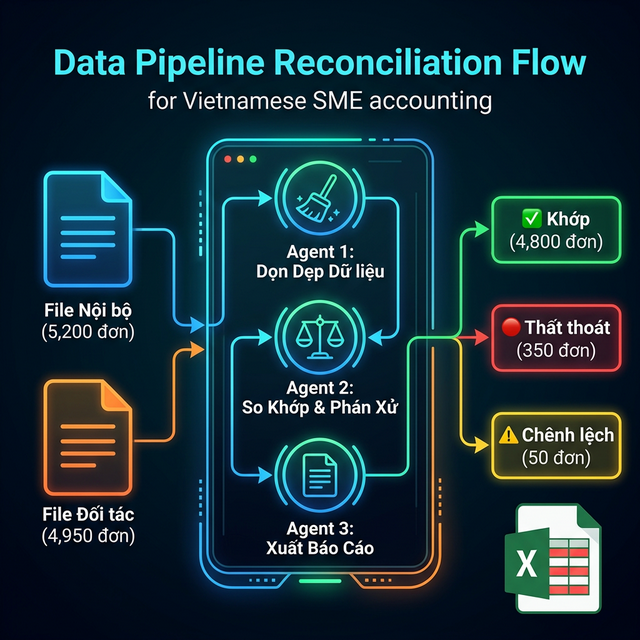

# Chương 11: Quyền Năng Thượng Tầng — Khai Khoáng "Mỏ Vàng" Dữ Liệu Bằng Data Pipeline

> [!IMPORTANT]
> **Data Pipeline** là "động cơ vĩnh cửu" của doanh nghiệp số. Nó biến mớ hỗn độn dữ liệu thành những quyết định kinh doanh sắt bén.

- **🎯 [Mục Tiêu Chương] (Objective):** Đập bỏ quy trình đối soát Excel thủ công. Xây dựng đường ống dữ liệu (Data Pipeline) tự động nạp, làm sạch và hợp nhất hàng vạn dòng dữ liệu từ nhiều nguồn.
- **📥 [Đầu Vào] (Input):** 2 File Excel/CSV thô từ hai hệ thống độc lập (Vd: KiotViet và GHTK).
- **🚀 [Đầu Ra] (Output):** File báo cáo tự động tô đỏ các dòng lệch tiền, kèm Dashboard BI trực quan.

---

> 🚀 **Yêu cầu:** Bạn cần [Antigravity](https://antigravity.google) đã cài đặt và **2 file Excel/CSV bất kỳ** của công ty để thực hành đối soát ngay trong chương này.

## 11.2. Mở Đầu: Tội Ác Của Việc "Dò File Bằng Mắt" Tại Các Chuỗi Bán Lẻ

### 📖 Câu Chuyện Đau Đớn: Thảm Án Tiền Thu Hộ (C.O.D) Tại Thời Trang "NevaB"

NevaB là một thương hiệu thời trang thiết kế nữ khá nổi tại TP.HCM, với doanh số Online khoảng 5.000 đơn hàng/tháng. Giám đốc Tài chính (CFO) tên Hùng luôn tự hào về tốc độ tăng trưởng của công ty. Tuy nhiên, đằng sau sự hào nhoáng đó là một "Tấn bi kịch" câm nín diễn ra định kỳ vào ngày 05 hàng tháng tại Phòng Kế toán.

Là công ty bán lẻ Online, NevaB phụ thuộc 90% vào dịch vụ Giao Hàng Thu Tiền Hộ (Ship C.O.D) của bên thứ ba (Như GHTK, Viettel Post). Cuối tháng, Kế toán trưởng tên Mai nhận được 2 tập tin khổng lồ:

- **Tập tin A (Từ nội bộ):** File Excel xuất từ hệ thống KiotViet ghi nhận 5.200 đơn hàng đã xuất kho (Bao gồm đơn thành công và đơn khách hoàn trả).
- **Tập tin B (Từ đối tác):** File CSV do hãng Vận chuyển gửi sang ghi nhận 4.950 đơn hàng họ báo là đã Thu được Tiền và chuyển khoản trả lại cho NevaB.

Quy trình khủng khiếp nhất của đời một người Kế toán bắt đầu: **Đối soát chéo (Reconciliation).**

Mai và 2 chị kế toán viên phải căng mắt ra so sánh 2 bảng tính này. Mục đích là tìm ra:

1. Những đơn hàng nào NevaB báo Đã Giao Thành Công, nhưng Hãng Vận Chuyển "Im lặng" chưa trả tiền? (Nguy cơ thất thoát tiền tỷ).
2. Những đơn hàng Hãng báo là Khách Boom (Hoàn Trả), nhưng Kho nội bộ chưa nhận lại được váy áo? (Nguy cơ mất hàng).
3. Những đơn hàng hai bên đều ghi nhận Đã Giao, nhưng Số Tiền lệch nhau (Phí chênh lệch, Lấy trộm tiền lẻ).

Nếu làm bằng hàm Excel `VLOOKUP`, chỉ cần số điện thoại bên GHTK gõ thừa 1 dấu cách (khoảng trắng), hoặc tên khách hàng "Nguyễn Văn A" bị viết thành "Nguyen Van A", hàm Excel sẽ báo lỗi `#N/A` toàn tập. Hàng ngàn ô báo lỗi.
Chị Mai và 2 nhân viên phải hì hục dò bằng mắt, bấm `Ctrl + F` từng dòng một suốt 4 ngày 4 đêm. Mắt mờ, tay run, đến ngày thứ 5 báo cáo lên Sếp: *"Sếp ơi, tụi em tìm không ra, tháng này công ty Tạm Lỗ Chênh Lệch Khoảng 35 triệu đồng chưa rõ nguyên nhân"*.

> [!NOTE]
> **PwC 2025:** 75% SME mất từ 1.5% đến 3% doanh thu ròng mỗi tháng cho vòng xoáy "Thất lạc dòng tiền COD". Data Pipeline giúp giảm 99% thời gian đối soát và bịt kín các "lỗ rò rỉ" doanh thu tức khắc.

**Bạn có thấy Nỗi Đau Này Quen Thuộc Không?**
Tội ác lớn nhất của Chuyển đổi số nửa vời là bắt Con người biến thành Máy Đọc Dữ Liệu. SME Việt Nam chết chìm trong rác dữ liệu: Dữ liệu Facebook một kiểu, Dữ liệu Shopee một kiểu, Dữ liệu CRM một kiểu. Hàng núi Dữ liệu (Big Data) đáng lẽ phải là "Mỏ vàng" báo cáo Kinh doanh, nay lại trở thành "Bãi rác" hành xác nhân sự.

---

## 11.3. [Phương Pháp Cốt Lõi] Mô Hình Tư Duy: Xây Dựng "Data Pipeline" Không Cần Kỹ Sư Dữ Liệu

Ở các Tập đoàn lớn ngàn tỷ, họ có Nguyên một phòng ban gọi là "Phân Tích Dữ Liệu" (Data Analyst) lương mỗi người 40 triệu/tháng. Các Data Analyst này dùng ngôn ngữ lập trình Python, SQL để xây dựng các "Ống dẫn dữ liệu" (Data Pipeline): Hút dữ liệu từ A, rửa sạch, rồi bơm sang B.

SME không có tiền thuê Kỹ sư Dữ liệu. Antigravity lập tức lấp đầy khoảng trống đó. Bất kỳ nhân viên Kế toán nào biết gõ phím, cũng có thể ra lệnh cho Antigravity Mở Ra Một Dây Chuyền Luyện Kim (Data Pipeline) ngay trên Folder máy tính của mình.

Đừng bao giờ vứt 2 file Excel cho AI và ảo tưởng bắt nó tự đoán. Hãy áp dụng **Khung Khởi Tạo Dây Chuyền 3 Thợ (Pipeline Multi-Agents)**:

### ⚙️ Thợ Dọn Dẹp (Data Cleaner Agent)

Nhiệm vụ đầu nguồn: Dữ liệu gốc luôn luôn "bẩn rác". Thợ này có nhiệm vụ gọi Thư viện Pandas đọc file, Cắt râu ria, Cạo vảy cá. Biến cột `098 123 4567` thành `0981234567`. Biến chuỗi `Mã-123` thành `MA-123` (In hoa chuẩn). Nếu Không có Dọn Dẹp, bước sau chắc chắn Sập.

### ⚙️ Thợ Trọng Tài (Data Comparator Agent)

Nhiệm vụ khớp xương: Lấy 2 Bảng Dữ liệu Đã Sạch sẽ (Cleaned Basetables). Dùng thuật toán Toán Học (Outer Join) nhập 2 bảng làm 1 dựa trên chìa khóa chung (Ví dụ: Mã Vận Đơn). Sau đó phát hiện Độ Lệch. Bắt ngay kẻ nói dối.

### ⚙️ Thợ Báo Cáo (Reporter Agent)

Nhiệm vụ ra đồ hộp: Con người không đọc hiểu dòng code Python khô khan. Thợ này phải xuất ngược kết quả thành Hệ thống màu cảnh báo trên Excel. Tô đỏ những ca mất tiền để Mắt con người dễ dàng bốc máy lên chửi Đối tác.

---

## 11.4. [Ví Dụ Mẫu & Case Study] Khởi Chạy Phép Màu: Sudo Prompt Rút Ruột Đối Tác Vận Chuyển

Quay lại với bài toán Cứu mạng dòng tiền COD của chị Mai (Kế toán trưởng). Chị Mai không đi đoạt mắt dò Excel nữa. Chị Copy File KiotViet Mới Nhất và File GHTK thả vào một Thư mục `/Kiem_Toan_COD_Thang_10/`.
Sau đó, chị bọc mình vào áo giáp của một "Tướng quân Data", ban bố Sudo Prompt Tối Thượng này:

> **SUDO PROMPT: CHIẾN DỊCH KHAI QUẬT DÒNG TIỀN THẤT THOÁT ĐỈNH CAO**
>
> 👑 **[VAI TRÒ & NGỮ CẢNH]**
> Cương Vị Của Bạn: Kỹ Sư Dữ Liệu Lõi (Senior Data Engineer). Nhiệm vụ của bạn là bảo vệ hòm tiền của Công ty bằng cách đối soát Tự động.
> Dữ liệu Input tại `/Kiem_Toan_COD_Thang_10/`: `Noi_Bo.xlsx` (Cột chìa khóa: Mã Vận Đơn) và `Doi_Tac.csv` (Cột chìa khóa: Ma_Van_Don).
>
> ⚙️ **[MẠNG LƯỚI ỐNG DẪN DỮ LIỆU (DATA PIPELINE TASKS)]**
>
> 👨‍💻 **[Agent 1 - Thợ Thanh Tẩy (Data Cleaner)]**
> Dùng công cụ Bash. Viết Python gọi thư viện `pandas`. Trích xuất toàn bộ 10.000 dòng.
> Hành Động Dọn Dẹp Cương Quyết:
>
> - Cột Mã: Xóa sạch mọi Khoảng trắng (Trim) và Ép In Hoa toàn bộ chữ cái (Uppercase) để đồng nhất.
> - Cột Tiền: Chuyển dữ liệu có dấu phẩy tiền tệ (vd: 125,000 VND) ép kiểu thành dạng Số Thực Tính Toán (Float).
>
> 🕵️‍♂️ **[Agent 2 - Trọng Tài Phán Xử (Logic Comparator)]**
> Nhận Base Data từ Agent 1. Dùng lệnh `pd.merge()` cơ chế `outer`.
> Viết Luật Phán Quyết Lọc Ra 3 Nhóm Đối Tượng Tội Phạm:
> [Nhóm Lỗi 1]: Có ở File Noi_Bo, Nhưng Không Tồn Tại ở Doi_Tac (Tội: Hãng vận chuyển ỉm hàng). Lưu Biến `Bao_Dong_Mat_Cap`.
> [Nhóm Lỗi 2]: Có ở Doi_Tac, Nhưng Không Tồn Tại Ở Noi_Bo (Tội: Bơm khống đơn ảo lấy phí). Lưu Biến `Don_Ao_Chen_Vao`.
> [Nhóm Lỗi 3]: Mã Hàng Tồn Tại Ở Cả 2 Bên, NHƯNG Lập Công thức (Tiền Bên A - Tiền Bên B) bị Âm hoặc Dương lớn hơn 0 đồng (Tội: Rút lõi tiền COD, Khách thu 500k, trả shop 450k).
>
> ✍️ **[Agent 3 - Designer Báo Cáo Sát Thủ]**
> Export Output của Agent 2 qua Thư viện `openpyxl`. Tạo một tệp `Ban_An_Hinh_Su_Doi_Soat_T10.xlsx` gồm 3 Sheets.
> Đẳng Cấp Nằm Ở Đây: Ở Sheet Của [Nhóm Lỗi 3], tự động Format Cell tô Nền Xanh chữ Đỏ cho tất cả các ô Tiền Bị Lệch. Hoàn tất việc này đi Đặc vụ, Sân khấu là của bạn!

**Chân Lý "5 Whys" Của Luồng Data Pipeline Này:**

1. **Làm gì?** Biến 2 File Rác khác hệ thống KiotViet và GiaoHàngTietKiem thành một Bản Án Lệch Tiền.
2. **Tại sao không Dùng VLOOKUP?** Vlookup ngu ngốc sẽ sập khi gặp 1 dấu cách thừa (`MA123` vs `MA123`). Agent 1 Thanh Tẩy (Cleanse) bằng mã Regex Python mới là Đỉnh Cao rũ sạch bùn nhơ.
3. **Mô hình ghép là gì?** Outer Join - Tức là lấy tất cả. Kẻ nào thiếu ở bên nào sẽ bị lòi ra ở nhóm Cảnh Báo bên kia.
4. **Tại sao Agent 3 phải tô màu?** Sếp không có thời gian tìm. Đập vào mắt Sếp phải là **Các Biến Cố Màu Đỏ** Đã Được Lọc. Mọi thứ bình thường bị che đi.
5. **Tiền sinh ra thế nào?** 10.000 dòng mất 0.25 giây. Kế toán 4 ngày hì hục nay còn 1 Phút. Tiền thất thoát Lệch COD giảm từ 35 triệu/tháng xuống 0 Đồng.

### 👣 Quy trình 3 bước "Luyện kim" dữ liệu

1. **Nạp liệu:** Upload cùng lúc 2 file (Vd: `Noi_Bo.xlsx` và `Doi_Tac.csv`) vào Antigravity.
2. **Kích hoạt:** Paste Sudo Prompt "Chiến dịch khai quật dòng tiền" (mẫu bên dưới). Theo dõi Terminal khi AI dọn rác và so khớp.
3. **Thu hoạch:** Nhận file `Ban_An_Hinh_Su_Doi_Soat.xlsx` với các ô lệch tiền được tô đỏ chót sẵn sàng để đối chất.

## 11.5. [Kết Quả Đầu Ra & Processing] Báo Cáo Lệch Chuẩn Thời Gian Thực

**Kết Quả Mẫu (Mừng Roi Khổng Lồ):**

Sáng hôm sau lúc 8h sáng, chị Mai đập cái File này lên bàn Thư ký làm việc của Đối tác Vận Chuyển: *"Giải trình cho chị 89 Đơn Khống và Thất thoát này"* trong sự Ngỡ Ngàng sững sờ. Tiền tỷ của Công ty đã được cứu rỗi từ UI Chatbot.

Antigravity cung cấp ngay file Output cuối cùng `Ban_An_Hinh_Su_Doi_Soat_T10.xlsx` để bạn tải về máy, gồm 3 Sheet:

- **Sheet 1 — Bao_Dong_Mat_Cap:** 47 đơn hàng có ở bộ Nội Bộ nhưng Không có ở Đối tác. (Tổng lốc: 128.5 triệu VNĐ).
- **Sheet 2 — Don_Ao_Chen_Vao:** 12 đơn hàng khống đối đối tác bơm vào ăn tiền phí.
- **Sheet 3 — Chenh_Lech_Tien:** Dữ liệu có ở 2 bên nhưng số tiền lệch. Antigravity tự động Format các ô Tiền lệch thành Nền chữ Đỏ chót.

**Phản hồi AI:**
> *"Hoàn tất đối soát 10.000 dòng trong 0.25 giây. Phát hiện 89 bất thường: 47 đơn thất thoát (128.5 triệu), 12 đơn ảo (34.2 triệu), 30 đơn chênh lệch tiền. File đã lưu tại `/Kiem_Toan_COD_Thang_10/`."*

### 🔧 Troubleshooting Data Pipeline

| Sự Cố | Nguyên Nhân | Giải Pháp |
| :--- | :--- | :--- |
| Merge ra toàn bộ dòng NULL | Cột chìa khóa (Mã Vận Đơn) bị đặt tên khác nhau giữa 2 file | Thêm bước: *"Agent 1: In ra tên cột Header của cả 2 file. Chờ tôi xác nhận cột nào là chìa khóa trước khi merge."* |
| File Excel bị merge cell (gộp ô) → Pandas đọc sai | File export từ KiotViet có merge cell ở header | Thêm: *"Khi đọc Excel, dùng `header=1` hoặc `skiprows=1` nếu dòng đầu bị merge."* |
| Số tiền so sánh sai do định dạng (125,000 vs 125000) | Cột tiền chứa dấu phẩy hoặc ký tự "VNĐ" | Đã có trong Prompt (Agent 1 Cleaner). Nếu vẫn lỗi, thêm: *"Strip tất cả ký tự không phải số trước khi ép kiểu Float."* |
| `openpyxl` lỗi khi format cell | Phiên bản thư viện quá cũ | Thêm: *"Cài `pip install openpyxl --upgrade` trước khi chạy."* |
| AI báo "File quá lớn, không đọc được" | File Excel > 50MB vượt context window | Chia file thành chunks: *"Đọc file bằng `pd.read_excel(chunksize=5000)` và xử lý từng chunk."* Hoặc chuyển sang dùng Gemini Pro. |

---

## 11.6. [Ví Dụ Mẫu & Case Study] WorkFlow Ứng Dụng Đa Cấp: Xây Dựng "Ngân Hàng Trung Ương" Dữ Liệu (Data Warehouse & BI Dashboard)

Nếu đối chiếu Khớp lệch là Nhu cầu Sinh tồn của phòng Kế toán. Thì Nhu cầu tối thượng của Giám đốc (CEO) Lạnh lùng hơn: **Business Intelligence (Trí Tuệ Kinh Doanh) Thời Gian Thực.**

Sếp không thể lúc nào cũng Chat với AI để hỏi số liệu vụn vặt. Sếp cần một **Bảng Điều Khiển Cơ Trưởng (Dashboard)** sáng đèn 24/7. Để làm được điều này, Antigravity đóng vai trò là "Máy Xúc", nhưng bạn cần một "Nhà Kho" (Data Warehouse) và một "Màn Hình" (BI Tool).

### 🏛️ Kiến Trúc 3 Tầng: Từ Bãi Rác Đến Biểu Đồ Lãnh Đạo

Quy trình chuẩn mực (Best Practice) dành cho SME bước vào kỷ nguyên Data-Driven diễn ra theo 3 chặng:

**Chặng 1: Khai Khoáng (Do Antigravity đảm nhiệm)**

- File CSV hôi hám từ Facebook Ads, File Excel rách nát từ KiotViet, CRM...
- Antigravity tự động kích hoạt `// turbo-all` lúc 2h sáng mỗi ngày, đọc toàn bộ mớ hỗn độn này, dọn rác (Cleanse), hợp nhất (Merge) thành những Bảng Dữ liệu sạch sẽ.

**Chặng 2: Lưu Trữ Tập Trung (Data Warehouse)**

- Thay vì để Antigravity phun ra 10 cái file Excel mới (rất dễ thất lạc bờ bụi), Antigravity sẽ được lệnh **Ghi thẳng Dữ liệu Sạch vào một Database Tập trung (Data Warehouse)**.
- *Lựa chọn Khuyên dùng cho SME:* Google BigQuery (Miễn phí 1TB truy vấn/tháng, siêu mạnh) hoặc PostgreSQL (Cài đặt nội bộ Cloud, chi phí rẻ).
- Sự vĩ đại ở đây: TẤT CẢ sự thật của công ty (Sales, Marketing, Kế toán) đều nằm chung một "Tôn Giáo" duy nhất. Không còn chuyện Kế toán báo Lãi, Marketing báo Lỗ. Mọi thứ đối chiếu chung 1 Bảng SQL.

**Chặng 3: Trực Quan Hóa (BI Dashboard - Business Intelligence)**

- CEO không bao giờ mở Database ra đọc các dòng kẻ ô chằng chịt.
- Doanh nghiệp cắm một phần mềm BI (Business Intelligence) trực tiếp vào Data Warehouse ở Chặng 2.
- *Công cụ Khuyên dùng:* **Metabase** (Miễn phí, Giao diện cực đẹp, Cắm vào PostgreSQL/MySQL trong 1 nốt nhạc), **Google Looker Studio** (Dùng chung với BigQuery), hoặc **Apache Superset**.

> [!TIP]
> **Dòng Tiền đến từ đâu?** 10.000 dòng mất 0.25 giây. Kế toán 4 ngày hì hục nay còn 1 phút. Tiền thất thoát lệch COD giảm về 0 đồng. CEO nắm quyền lực số tuyệt đối, thảnh thơi như bậc quân vương.

---

## 11.7. [Kết Luận & Action Items] Bảng Nhận Diện Cơ Hội Khai Thác: Triển Khai Xương Sống Dữ Liệu

Mang Checklist này xuống mọi phòng ban, phát tín hiệu tìm "Cơ hội Khai phá":

- **[ ] Dò tìm "Cuốn sổ rách" của Bộ phận Kho:** Cấm tuyệt đối Kho đếm tay. Đưa AI Tích Hợp Đọc Phiếu Xuất Kho Và Phiếu Thu Bán. So Soi Hệ Thống Lệch.
- **[ ] Biến Tạp Vụ Lập Báo Cáo:** Trưởng phòng Marketing muốn Báo cáo Xu Hướng Tuần/Tháng. Setup 1 Script Python hẹn Giờ Cố Định (Cronjob). Lấy Skill [`tao_slide_bao_cao`](../skills/tao_slide_bao_cao/SKILL.md), Cứ 8h Tối T6 Nó Tự Ra 10 Trang Slide Thuyết Trình.
- **[ ] Tích Hợp Luật Python Chống Lỗi Đánh Máy:** (Anti-Human Error). Luôn Nhắc Nhở các Điểm Nhập Thô có Bộ Lọc AI đứng chặn. Chặn sạch SĐT sai định dạng.

| Cuộc Thánh Chiến Dữ Liệu | Đội Quân Thủ Công | Liên Minh AI | Sức Công Phá |
| :--- | :--- | :--- | :--- |
| **Bản Giao Hưởng Báo Cáo** | Giám Đốc Đợi 10 Ngày Mới Có Thông Tin. | Hỏi Là Có Pivot Chart Trong 1 Giây. | Ra Đòn Marketing Đúng Nhịp Xu Hướng Hot. |
| **SoS Lỗi Số** | Mất Đơn Khách Kiện, Giấu Lỗi File Excel. | Con Số Lệch ±1 → Cờ Cảnh Báo Đỏ Tức Thì. | Giảm Thất Lạc Tiền Thu Từ Đối Tác. |

---

Bạn Có Hiểu Sự Thấu Suốt Của Câu Chữ Không?
Tất Cả Sức Sáng Chói Này Đến Được Lại Bởi Cái "Bộ Óc Trí Tuệ" Phía Sau.
Nhưng nếu File dữ liệu chưa có thì sao? Nếu chúng ta phải đoán trước tương lai?
⏭ *(Lật qua **Chương 12: Phân Tích Kịch Bản & Monte Carlo** — Nơi chúng ta dùng toán học để nhìn thấu tương lai dự án).*

---

## 📚 Tài Liệu Tham Khảo

- [🚀 Antigravity — Tải và Cài đặt công cụ](https://antigravity.google)
- [Skill Đối Soát Ngân Hàng](../skills/doi_soat_ngan_hang/SKILL.md)
- [Skill Phân Tích Lãi Lỗ](../skills/phan_tich_lai_lo/SKILL.md)
- [Workflow Đối Soát COD](../workflows/doi-soat-cod.md)
- [Chương 12 — Quyết Định Kinh Doanh](12-business-decision-making.md)
- [Chương 08 — MCP kết nối hệ thống](08-mcp-ket-noi-he-thong.md)
