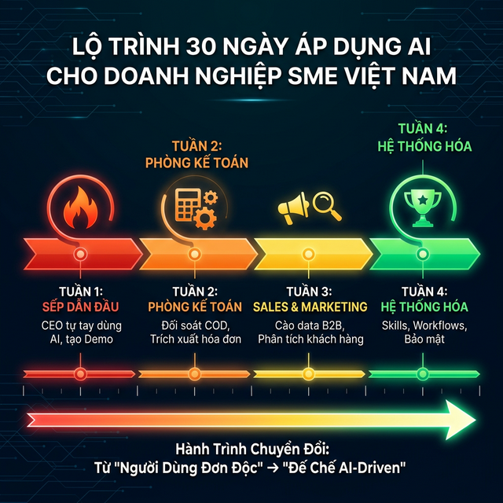

# Chương 9: Lộ Trình 30 Ngày Khép Kín — Từ "Người Dùng Đơn Độc" Đến "Đế Chế AI-Driven"

*(Chống lại căn bệnh Cả thèm chóng chán khi Áp dụng AI tại Doanh Nghiệp Việt)*

---

## 1. Mở Đầu: Tiếng Thở Dài Của Sự Chuyển Đổi Số "Nửa Vời"

### 📖 Câu Chuyện Đau Đớn: Ảo Ảnh Của "Tháng Đầu Tiên"

Anh Phát, Giám đốc một chuỗi Phân phối Điện máy khu vực Miền Trung, tham gia một Hội thảo về AI. Nghe diễn giả hô hào vĩ cuồng, anh lập tức mua 10 tài khoản ChatGPT Plus và Cài đặt Antigravity cho toàn bộ Trưởng phòng. Anh tuyên bố: *"Từ cao trào này, chúng ta sẽ tự động hóa 100% doanh nghiệp!"*.

- **Tuần 1:** Các Trưởng phòng háo hức. Ai cũng mở Chatbot lên hỏi *"Vẽ cho tôi bức tranh con hổ"*, *"Kể chuyện cười"*, hoặc nhờ viết 1 cái Email xin lỗi khách hàng. Ai cũng ồ lên: *"Giỏi thật!"*
- **Tuần 2:** Lượng sử dụng bắt đầu vơi đi. Bộ phận Kế toán bảo: *"Thà em bấm Máy tính cầm tay Casio còn nhanh hơn là Phải nghĩ câu lệnh Text gõ cho con AI này tính"*.
- **Tuần 3:** Có nhân viên Marketing dùng AI tạo 1 bài viết Quảng Cáo, AI bị Ảo giác (Hallucinated) đưa sai Tính năng Sản phẩm. Công ty bị Khách hàng chửi. Trưởng phòng kết luận: *"AI ngu lắm, không dùng được đâu"*.
- **Tuần 4 (Tròn 30 ngày):** Các tài khoản AI bị lãng quên, bám bụi kỹ thuật số. Doanh nghiệp của anh Phát quay về với cái máng lợn Cũ: File Excel nhì nhằng, Tăng ca mù mịt và Tranh cãi Nội bộ.

**Vì Sao Thất Bại?**
Anh Phát mắc phải Lỗi sai Hệ thống kinh điển: Cứ nghĩ mua Gươm Báu (Tool) phát cho nhân viên là họ tự động trở thành Tướng Quân.
Chuyển đổi số không phải là thay đổi Công cụ. Chuyển đổi số là thay đổi **Thói Quen Hành Vi (Behavioral Shifts)** và tái cấu trúc **Quy Trình Công Việc (Processes)**.

Chương cuối cùng này cung cấp cho Sếp một **Lộ Trình Trồng Cây AI 30 Tuần Tự Khắc Khổ**. Không có phép màu 1 đêm. Từ "Người Tiên Phong Đơn Độc" (Sếp) cho đến "Ăn Sâu Vào Máu Toàn Tổ Chức".

---

## 2. Bản Đồ Tác Chiến 30 Ngày (The 30-Day SME Onboarding Roadmap)

Đừng ném Antigravity cho nhân viên và bảo *"Dùng đi"*. Hãy áp đặt lộ trình Mưa Dầm Thấm Lâu dưới đây, với KPIs đo lường rõ ràng.

### 🛡️ Tuần 1: Cú Sốc Tri Nhận Điểm Tối Vĩ Mô (Days 1-7)

**Mục Tiêu:** Sếp (C-Level) phải là người chảy máu và Đau đớn nhất. Không ủy quyền cho Lính ở Tuần Đầu Tiên.

- **Ngày 1-2 (Tự Phẫu Thuật):** Sếp lên phòng đóng kín cửa. Cầm 1 tờ giấy A4 trắng. Liệt kê: *"3 Việc gì cực kỳ Ngu xuẩn, tốn thời gian, nhưng Tháng Nào tôi cũng Phải Làm?"* (Ví dụ: Đọc báo cáo Excel 15 File/Chi nhánh; Duyệt giấy tờ xin nghỉ phép).
- **Ngày 3-5 (The First Blood - Nhát Chém Đầu Tiên):** Sếp Cài Antigravity lên máy tính cá nhân. Áp dụng ngay Chương 5 (Data Pipeline). Dùng 1 Lệnh Sudo Prompt Bắt AI Trộn 15 File Excel Đó Thành 1 Biểu Đồ BI Duy Nhất.
- **Ngày 6-7 (Tuyên Thệ Máu):** Khi Sếp đã Tự Mình trải nghiệm Cảm giác Phép thuật Máy tính làm Khối việc 3 Ngày Trong 3 Giây. Mới Lôi Trưởng Phòng/Dev Lead vào Họp Tuyên Thệ: *"Tôi đã làm được. Các anh xem! Tháng này không theo AI thì Nộp Đơn Nghỉ Việc!"*.

**🎯 KPI Đầu Ra Tuần 1:** Sếp có 1 Demo Sống (Artifact Walkthrough) dằn mặt nhân viên.

**💡 Prompt Gợi Ý Tuần 1 (Copy-Paste Dùng Ngay):**
> *"Hỡi Antigravity, tôi có 15 file Excel doanh số 15 chi nhánh nằm tại `/BaoCao_ChiNhanh/`. Hãy đọc tất cả, gộp thành 1 bảng tổng, vẽ biểu đồ Bar Chart so sánh doanh thu giữa các chi nhánh. Lưu biểu đồ và file tổng hợp tại cùng thư mục."*

*(Tham khảo: [Chương 8 — Data Pipeline](06-data-pipeline.md), [Skill Báo Cáo Doanh Thu](../skills/bao_cao_doanh_thu/SKILL.md))*

### 🛡️ Tuần 2: Xâm Nhập Khối Back-Office (Days 8-14)

**Mục Tiêu:** Đánh thẳng vào Phòng Ban Khối Lượng Giấy Tờ Lớn Nhất (Kế Toán, HR, Admin). Đây là nơi Ngợp Nước (Bottlenecks) và sinh Bệnh Tham Nhũng/Nhầm Lẫn nhiều nhất.

- **Ngày 8-10 (Lọc Bệnh Nhân HR):** HR phải cấu hình Skill `loc_cv_ung_vien`. Bắt buộc dùng Antigravity Quét Bằng PDF Tự Động cho 1 đợt tuyển dụng Dù Là Nhỏ nhất. Đo ngay xem giảm bao nhiêu Giờ Lao Động.
- **Ngày 11-13 (Kế Toán Thanh Trừng):** Áp dụng Mega-Project Đối soát Khớp lệch Kho (Chương 4-5). Cấm Tuyệt đối VLOOKUP bằng Mắt giữa 2 Tệp Số Vận Chuyển và Sổ KiotViet.
- **Ngày 14 (Quy Tắc No-File Touch):** Ra thiết chế mới: Bất cứ khi nào phòng Ban Khối Văn Phòng Cầm con Chuột bấm đổi Tên 100 File Word liên tiếp, Lập tức Bị Kỷ Luật. Phải nhường Căn Tác Bằng Bash/Python Script cho AI Làm.

**🎯 KPI Đầu Ra Tuần 2:** Lượng giờ làm việc Ngoài giờ (Overtime) của Kế toán giảm 30%. Chốt đúng Số Dư Quỹ C.O.D lệch dưới 10k.

**💡 Prompt Gợi Ý Tuần 2 (Copy-Paste Dùng Ngay):**
> *Dùng [Workflow Onboard Nhân Viên](../workflows/onboard-nhan-vien.md) cho đợt tuyển mới.*
> *Dùng [Skill Đối Soát Ngân Hàng](../skills/doi_soat_ngan_hang/SKILL.md) để so khớp Sao kê vs KiotViet.*

### 🛡️ Tuần 3: Trấn Lột Khối Tiền Tuyến Sale & Marketing (Days 15-21)

**Mục Tiêu:** Mang Quyền lực Số liệu Tấn Công Lấy Khách Hàng. Cấm Chơi Lối Chạy Ads Cảm Tính Cổ Điển.

- **Ngày 15-17 (Inbound Zalo Lead Catcher):** Khởi sự ngay Mega-Project Bắt Số Điện Thoại Nóng từ Zalo/Fanpage (Chương 4). Ép SLA (Cam kết thời gian) cho Team Sale: *"Có chuông báo Lead AI Nã Xuống Telegram, Sale Phải Bốc máy gọi trong vòng 3 Phút"*.
- **Ngày 18-19 (Scraping Khổ Nhục Kế):** Mở Binh Đoàn Nhện (Browser Subagents) cào 10.000 Thông Tin Email của Giám đốc HR (Sale B2B). Bơm Data Lạnh này vào Nền tảng Gửi Email Tự Cấu Trúc Khối Cá Nhân (AI Viết email riêng cho từng CEO một chứ không Spam Bulk).
- **Ngày 20-21 (Thảm Sát Biases Bằng Chương 6):** Cấm Giám đốc MKT đệ trình duyệt Ngân sách Bằng Powerpoint Suông. Bắt buộc Kẹp theo 1 Tấm Ảnh "Mô Phỏng Lỗ Lãi Bằng Python" Do AI Cố Vấn (Decision Support).

**🎯 KPI Đầu Ra Tuần 3:** Tỉ lệ Chết Đoạn (Lead Drop-off) của Khách Nhắn Facebook giảm 50%. Tỉ lệ Chốt Hẹn B2B (Meeting Rate) Tăng 2 Lần vì Được Call ngay Lập Tức Điểm Chạm Vàng Thần Tốc.

**💡 Prompt Gợi Ý Tuần 3 (Copy-Paste Dùng Ngay):**
> *Dùng [Workflow Đăng Bài Social](../workflows/dang-bai-social.md) để tái sử dụng nội dung đa kênh.*
> *Dùng [Workflow Tạo Proposal](../workflows/tao-proposal.md) để soạn báo giá B2B tự động.*

### 🛡️ Tuần 4: Luyện Kim Di Sản Lõi (Knowledge Workflows) (Days 22-30)

**Mục Tiêu:** Chữa Dứt Điểm Căn bệnh "Mất Trí Nhớ Nhân Sự" Bằng Kho Báu Tổ Chức. Cấu Hình Cột Chống Rò Rỉ Data.

- **Ngày 22-25 (Kiến Tạo Kho Kỹ Năng /skills):** Mọi "Mánh Khóe" Báo Cáo Của Mỗi Trưởng Phòng Phải Được Ghi Chép Lại Sang 1 File `SKILL.md` ([Chương 7](08-skills-va-workflows.md)). Đóng gói chất xám Cầm Tay chỉ Việc Lại Rõ Ràng Cho Máy Nó Đọc Thuộc Năm Nay Qua Năm Khác.
- **Ngày 26-27 (Nút Bấm Cửu Âm Chân Kinh /workflows):** IT Dev Lead và Trưởng Marketing Viết Slash Commands (`// turbo-all`). Tham khảo [Danh sách Workflow mẫu](08-skills-va-workflows.md) hoặc thư mục [`/workflows/`](../workflows/).
- **Ngày 28-29 (Khấn Vái Lệnh Bài Bảo Mật Hệ Thống AI Governance):** Kích Hoạt Prompt Định Nghĩa ([Chương 10](10-bao-mat.md)). Bắt Masking Data Khách Hàng. Loại Trừ Prompt Lậu Phá Hại Giết Hệ Máy Nguồn Lực.
- **Ngày 30 (Lễ Trưởng Thành Doanh Nghiệp Cấp Độ Số):** Cấm Dùng Cụm Từ "Chatbot". Chúng ta gọi Công Ty Chúng ta là Công Ty "AI-Driven". Tổ chức cuộc thi Vinh Danh Người Có Sudo Prompt Đỉnh Nhất Tháng, Thưởng To Bằng Thóc!

**💡 Prompt Gợi Ý Tuần 4:**
> *Dùng [Workflow Kiểm Tra Sức Khỏe Web](../workflows/kiem-tra-suc-khoe-web.md) cho team IT.*
> *Dùng [Workflow Phân Tích Doanh Thu](../workflows/phan-tich-doanh-thu.md) cho Sếp cuối tháng.*

---

## 3. Lời Dặn Trọng Niệm Của Người Đi Trước (Outro Ebook)

Khi bạn khép lại những trang cuối cùng của Cuốn Bí Kíp Của Cuộc Chuyển Đổi Số Giữa Ngã Ba Phân Hóa Đẳng Cấp Xã Hội Doanh Nghiệp Này.

Hãy Nhớ Rằng: **Antigravity Không Cứu Được Bạn, Nếu Bạn Vẫn Còn Tổ Chức Quản Trị Hệ Thống Quanh Những Con Người Lười Cập Nhật Mới**. Tư duy Agentic Cần Những Tướng Cấp Trung Đi Lược "Biết Chịu Lùi 1 Nhịp Dạy Máy Dài Cổ Lên Tiếng, Để Năm Sau Nhàn Cả Cuộc Đời".

Máy Sinh Mã Đã Đứng Bóp Lẫy Cửa Phụ Lục Kỹ Thuật Đã Từng Rất Thiêng Liêng (Coding/Data Engineering). Sân Chơi Của Khủng Hoàng Tuyển Dụng Chỉ Còn Lại Dành Cho Kẻ Giỏi Đọc Tình Hình Doanh Nghiệp Vĩ Mô (Business Logic) Mà Thôi.

Từ Ngày Hôm Nay Trở Đi, Mỗi Khoản Lãng Phí Tiền Bạc Của Công Ty SME Bạn Vì Thuê Thiếu Nhân Sự Hay Làm Ẩu... **Đều Là Sự Lựa Chọn Phóng Túng, Chứ Không Thể Bao Biện Rằng Bạn Không Có Trong Tay Một Kỹ Sư Công Nghệ Thông Tin Miễn Phí 0 Đồng Antigravity Đang Chờ Mệnh Lệnh Chân Xác Nhất**.

**BẰNG SỨC MẠNH CỦA ĐÚNG 1 CÂU NHẬP LỆNH CHUẨN MỰC (SUDO PROMPT), HÃY THỐNG TRỊ LẠI MẢNH ĐẤT THỊ PHẦN KINH DOANH CỦA CHÚNG TA!**

*— Trân Trọng Khép Lại Ebook Masterpiece V5 (Kiến Tạo Một Thập Kỷ Vàng Son Cho Lãnh Đạo AI-First SME Việc Nam) —*

---

## 📚 Tài Liệu Tham Khảo
