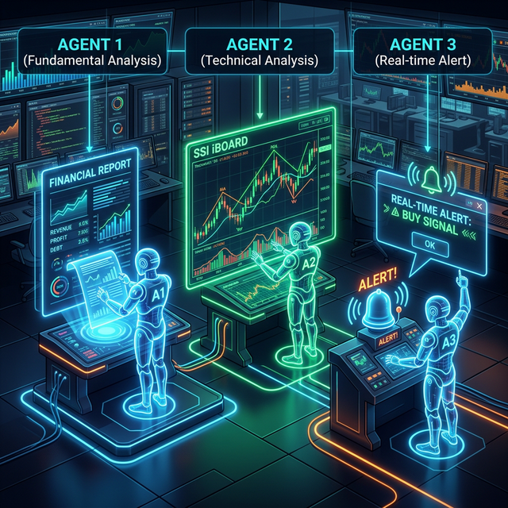

# Chương 13: Sói Già Phố Wall — Ứng Dụng Antigravity Trong Đầu Tư Chứng Khoán

> [!IMPORTANT]
> **Thương trường là chiến trường, nhưng Chứng khoán lại là lò bát quái.** Lãnh đạo SME thường mang thói quen "cảm tính" từ kinh doanh sang đầu tư, dẫn đến thua lỗ. Chương này biến Antigravity thành một chuyên gia phân tích tài chính (Quants) cá nhân phục vụ riêng bạn 24/7.

- **🎯 [Mục Tiêu Chương] (Objective):** Loại bỏ yếu tố cảm xúc (FOMO và Panic Sell) trong đầu tư chứng khoán. Xây dựng trợ lý AI tự động phân tích kỹ thuật, thu thập tin tức vĩ mô, và dự đoán ngưỡng vào tiền (Entry points) cho rổ cổ phiếu VN30.
- **📥 [Đầu Vào] (Input):** Mã cổ phiếu (Ticker), File PDF Báo cáo tài chính, hoặc Nguồn cấp dữ liệu trực tiếp từ Bảng Giá SSI (SSI iBoard).
- **🚀 [Đầu Ra] (Output):** Khuyến nghị điểm mua/bán chuẩn xác kết hợp TA (Technical Analysis) & Phân tích Tin tức (Market Sentiment), báo cáo tóm tắt FA, và Alert về Zalo.

---

## 13.1. Mở Đầu: Bi kịch "Đu Chỉnh" Của Sếp Khi Rảnh Rỗi

### 📖 Câu Chuyện Thực Trạng: Anh Tuấn CEO Và Danh Mục Lỗ 30%

Anh Tuấn là Giám đốc một xưởng in ấn lớn tại Hà Nội. Kinh doanh ổn định, dư dả dòng tiền mặt, anh quyết định "đem tiền đi đẻ" trên thị trường Chứng khoán (TTCK) Việt Nam.

Ban đầu, anh tham gia vài "Room VIP" trên Zalo. Hôm nay môi giới phím mã A "sắp đánh lên", ngày mai phím mã B "có game thoái vốn". Anh bận rộn họp hành cả ngày, thi thoảng mở bảng điện thấy xanh xanh đỏ đỏ là tim đập thình thịch. Mua theo hô hào nhưng trễ nhịp T+2.5, lúc hàng về đến tài khoản thì thị trường sập. Không có thời gian cắt lỗ, anh tặc lưỡi: *"Thôi vứt đấy coi như đầu tư dài hạn"*.

Kết quả sau 1 năm? Xưởng in lãi 2 tỷ, nhưng tài khoản chứng khoán lỗ mất 1.5 tỷ (chia đôi tài khoản).

**Tại sao CEO kinh doanh giỏi lại đánh chứng khoán te tua?**
Vì họ thiếu ba vũ khí chết người mà các tay to (Cá Mập) luôn có:

1. **Thời gian:** Sếp không thể ngồi ngâm cứu bản BCTC dài 150 trang của Hòa Phát (HPG) hay FPT.
2. **Kỷ luật dữ liệu:** Sếp mua vì tin đồn, không phải vì Lợi nhuận gộp tăng trưởng hay Tỷ lệ Nợ/Vốn chủ sở hữu thấp.
3. **Mắt thần theo dõi:** Hàng ngàn mã cổ phiếu biến động từng giây, mắt người không thể quét hết được cơ hội.

> [!NOTE]
> **Sự thật tàn nhẫn:** Trên TTCK, những quỹ đầu tư lớn đã sử dụng siêu máy tính và Algorithmic Trading (Giao dịch thuật toán) từ 10 năm trước. Bạn đang đem "Cảm giác" đi đấu với "Robot AI". Cách duy nhất để tồn tại là phải có AI của riêng mình.

Với **Antigravity**, bạn chính thức sở hữu một phòng phân tích (Research Dpt) đẳng cấp như quỹ Dragon Capital ngay trên máy tính của mình.

---

## 13.2. [Phương Pháp Cốt Lõi] Mô Hình Quản Trị Danh Mục Bằng Agentic AI

Để Antigravity gánh vác phần "Máu Lạnh" nhất trong đầu tư, chúng ta sẽ thiết lập 3 Đại Lý Đặc Vụ (Agents) tương ứng với 3 trường phái kinh điển.

### 📈 Agent 1: Cỗ Máy "Soi" Cơ Bản (FA - Fundamental Analysis)

*Nhiệm vụ: Đọc Báo cáo tài chính (BCTC), tìm kim cương trong cát.*
Thay vì tự đọc file PDF 150 trang, bạn ném BCTC vào Antigravity. Agent này sẽ chạy kỹ thuật RAG (Retrieval-Augmented Generation) để rút trích: Doanh thu Tăng hay Giảm? Tiền mặt doanh nghiệp còn bao nhiêu? Hàng tồn kho có bị ùn ứ không? Tính nhanh chỉ số P/E, P/B, ROE, ROA.

### 📉 Agent 2: Bộ Lọc CanSlim (Stock Screener)

*Nhiệm vụ: Truy quét toàn bộ thị trường tìm Cổ phiếu vượt đỉnh.*
Agent này được lập trình để dùng công cụ Browser hoặc Python cào dữ liệu từ các trang tài chính. Nó sẽ quét qua 1.600 mã trên cả 3 sàn (HOSE, HNX, UPCOM) để lọc ra đúng 5 mã đáp ứng tiêu chí: Lợi nhuận tăng trưởng > 20% mỗi quý, Có dòng tiền lớn tham gia, Phá vỡ nền tảng giá.

### 🔔 Agent 3: Lính Gác Ngày Đêm (Real-time Alert)

*Nhiệm vụ: Canh điểm nổ, chống điểm gãy.*
Khóa chặt vòng an toàn bằng một Script Python chạy ngầm. Giá cổ phiếu XYZ vừa rớt khỏi vùng hỗ trợ 50? AI lập tức bắn tin nhắn Telegram: *"Sếp, XYZ thủng mốc 50k, khẩn cấp xem xét cắt lỗ bảo toàn vốn."*

---

## 13.3. [Ví Dụ Mẫu & Case Study] Sudo Prompt Triệu Đô: Bóc Tách BCTC Trong 30 Giây

Hãy tưởng tượng, tối nay Vinamilk (VNM) vừa tung BCTC quý 3. Tất cả các diễn đàn đang xôn xao. Thay vì đợi sáng mai môi giới lên bài phân tích, bạn Tải File BCTC PDF về máy mém vào Thư mục `/Chung_Khoan/BCTC/`. Và ra lệnh tối thượng:

> **SUDO PROMPT: CHIẾN DỊCH KHÁM NGHIỆM TỬ THI TÀI CHÍNH (FINANCIAL FORENSIC)**
>
> 👑 **[VAI TRÒ & NGỮ CẢNH]**
> Cương vị của bạn: Trưởng phòng Phân Tích Cơ Bản (Senior Equity Analyst) của một Quỹ phòng hộ (Hedge Fund).
> Đầu vào: File PDF Báo cáo Tài Chính của VNM tại `/Chung_Khoan/BCTC/VNM_Q3.pdf`.
>
> ⚙️ **[MẠNG LƯỚI PHÂN TÍCH (ANALYSIS TASKS)]**
>
> 👨‍💻 **[Agent 1 - Thợ Bốc Xếp Số Liệu]**
> Đọc sâu file PDF. Trích xuất chính xác 5 chỉ tiêu sống còn của Quý này và Quý cùng kỳ năm ngoái: (1) Doanh thu thuần, (2) Lợi nhuận gộp, (3) Lợi nhuận sau thuế, (4) Tổng Nợ vay / Vốn chủ sở hữu, (5) Dòng tiền kinh doanh (CFO).
>
> 🕵️‍♂️ **[Agent 2 - Cố Vấn Khó Tính]**
> Nhận số liệu từ Agent 1. Đưa ra 3 gạch đầu dòng KHEN ngợi. Đưa ra 3 gạch đầu dòng CHÊ bai (Đặc biệt đào sâu vào: Biên lợi nhuận gộp có bị bào mòn không? Dòng tiền có dương không hay chỉ là lãi giả?).
>
> ✍️ **[Agent 3 - Designer Báo Cáo Kẻ Thù]**
> Tổng hợp thành một bảng Markdown gọn gàng. Dòng cuối cùng: Chấm điểm từ 1 đến 10 cho độ An Toàn Tài Chính. Và Trả lời câu hỏi: Dưới góc độ Đầu tư Giá trị, Cổ phiếu này có định giá hấp dẫn trong bối cảnh hiện tại không?

**Kết quả nhận được (Chỉ sau 20 giây):**
Thay vì loay hoay dò từng trang, bạn sẽ nhận được một bản tóm tắt sắc lẹm: *"VNM - Khen: Cơ cấu nợ vay cực thấp (chỉ 10%). Chê: Biên lợi nhuận gộp suy giảm từ 42% xuống 40% do giá sữa nguyên liệu tăng. Cảnh báo: Lợi nhuận trên sổ sách tăng nhưng Dòng tiền kinh doanh âm nhẹ. Chấm điểm rủi ro: 7/10. Khuyến nghị: Theo dõi thêm biến động giá nguyên liệu thế giới, chưa vội mua mới."*

Lãnh đạo đưa ra quyết định dựa trên Độc Lập Dữ Liệu, Không Bị "Lùa Gà".

---

## 13.4. Kho Vũ Khí Chứng Khoán: Skills & Workflows Tích Hợp

Để vũ trang tận răng cho các "chứng thủ", Antigravity cung cấp sẵn 3 Slash Commands (Lệnh tắt) quyền lực.

| Lệnh (Workflow) | Công dụng & Tính năng | Skill tương ứng |
| :--- | :--- | :--- |
| `/loc-co-phieu` | Kết nối **SSI iBoard** quét rổ **VN30**. Kết hợp chỉ báo TA (RSI, MACD) và quét tin tức thị trường (News Sentiment) để dự đoán Cột mốc Vào Tiền (Entry Point) tối ưu. | [`loc_co_phieu`](../skills/loc_co_phieu/SKILL.md) |
| `/phan-tich-bctc` | Đọc hàng rổ file PDF BCTC cùng lúc, so sánh đối thủ cùng ngành (Ví dụ so BCTC của HPG với HSG). | [`phan_tich_bao_cao_tai_chinh`](../skills/phan_tich_bao_cao_tai_chinh/SKILL.md) |
| `/canh-bao-gia` | Setup cronjob Python chạy 15 phút/lần phiên giao dịch. Bắn thông báo Telegram khi cổ phiếu thủng đáy hoặc nổ vol lớn. | [`canh_bao_bien_dong_gia`](../skills/canh_bao_bien_dong_gia/SKILL.md) |

### Gợi ý Cách Phối Hợp (Combo)

Vào lúc 8h sáng, chạy Auto Script kết hợp Workflow **`/loc-co-phieu`**. Sau khi có danh sách 5 cổ phiếu xịn nhất, AI tiếp tục tự động vòng qua file PDF BCTC (Nếu có tải sẵn) để chạy ngầm **`/phan-tich-bctc`**. Đúng 8h30 sáng trước giờ Giao dịch, Sếp nhận 1 file Báo cáo Brief trên máy tính phân tích chi tiết: *"Hôm nay Sếp nên ngắm mã A, mã B"*.

---

## 13.5. [Kết Luận & Action Items] Tâm Lý Giao Dịch Bằng AI (Trading Psychology)

> *"Phố Wall được xây dựng trên hai cảm xúc: Tham Lam và Sợ Hãi. AI thì không có cả hai."*

Biến AI thành người đồng hành (Co-pilot) trên thị trường không phải để bạn trở thành "tay đánh bạc giỏi hơn", mà để bạn Đầu tư Trách Vị Thế Lãnh Đạo (Executive Investing):

- **[ ] Gỡ app Bảng điện khỏi điện thoại:** Đừng theo dõi giá từng giây. Để `/canh-bao-gia` lo việc đó. Khi nào AI réo thì mới bật máy tính lên xứ lý định lý Điểm Mua/Bán.
- **[ ] Lập Check-List Tự Động Hóa Mua Vào:** Trước khi định đặt lệnh mua 1 tỷ cổ phiếu FPT. Hãy dùng Antigravity chạy thử `/phan-tich-quyet-dinh` để ép AI đóng vai Kẻ Cãi Lại, moi móc những điểm rủi ro nhất của FPT mà bạn bỏ sót do quá FOMO.
- **[ ] Tập Trung Làm Giàu Lõi Doanh Nghiệp Của Mình:** TTCK là kênh phân bổ tài sản. Hãy để Antigravity làm "Chó Giữ Nhà" bảo vệ tài khoản chứng khoán, còn Sếp dành 80% sức lực để phát triển Công Ty SME của mình.

⏭ *(Sang chương tiếp theo, chúng ta sẽ bước sang Phần V với **Chương 14: Local LLMs & Tự Tạo Chatbot** để đưa AI về dùng riêng cho doanh nghiệp).*

---

## 📚 Tài Liệu Tham Khảo

- [Skill: Lọc Cổ Phiếu Theo Bộ Chỉ Số](../skills/loc_co_phieu/SKILL.md)
- [Skill: Phân Tích BCTC Nhanh](../skills/phan_tich_bao_cao_tai_chinh/SKILL.md)
- [Skill: Cảnh Báo Giá Cổ Phiếu Volatility](../skills/canh_bao_bien_dong_gia/SKILL.md)
- [Workflow Tiện Ích: Phân Tích Quyết Định Định Giá](../workflows/phan-tich-quyet-dinh.md)
