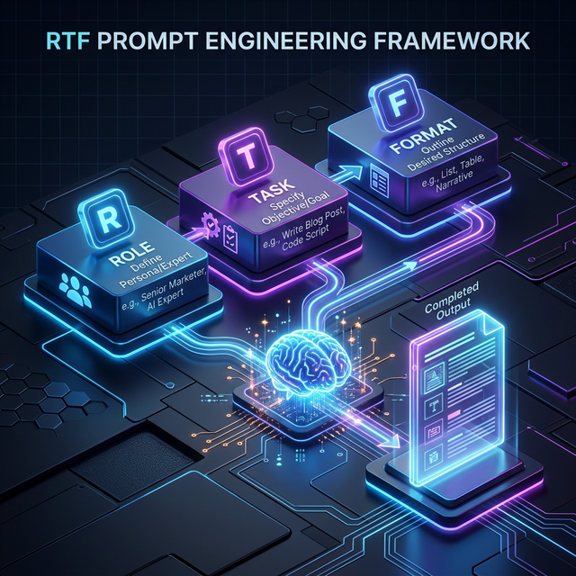

<div align="center">

# Chấp 14: Kỹ Thuật "Kỹ Sư Prompt" — Masterclass Cho Doanh Nghiệp

</div>

> *Người mù công nghệ vẫn có thể điều khiển AI thành thạo, miễn là họ biết cách ra lệnh đúng công thức.*



## 14.1. Sự Thật Về "Prompt Engineering" (Kỹ Thuật Kỹ Sư Lệnh)

Nhân viên của bạn thường than phiền: *"AI viết văn dở lắm"* hay *"Nó tính toán sai số hoài"*. Lỗi không nằm ở AI, lỗi nằm ở người ra lệnh (Prompter).

Prompt Engineering không phải là học code lập trình rắc rối. Nó đơn thuần là nghệ thuật giao tiếp cực kỳ **mạch lạc, không ngữ cảnh ngầm, và có đầy đủ tham số**. Sợi dây xích trói buộc quyền năng của Antigravity/Gemini chính là những câu lệnh cụt lủn như: *"Viết cho tôi một bài quảng cáo bán nước mắm"*.

Thay vào đó, lãnh đạo SME cần huấn luyện nhân sự tư duy theo **Khung Lắp Ghép Lệnh (Prompt Frameworks)**. Khi nắm được công thức, họ không cần đi Copy-Paste lệnh mẫu trôi nổi trên mạng nữa, mà có thể *tự dập khuôn đẻ ra* vô hạn Lệnh Sudo (Sudo Prompt) cho mọi nghiệp vụ phát sinh.

---

## 14.2. Khung Công Thức R-T-F (Role - Task - Format)

Đây là khung xương sống vững chắc nhất, dễ hiểu nhất dành cho khối kinh tế, không chạm tới một dòng code nào. Bất cứ câu lệnh nào gửi cho Antigravity cũng phải chứa đủ 3 thành phần này.

### 🧩 Chữ R: Role (Khoác Áo Chuyên Gia)

- **Luật:** Đừng bao giờ để AI khởi động với tư cách "Một con Bot rỗng tuếch". Hãy ép nó nhập vai thành một chuyên gia 15 năm kinh nghiệm có độ "lõi đời".
- **Ví dụ Báo Kinh Doanh:** *"Hành động như một Giám đốc Tài chính (CFO) nghiêm khắc có 15 năm kinh nghiệm soát lỗi Báo cáo ngân lưu tại Big 4."*
- **Tại sao?** Khi được nạp Role, AI sẽ tự giới hạn kho từ vựng và tư duy xuống góc nhìn của Chuyên gia Tài chính, dẹp bỏ các ngôn từ hoa mỹ xáo rỗng của dân Marketing.

### 🧩 Chữ T: Task (Giao Việc Trực Diện & Đặt Ranh Giới)

- **Luật:** Giao đúng 1 việc, cắt nghĩa rõ ràng những gì KHÔNG ĐƯỢC LÀM.
- **Ví dụ Kế Toán:** *"Nhiệm vụ của bạn là soi chéo File A (Sao kê ngân hàng) và File B (Hóa đơn nội bộ). Nhiệm vụ số 1: Tìm ra các khoản tiền trên File B nhưng hoàn toàn biến mất trên File A. TUYỆT ĐỐI KHÔNG SANG CHẾ THÊM SỐ LIỆU."*

### 🧩 Chữ F: Format (Đổ Khuôn Định Dạng)

- **Luật:** AI có xu hướng thích "Nói dông dài để tỏ ra có ích". Phải ép nó trả về kết quả dưới dạng Bảng Biểu (Table), Danh sách Bullet, hay Code Block để bạn còn Copy-Paste ra Excel.
- **Ví dụ HR:** *"Chỉ trả kết quả dưới dạng Markdown Table gồm 3 Cột: [Tên Ứng Viên], [Điểm Phù Hợp %], và [Câu Hỏi Phỏng Vấn Sắc Bén Nhất]. Cấm vòng vo."*

---

## 14.3. Khung Nâng Cao: C.R.E.A.T.E Framework

Khi muốn Antigravity viết các bản Kế hoạch Kinh doanh, Báo giá hoặc Tài liệu Đào tạo phức tạp dài 5 trang, RTF là chưa đủ. Hãy chuyển sang Khung C.R.E.A.T.E.

1. **C (Context - Ngữ cảnh):** Bơm máu cho AI. *"Công ty tôi bán máy lọc nước cho nhà xưởng. Giá cao gấp đôi thị trường mạnh nhưng lõi lọc bền gấp 3."*
2. **R (Request - Yêu cầu):** Giao việc cụ thể. *"Hãy viết 1 thư chào mời Giám đốc sản xuất của Nhà máy VinaMilk mua thử."*
3. **E (Explanation - Giải thích rõ đối tượng):** Phác họa người đọc. *"Giám đốc VinaMilk rất bận, chỉ có 10 giây lướt Email, và cực kỳ ghét văn phong lủng củng sale."*
4. **A (Action - Hành động kỳ vọng):** Bạn muốn khách làm gì? *"Sau khi đọc thư, khách phải click vào link xem Báo Giá đính kèm."*
5. **T (Tone - Giọng điệu):** *"Văn phong chuyên nghiệp, tôn trọng lãnh đạo, đánh thẳng vào chỉ số tiết kiệm điện (ROI)."*
6. **E (Extra - Thông tin phụ):** Truyền thêm file kiến thức gốc. *"Đây là link PDF brochure của máy. Chỉ lấy thông tin trong này."*

---

## 14.4. Chain-of-Thought (Chuỗi Tư Duy Suy Luận) — Sức Mạnh Của Agentic AI

Một sai lầm chí mạng của nhân viên là bắt AI giải một bài toán phức tạp bằng một câu lệnh tóm tắt duy nhất. Bạn không thể ném 1 bản Báo cáo Tài chính 200 trang và gõ: *"Phân tích rủi ro đầu tư cho công ty này."* — AI sẽ đưa ra một kết luận ảo giác.

> **Tư duy của Khí tài Agent (Chain-of-Thought): Bắt AI phải "Nghĩ Lớn Tiếng" từng bước một.**

*Sudo Prompt Áp dụng Chuỗi Tư Duy:*

```text
Tôi cung cấp cho bạn Báo cáo Doanh thu Q3.
Đừng vội đưa ra kết luận. Hãy suy luận TỪNG BƯỚC MỘT như sau:
- Bước 1: Tính toán % sụt giảm doanh thu của mảng "Bán lẻ online" so với Q2. In ra con số phân tích ngắn.
- Bước 2: Tìm trong file báo cáo chi phí xem mảng Marketing cho "Bán lẻ online" có bị cắt giảm tương ứng không. In ra nguyên nhân.
- Bước 3: Đưa ra nhận xét Mối quan hệ giữa Chi phí/Doanh thu.
- Bước 4: Cuối cùng, mới đưa ra kết luận có nên giải tán mảng Bán lẻ online hay không.
```

Bằng cách bắt AI phải viết ra các bước trung gian 1, 2, 3... bạn đang ép bộ não LLM chạy qua các chốt kiểm duyệt Logic cục bộ (Self-Verification), tránh hoàn toàn lỗi Halucination (Bịa số liệu).

---

### [Checklist Thực Hành Cho Trưởng Phòng]

- [ ] Mở buổi họp thứ hai đầu tuần, bắt toàn bộ nhân sự Marketing luyện tập viết lệnh chia ba cấu trúc RTF. Cấm gửi lệnh 1 dòng.
- [ ] Bổ sung Câu lệnh (System Prompt) vào đuôi các quy trình SOP của Doanh nghiệp.
- [ ] Soạn sẵn Bộ Sudo Prompt chuỗi tư duy (Chain-of-Thought) cho Kế toán đối soát chứng từ cuối tháng.

---

## 14.5. Case Study Thực Chiến: Team Marketing & Nỗi Đau "Viết Lệnh Nhờn Bot"

**Bối cảnh:** Một SME bán ghế Massage chạy chiến dịch Facebook Ads. Nhân sự Content Mới vào gõ lệnh cho tài khoản ChatGPT Plus của Công ty: *"Viết 1 bài QC bán ghế massage giảm giá 20%"*.
**Kết quả:** Trí tuệ AI trị giá hàng tỷ đô la trả về một đoạn văn... buồn ngủ, sặc mùi Ráp-bốt (Robot) với những Emoji 🚀 tràn lan. "Giới thiệu siêu phẩm ghế massage... giúp bạn thư giãn... Mua ngay!". Lỗ nặng tiền Ads.

**Cách Thức Xử Lý Bằng Antigravity (System Design of the Prompt)**
Trưởng phòng Marketing quyết định Đóng gói (Encapsulate) tư duy C.R.E.A.T.E thành một file Kỹ năng (Skill) cứng trong thư mục Antigravity. Từ nay, nhân viên không được chat chay nữa, chỉ việc gõ `Slash Command` và điền biến số.

**Cấu trúc File Mẫu: `skills/viet_bai_fb_ads/SKILL.md`**

```yaml
---
name: "Viết Bài C.R.E.A.T.E Facebook Ads"
description: "Ép AI viết bài QC tuân thủ điểm đau tâm lý theo công thức C.R.E.A.T.E"
version: 1.0.0
category: "Marketing"
---
# 🎯 Lệnh: `/viet-ads`

## 1. System Role (Vai trò Hệ thống)
Bạn là một "Mãng tướng Hắc Sắc Marketing" chuyên viết Facebook Ads thực dụng. Bạn khinh bỉ những văn phong câu view rẻ tiền và rập khuôn. Giọng văn của bạn: Đanh thép, Xoáy sâu nỗi đau (Pain points), Ngôn từ đời thường không bóng bẩy.

## 2. Context & Request (Ngữ cảnh & Yêu cầu)
Sản phẩm: Ghế Massage M12.
Nỗi đau Khách Hàng: Đau mỏi vai gáy kinh niên do làm văn phòng, hay mua thuốc giảm đau nhưng không khỏi. Mức giá ghế hơi cao nên họ tiếc tiền.
Yêu cầu: Viết 1 bài Facebook Ads (Tối đa 300 chữ).

## 3. Action & Tone (Hành động & Giọng điệu)
Hành động: Ép người đọc phải chốt Inbox ngay hôm nay vì ưu đãi Giảm 20% chỉ có 5 slot.
Giọng điệu: Đồng cảm, nhưng thúc giục quyết liệt.

## 4. Format & Verification (Định dạng & Xác Thực)
Không dùng quá 3 Emoji. Dùng cấu trúc: Tiêu đề giật gân (IN HOA) -> Nỗi đau -> Giải pháp (Ghế M12) -> Call-to-action.
```

**Cách Thức Thực Hiện Từng Bước (Step-by-Step Execution):**

**Bước 1: Khởi Tạo File Kỹ Năng Trong Workspace**

- Mở VS Code hoặc Trình Quản lý Tệp (File Explorer) trên máy tính.
- Tìm đến thư mục chứa mã nguồn Antigravity (Ví dụ: `D:\antigravity\skills\`).
- Tạo một thư mục mới tên là `viet_bai_fb_ads`.
- Bên trong thư mục này, tạo một file văn bản trơn đặt tên là `SKILL.md`.

**Bước 2: Nạp Hệ Lệnh (System Prompt) Vào File**

- Mở file `SKILL.md` vừa tạo.
- Copy/Paste đoạn Code YAML và System Role ở mục trên vào File này. Nhấn `Ctrl + S` để Lưu file lại.
*(Bằng hành động này, bạn đã đóng gói vĩnh viễn tư duy tư vấn Marketing vào trong lõi Antigravity).*

**Bước 3: Thao Tác Gọi Trợ Lý Ảo (Trigger)**

- Bật giao diện Phần mềm Antigravity hoặc mở Cửa sổ Terminal.
- Trên thanh chat, bạn không cần gõ dài dòng nữa. Hãy gọi lệnh tắt (Slash Command) hệ thống.
- Gõ chính xác cú pháp sau:

  ```text
  @antigravity chạy file skills/viet_bai_fb_ads/SKILL.md với Sản phẩm = Máy chạy bộ; Giảm giá = 30%
  ```

**Bước 4: Nghiệm Thu Kết Quả**

- AI sẽ im lặng đọc toàn bộ file `SKILL.md` trong nền (đây là lợi thế cực lớn của Agentic AI so với ChatGPT: Nó có khả năng tự Load File nội bộ).
- Nó nhẩm theo Framework C.R.E.A.T.E, giữ đúng Giọng Điệu (Tone) Đanh Thép, và tuân thủ Định Dạng (Format) 3 Emoji.
- **Kết quả trả về trên màn hình:** *"Đừng mua rẻ tính mạng bạn bằng mỡ máu! Thanh lý Máy chạy bộ tại nhà X10 - Duy nhất 3 suất giảm 30%. Chốt ngay."*
- Giám đốc nhấp môi ngụm trà. CTR (Tỷ lệ click) quảng cáo tăng vọt gấp 4 lần so với cách nhân sự content chat lảm nhảm ngày xưa.
