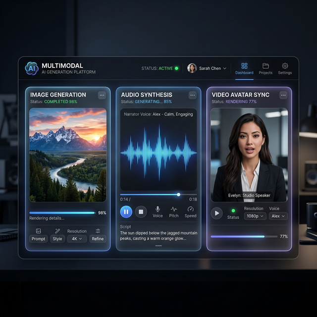

<div align="center">

# Chấp 15: AI Đa Phương Thức (Multimodal) — Đế Chế Media 0 Đồng

</div>

> *Không chỉ là những cỗ máy xử lý số liệu. AI giờ đây đã có "Tai" để nghe, có "Mắt" để nhìn thẩm mỹ, và có "Họng" để cất giọng nói.*



## 15.1. Khi Văn Bản Gọi Hình Ảnh & Âm Thanh Chào Đời

Sẽ là một sai lầm khủng khiếp nếu Lãnh đạo SME (đặc biệt là khối Growth/Marketing/Đào tạo) chỉ dùng AI (LLM) để... chắp bút mần thơ. Vũ khí hạt nhân thứ 2 của kỷ nguyên AI là khả năng sinh nở **Đa Phương Thức (Multimodal Generation)**.

Điều này có nghĩa là, với cùng một kịch bản text mà Ebook này hướng dẫn bạn tạo từ Antigravity/Gemini (Ở Chương 4 và Chương 8), bạn có thể ngay lập tức chuyển hóa nó thành Hình Ảnh 4K, Audio Giọng Đọc MC Chuyên Nghiệp, và thậm chí là Video Đại Sứ Thương Hiệu Ảo.

**Chi phí Media sản xuất theo cách cũ:** Đi thuê mướn mẫu ảnh 10tr/ngày + Thu âm VO 2tr/bài + Dựng phim 5tr/clips.
**Chi phí sản xuất bằng AI:** ~0.5$ (Chưa tới 1 ly Trà đá cho mỗi thành phẩm).

---

## 15.2. Chân Vạc Thứ 1: Kiến Tạo Hình Ảnh Bằng Text-to-Image (Midjourney/DALL-E)

Phòng ban sử dụng nhiều nhất: **Marketing (Quảng Cáo), Thiết Kế Bao Bì (R&D).**

Hãy quên việc lên Google xin xỏ những tấm ảnh Stock mờ tịt và bị dính Logo bản quyền. Bằng cách nối đuôi lệnh ra Antigravity: *"Tạo cho tôi 5 Lệnh Prompts bằng tiếng Anh miêu tả Cảnh một chàng trai đang uống Cà phê Việt Nam lúc bình minh"*, sau đó quăng vào **Midjourney V6**. Bạn sẽ có một tấm ảnh sắc nét như máy cơ Sony A7 chụp ở khẩu độ f/1.4.

*Cấu trúc Prompt Hình Ảnh Kinh Điển (Tặng Kèm):*
`[Chủ Thể Chính] + [Hành Động] + [Môi Trường Xung Quanh/Thời Tiết/Ánh Sáng] + [Góc Máy Ảnh, Thông Số Ống Kính] + [Phong Cách Nghệ Thuật (Ví dụ: Cinematic, Hyper-Realistic)] --ar 16:9`

---

## 15.3. Chân Vạc Thứ 2: Nhân Bản Giọng Nói (Text-to-Speech) Với ElevenLabs

Sử dụng AI biến văn bản thành giọng đọc (Chị Google) đã là chuyện của những năm 2018. Công nghệ Voice Cloning của năm 2024-2025 vượt qua mọi giới hạn: Nó hiểu được hơi thở, biết luyến láy khi buồn, biết gầm gừ khi giận dữ.

Vũ khí mạnh nhất trong mảng này là **ElevenLabs**.

- **Ứng dụng Đào tạo Nội bộ (HR/L\&D):** Thu âm nguyên cuốn Sổ tay Văn hóa Doanh nghiệp 50 trang thành Audio Book bằng Giọng đọc trầm ấm của chính CEO. Nhân viên Sales chạy xe bốc hàng vẫn có thể đeo loa nghe Sếp giảng đạo lý qua tai nghe Bluetooth. Mọi thứ chỉ mất 5 phút xuất File.
- **Ứng dụng Auto-CSKH:** Antigravity gõ xong câu Xin lỗi của Khách V.I.P (Ở lệnh `/xu-ly-khieu-nai`). Bạn dùng Audio AI để chuyển văn bản đó thành file `.mp3` gọi thoại Call Bot (VoiceBot) báo hủy đơn. Khách hàng 100% tưởng đầu dây bên kia là một Cô Điều Phối Viên bằng xương bằng thịt.

---

## 15.4. Chân Vạc Thứ 3: Đại Sứ Ảo Lên Sóng (HeyGen / D-ID)

Đây là ranh giới Tự Động Hóa Nhận Thức tối thượng cho ngành Sáng Tạo Nội Dung. Bạn không cần Bấm Máy Quay cũng có thể sản xuất mỗi ngày 50 Video Tiktok dài 1 phút.

**Quy Trình Pipeline Đa Đặc Vụ (Multi-Agent Workflow):**

1. Lệnh `/tao-content-calendar` trên Antigravity cào được tin hot về luật Đất Đai rạng sáng nay. Tự nó soạn kịch bản Video Tiktok 150 chữ (Rất gãy gọn, có Hook, có Call-to-action).
2. Lấy Kịch bản Text đó, Tải lên hệ thống **HeyGen (AI Avatar Video Generator)**.
3. Chọn mẫu AI Avatar (Một anh chuyên gia mặc Vest có cái môi mấp máy theo mồm chuẩn 100% tiếng Việt).
4. Phóng (Export) ra Video thành phẩm để ném sang mảng Auto-Posting (Tự động đăng bài).

**Khủng hoảng Kênh Truyền Thông (Marketing Crisis) được giải quyết:** Dẹp bỏ tình trạng KOL xây Kênh Tiktok của Công ty lên hàng Triệu Sub sau đó nghỉ việc và làm sập Brand. Gương mặt Đại Sứ của công ty lúc này là một bức ảnh AI không bao giờ đòi tăng lương, không bao giờ scandal, không bao giờ lão hóa, và Sẵn Sàng Nói Liên Tục Mọi Ngôn Ngữ!

---

### [Luật 5 Whys: Phân Tích Thực Chiến Multimodal]

1. **Làm Gì?** Dùng AI để sinh Ảnh, Audio giọng đọc đa cảm xúc, và Video người ảo thay vì thuê ekip production.
2. **Tại Sao?** Tốc độ phản ứng với trend là số 1 ở Marketing Mạng Xã Hội. Nếu chờ ekip quay mất 1 ngày, Trend đã nguội. Chi phí sản xuất giảm 99%. Nhân sự nội bộ thì có video giáo trình để học ngay tắp lự.
3. **AI Lấy Nguồn Ở Đâu?** Ảnh được sinh từ các Model khuếch tán (Diffusion) học từ hàng tỷ bức tranh; Giọng nói học từ mô hình Neural Speech Synthesis.
4. **Lỗi Thì Tính Sao (Hallucination Hình mờ)?** Ảnh sẽ dính lỗi (thừa ngón tay, mờ mặt). Giải pháp: Nhân sự Marketing phải biết xài các công cụ (Upscaler/Inpainting) để khoanh vùng nhờ AI sửa lại đúng chỗ hỏng.
5. **Dòng Tiền Ra Sao (ROAI)?** Phí duy trì gói Premium HeyGen/Midjourney khoảng $30-$50/Tháng. Trả lại Sản lượng = 1 Đội Ngũ Setup Ánh Sáng, Quay Phim, Thu Âm vất vả lương chục triệu mỗi tháng. Lãi ròng khổng lồ.

---

## 15.5. Case Study: Hệ Thống Auto-Media Triển Khai Xuyên Đêm

**Bối cảnh:** Một Trung tâm Tiếng Anh muốn tung ra chuỗi "1 Từ Vựng Mỗi Ngày" (Shorts/Reels) nhưng không có tiền thuê giáo viên Bản ngữ ghi hình liên tục.

**Hệ Thống Thiết Kế (System Design - Auto Media Pipeline):**
Đây là một hệ thống Multi-Agent nối tiếp:

1. **Agent Text (Gemini):** Đẻ ra kịch bản 1 từ vựng, tự đưa thêm 예문 (Câu ví dụ).
2. **Agent Voice (ElevenLabs API):** Nhận kịch bản Text, gọi API chuyển thành Giọng Nam Mỹ chuẩn trị giá (File `audio.mp3`).
3. **Agent Video (HeyGen API / D-ID):** Ép File `audio.mp3` vào ảnh Avatar Giáo viên để sinh khẩu hình miệng khớp 100% (File `video.mp4`).

**Cấu trúc File Mẫu: `workflows/auto-media-shorts.md`**

```md
---
description: "Tự động sản xuất Video Reels Kèm Giọng Bản Ngữ"
---
# Lệnh: `/auto-media-shorts`

## Kịch Bản Luồng Chạy (Workflow Execution)

1. Tự khởi tạo 1 Sudo Prompt gửi Gemini: "Sinh cho tôi 1 từ vựng Tiếng Anh cấp độ IELTS 6.5 chủ đề Môi Trường. Yêu cầu có định nghĩa và 1 câu ví dụ. Lưu vào file `kịch_bản.txt`."
// turbo

2. Gọi MCP Server hoặc dùng Bash Script: Gửi nội dung file `kịch_bản.txt` qua cồng ElevenLabs API.
```bash
# Ví dụ Lệnh Hệ Thống Antigravity thao túng cURL
curl -X POST https://api.elevenlabs.io/v1/text-to-speech/{VOICE_ID} \
  -H "xi-api-key: $ELEVENLABS_KEY" \
  --data "{\"text\": \"$(cat kịch_bản.txt)\"}" \
  -o "output_voice.mp3"
```

// turbo

1. Bắn tín hiệu sang HeyGen (hoặc dùng Trình duyệt Browser Agent của Antigravity để tự thao tác mở web HeyGen, upload `output_voice.mp3` và bấm [Generate Video]).

```

**Cách Thức Thực Hiện Từng Bước (Step-by-Step Execution):**

**Bước 1: Lấy Mã Kích Hoạt (API Key) Từ Nguồn Cấp**
- Truy cập trang web `elevenlabs.io`. Đăng nhập bằng tài khoản Google.
- Nhấn vào Cài đặt (Profile Icon) góc cực phải màn hình $\rightarrow$ Chọn **Profile + API key**.
- Bấm biểu tượng 👁 (Con mắt), Copy chuỗi ký tự mật mã (Ví dụ: `sk_5d93...`).

**Bước 2: Nạp Mã Bảo Mật Vào Não Bộ Antigravity**
- Mở thư mục chứa mã nguồn hệ thống Antigravity.
- Mở file tên là `.env` (File môi trường).
- Dán lệnh dòng cấu hình vào: `ELEVENLABS_KEY="sk_5d93..."`.
*(Hành động này giúp Antigravity có quyền "quẹt thẻ" tiêu tiền của bạn trên nền tảng ElevenLabs).*

**Bước 3: Phát Lệnh Thực Thi Xuyên Đêm**
- Sếp rảnh rỗi lúc 23h đêm, mở Antigravity lên và gõ lệnh sau ở thanh tin nhắn:
  ```text
  @antigravity thực thi luồng auto-media-shorts.md lặp lại 30 vòng cho 30 từ vựng khác nhau
  ```

**Bước 4: Quyền Lực Brower Agent (Trình Duyệt Đặc Vụ)**

- Vì có từ khóa lặp vòng (Loop), Antigravity sẽ gọi Module Trình duyệt Ảo.
- Màn hình máy tính của bạn sẽ tự bật lên tab Chrome mới. Chuột tự động di chuyển đến nút `Generate` trên web HeyGen, tự động gõ Text, tự động tải File `.mp4` về mục `/exports`.
- Sáng dậy 7h, bạn mở máy và có sẵn 30 Video Tiktok chuẩn chỉ. Bạn chỉ việc ném lên Mạng xã hội. Đáng sợ và Hoàn mỹ!
