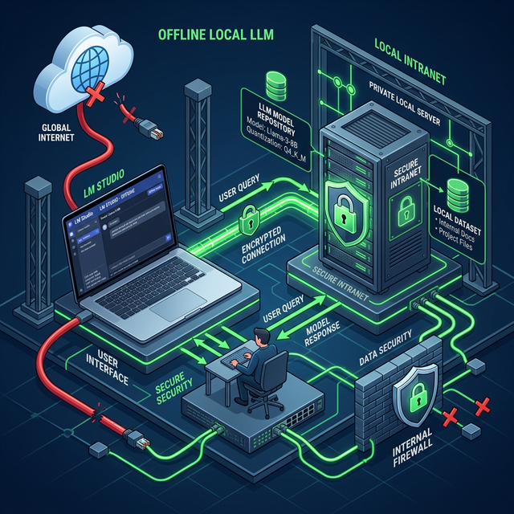

# Chấp 16: Local LLM & Cách Tự Tạo Chatbot Bảo Mật Cục Bộ

> *Ngắt cáp mạng Internet. Sập Wi-fi. Một Trợ Lý Ảo vẫn âm thầm nghiến ngấu dữ liệu mật và trả lời mọi truy vấn trong căn phòng đóng kín của Giám Đốc.*

## 16.1. Tại Sao Lại Cần Mô Hình "Chạy Cục Bộ" (Local LLMs)?

Dù đã có Lá Chắn Data Masking (Che mờ dữ liệu) được trình bày ở Chương 11, nhưng giới hạn tâm lý của các **Ngân Hàng, Bệnh Viện, hoặc Cơ Sở An Ninh Quốc Phòng** vẫn là: *Không một chữ nào được phép rời khỏi máy chủ qua Cổng Mạng Quốc Tế.*

Nếu dùng API của Google Gemini hay Anthropic Claude, dữ liệu bắt buộc phải được mã hóa truyền qua mạng đám mây (Cloud) để sang Server của Mỹ xử lý và trả về. Đối với các Giám đốc Rủi ro cực đoan, điều này vẫn có 0.0001% nguy cơ rò rỉ.

**Cứu Cánh: Local LLM (Mô hình Ngôn ngữ Lớn Cục bộ).**
Khái niệm này ám chỉ việc bạn "Download" (Tải) nguyên não bộ của một con AI (ví dụ mã nguồn mở Llama 3 của Meta, hoặc Qwen của Alibaba) với dung lượng vài chục Gigabyte về máy tính Laptop hoặc Máy Chủ nội bộ của SME. Sau đó rút phích cắm mạng. Con AI này chạy 100% bằng Card Đồ Họa (GPU) tĩnh tại phòng của bạn. Tuyệt mật tuyệt đối.

---

## 16.2. 10 Phút Vẽ Ra Một Chatbot Offline Cơ Bản Bằng LM Studio

Để đập tan lầm tưởng "Mua máy chủ AI chắc tốn tiền tỷ", chúng ta sẽ có một bài diễn tập thực tiễn. Bất kì ai có 1 chiếc Macbook Chip M1/M2/M3 (hoặc PC có Card NVIDIA RTX tử tế) đều có thể làm theo.

**Bước 1: Cài đặt "Nhà Ga" LM Studio**

- Tải ứng dụng tên là **LM Studio** về máy (Miễn phí hoàn toàn). Công cụ này giống như trình duyệt Chrome, nhưng thay vì lướt Web, nó dùng để chạy các mô hình AI.

**Bước 2: Tìm Thẻ Não Bộ LLaMA 3**

- Ngay trong giao diện ứng dụng có cung cấp thanh Tìm Kiếm (Khay kho dữ liệu HuggingFace).
- Gõ tìm kiếm mô hình mã nguồn mở tốt nhất nhì thế giới hiện tại: `Llama-3-8B-Instruct`. Phiên bản dung lượng đã nén (Quantization dạng GGUF nặng khoảng 5-6GB).
- Nhấn tải xuống ổ cứng máy tính.

**Bước 3: Khởi Động Nồi Hơi & Chat Offline**

- Qua tab "Chat", bấm "Load Model" (Nạp não bộ vào RAM).
- Giờ đây, bạn có một khung Chat quen thuộc như màn hình ChatGPT. Bạn có thể chép thông tin Bảng Kế Toán (chưa che tên) vào đây và kêu AI phân tích nguyên nhân lỗ.
- Quan sát kỹ: Dữ liệu không hề có độ trễ Ping vì nó được xử lý ngay tại chip GPU Laptop của bạn. CPU hú vang, chứng tỏ Hệ thống Offline Local LLM Đang Sống!

---

## 16.3. Tích Hợp Local LLMs Vào Môi Trường Antigravity

Antigravity là một môi trường linh hoạt bậc nhất. Nếu SME không muốn tiêu thụ 1 đồng Token (API Dollar) nào của OpenAI/Google, Giám Đốc IT có thể ép Antigravity kết nối vào não bộ nội bộ (LM Studio Server).

- LM Studio sau khi tải LLama 3 cho phép ấn nút **[Chạy Local Inference Server]**.
- Nó cung cấp đầu ra tại cổng `http://localhost:1234/v1`.
- Trong Môi trường Lõi Antigravity, bạn cấu hình thay đổi Base URL nhắm vào địa chỉ Localhost này thay vì `api.openai.com`.
- **Kết Quả Kinh Ngạc:** Toàn bộ lệnh Workflow (Lọc CV, Quản lý kho Mật) của bạn sẽ chạy ầm ầm trên cái rùa nhỏ LLaMA 3. Chi phí Token hàng tháng = **0 Đồng Tròn Trĩnh**.

*(Lưu ý: Các mô hình Local nhỏ (8B tham số) thường "Ngu" hơn Gemini 1.5 Pro hoặc Opus (ngàn tỷ tham số) ở Logic Suy diễn đa chiều phức tạp. Nên chỉ áp dụng Local LLM vào các quy trình Nhận dạng Mẫu, Dịch thuật Cục bộ, Rút trích Mẫu rập khuôn).*

---

### [Luật 5 Whys: Phân Tích Thực Chiến Local LLM]

1. **Làm Gì?** Thay vì thuê bao não trên Cloud (Đám mây), Tải não con AI về đặt trên Bàn làm việc của Kế toán. Ngắt kết nối mạng và hỏi đáp truy vấn Data nhạy cảm hằng ngày.
2. **Tại Sao Phải Làm?** Đáp ứng Tiêu chuẩn Tuân thủ ISO 27001 và Nghị Định Bảo Vệ Thông Tin Y Tế/Tài Chính Cấp Bạch kim. Không còn bất cứ Cửa sau (Backdoor) Hacker nào có thể truy vấn xuất Data của công ty ra biên giới.
3. **AI Xử lý Bằng Gì?** Bằng Card Đồ Họa VRAM nội bộ (như RTX 3090/4090 hoặc Apple Silicon Unified Memory). Tốc độ đáp ứng Text Output phụ thuộc cực mạnh vào chip GPU đắt hay rẻ.
4. **Lỗi Hoang Tưởng (Hallucination Cục Bộ) Xử Sao?** LLaMA 3 8B dễ cãi ngang hơn Opus. Sếp khắc phục bằng cách Thiết kế "Temperature = 0" và dùng kỹ thuật RAG (Kẹp File PDF cục bộ đè lên lệnh cấm suy luận ra ngoài File) (Xem Chương 11).
5. **Dòng Tiền Ra Sao (ROAI)?** Phí duy trì Model Hàng Tháng là 0 Đồng. Phí "Nuôi" duy nhất là hóa đơn Tiền Điện Khấu Hao mua dàn máy chủ nội bộ. Hoàn Vốn (Break-even) trong 6 tháng nếu Công ty có cường độ xử lý hơn triệu từ/ngày.
