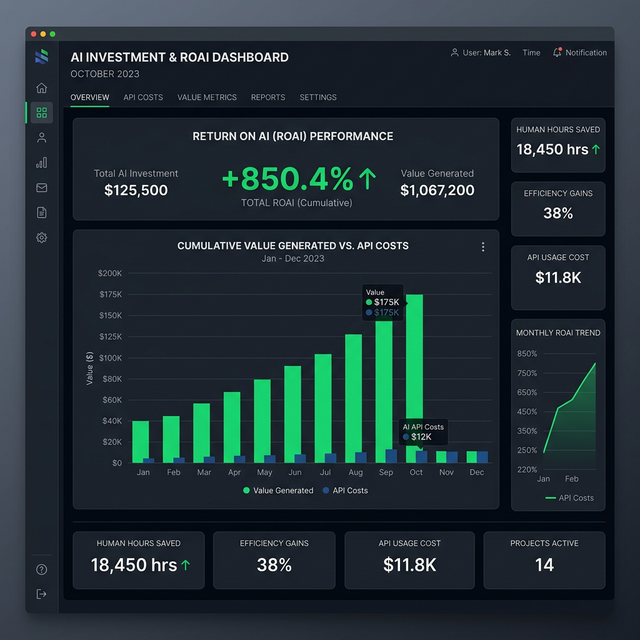

# Chấp 17: Bảng Đo Lường "Return on AI" (ROAI) — Lời Giải Cho Bức Tranh Lợi Nhuận

> *Một dự án Tự Động Hóa chỉ là "Đồ chơi công nghệ" cho đến khi bạn chứng minh được trên bảng Excel rằng nó đang in ra tiền.*

## 17.1. Căn Bệnh "Thử Cho Biết" Và Mồ Chôn Dự Án AI

Rất nhiều SME Việt Nam sau khi mua Antigravity hoặc tài khoản ChatGPT ChatGPT Plus về, để nhân viên chơi đùa khoảng 2 tuần rồi... bỏ xó. Lý do cốt lõi: **Ban Giám Đốc không có công cụ đo lường Hoàn Vốn (Return on AI - ROAI).**

Khi không nhìn thấy con số lãi/lỗ trực quan, Sếp sẽ coi hóa đơn 20$ tiền API mỗi tháng là "Phí thử nghiệm vô ích" thay vì "Lương trả cho một Nhân sự Cấp Cao làm việc 24/7 không ngủ".

Chương cuối cùng này cung cấp cho bạn một Vũ khí sắc bén nhất: **Khung tư duy Đo lường Hiệu quả Tài chính của Dự án AI.**

---

## 17.2. Phương Trình Cốt Lõi Tính Toán ROAI

Đừng đo lường dự án AI bằng số lượng câu lệnh (Prompt) đã gõ. Hãy đo trên Bảng Hệ Quy Chiếu Lương Cơ Bản của nhân sự.

**Định kiện 1: Đánh giá Giá trị Giờ Công (Hourly Rate Value)**

- Giả sử Lương nhân viên Kế Toán = 15.000.000 VNĐ / Tháng.
- Làm việc 22 ngày x 8 tiếng = 176 Giờ/Tháng.
- Vậy 1 Giờ Công (1 man-hour) của Kế toán trị giá = 85.000 VNĐ.

**Định kiện 2: Đo lường Khối Lượng Tác Vụ (Task Volume)**

- Mỗi tháng, Kế toán tốn 40 Giờ để ngồi mở từng file PDF đối soát giao dịch Ngân Hàng với Phần mềm KiotViet.
- Tổng chi phí nhân sự cho tác vụ này: 40h x 85.000 VNĐ = 3.400.000 VNĐ.

**Định kiện 3: Chi phí Chạy Máy (The API Engine Cost)**

- Bạn dùng Lệnh Kế Toán Antigravity (`/lap-to-khai-thue` - Chương 08).
- AI nuốt 10.000 file PDF trong vòng 15 Phút. Điện năng và Giá API Token thực tế trừ vào tài khoản Google Gemini chỉ tốn 2$ (50.000 VNĐ).

**LẬP BẢNG TÍNH LỢI NHUẬN GỘP (ROAI) 1 THÁNG CỦA 1 TÁC VỤ NHỎ:**

- Chi phí chạy người cũ : `3.400.000 VNĐ`
- Tiền mua API cho máy  : `- 50.000 VNĐ`
- **Tiền Lãi Ròng (ROAI) : `+ 3.350.000 VNĐ`**
- **Sản lượng Kép:** Kế toán được giải phóng 40h/tháng. Đẩy họ sang làm Thu hồi Nợ Khó Đòi (Phát sinh dòng tiền thực).

*Một phép tính quá hiển nhiên để bóp cò quyết định!* Nếu tính Lũy kế 6 Phòng Ban (Nhân sự, Marketing, CSKH) mỗi tháng tiết kiệm được 200 Giờ công, SME bạn đang Lãi Chóp một Nhân Sự Cứng Cựa Miễn Phí.

---

## 17.3. Khung OKRs Thiết Lập Mục Tiêu Ứng Dụng Agentic AI Cấp Công Ty

Cách tốt nhất để ép nhân viên bỏ lối mòn là **Biến Vị Trí Của Họ Thành "Người Duyệt Bot"**.

Thay vì giao KPI: *"Tháng này em phải viết 30 bài SEO"*. Hãy giao OKRs thời chuẩn AI:

- **Objective (Mục Tiêu):** Chuyển đổi toàn bộ quy trình Viết SEO từ sức người sang Máy.
- **Key Result 1:** Thiết lập xong `Sudo Prompt` đóng hộp cho Kịch bản Auto-Content Engine.
- **Key Result 2:** Số lượng bài AI tự đăng đạt 150 bài/Tháng (Gấp 5 lần sức người cũ).
- **Key Result 3 (Veto Filter):** Tỷ lệ bài dính "Ảo giác số liệu" hoặc "Văn phong Rô-bốt" bị lọt ra ngoài lưới duyệt của nhân viên nhỏ hơn < 1%.

Ở tư thế này, Nhân Viên không còn sợ AI cướp việc, vì chức danh của họ đã biến thành **"Giám Sát Viên Trí Tuệ Nhân Tạo"** (AI Supervisor) có toàn quyền Phủ quyết Lệnh Máy.

---

### [TỔNG KẾT EBOOK] Sứ Mệnh Antigravity & Đế Chế SME Tự Động

Cuộc đua trong 5 năm tới của SME Việt Nam không phải là ai thuê xưởng bự hơn hay tuyển được nhiều Sales hơn.
Cuộc chiến sẽ phân định bằng việc: **Doanh nghiệp nào gắn "Não Bộ Nhân Tạo" vào Dữ Liệu Lõi nhanh hơn.**

Cuốn dã sử *Antigravity Business Guide* bạn đang cầm trên tay đã hoàn thiện 100% Cấu Bức từ:

- (1) Khai thông Chướng ngại Tâm lý Lãnh đạo.
- (2) Nhúng Máy Cày Multi-Agent vào các Nghiệp vụ Tối tăm nhất (Rác Data).
- (3) Rào chắn Pháp lý Bảo mật.
- (4) Đo lường rạch ròi bằng Bảng Lãi Lỗ ROAI.

Gấp sách lại. Bật Terminal Lên.
**Và Bấm Lệnh `// turbo-all` đi Sếp!**
