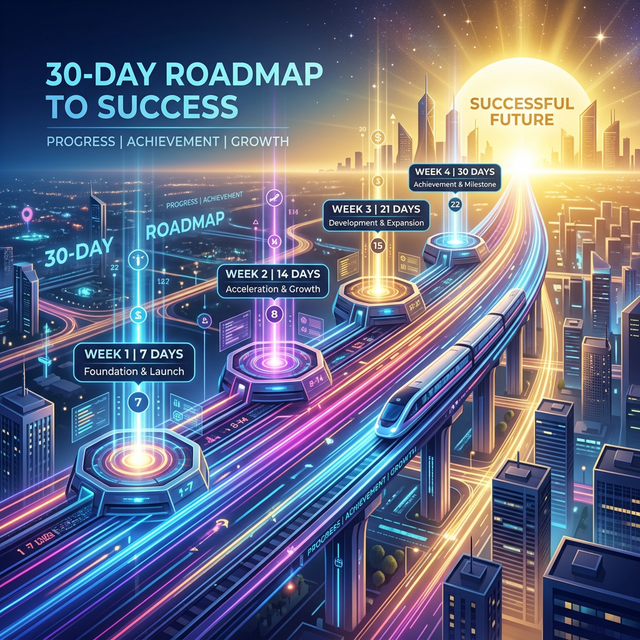

# Chương 18: Lộ Trình 30 Ngày — Từ "Người Dùng" Đến "Đế Chế AI-Driven"

> [!IMPORTANT]
> Chuyển đổi số không phải là thay đổi công cụ, mà là thay đổi thói quen hành vi. Lộ trình 30 ngày này là kỷ luật sắt để đưa doanh nghiệp của bạn vào quỹ đạo tự đông hóa vĩnh cửu.

- **🎯 [Mục Tiêu Chương] (Objective):** Thiết lập khung kỷ luật 30 ngày để đưa toàn bộ 6 phòng ban vào đường ray Tự Động Hóa.
- **📥 [Đầu Vào] (Input):** Doanh nghiệp đã vượt qua vòng thẩm định làm sạch Data.
- **🚀 [Đầu Ra] (Output):** Kho tàng Workflows và Skills hoàn chỉnh, nhân sự làm việc không chạm tay vào thao tác thừa.

---

## 18.2. Mở Đầu: Tiếng Thở Dài Của Sự Chuyển Đổi Số "Nửa Vời"

### 📖 Câu Chuyện Đau Đớn: Ảo Ảnh Của "Tháng Đầu Tiên"

Anh Phát, Giám đốc một chuỗi Phân phối Điện máy khu vực Miền Trung, tham gia một Hội thảo về AI. Nghe diễn giả hô hào vĩ cuồng, anh lập tức mua 10 tài khoản ChatGPT Plus và Cài đặt Antigravity cho toàn bộ Trưởng phòng. Anh tuyên bố: *"Từ cao trào này, chúng ta sẽ tự động hóa 100% doanh nghiệp!"*.

- **Tuần 1:** Các Trưởng phòng háo hức. Ai cũng mở Chatbot lên hỏi *"Vẽ cho tôi bức tranh con hổ"*, *"Kể chuyện cười"*, hoặc nhờ viết 1 cái Email xin lỗi khách hàng. Ai cũng ồ lên: *"Giỏi thật!"*
- **Tuần 2:** Lượng sử dụng bắt đầu vơi đi. Bộ phận Kế toán bảo: *"Thà em bấm Máy tính cầm tay Casio còn nhanh hơn là Phải nghĩ câu lệnh Text gõ cho con AI này tính"*.
- **Tuần 3:** Có nhân viên Marketing dùng AI tạo 1 bài viết Quảng Cáo, AI bị Ảo giác (Hallucinated) đưa sai Tính năng Sản phẩm. Công ty bị Khách hàng chửi. Trưởng phòng kết luận: *"AI ngu lắm, không dùng được đâu"*.
- **Tuần 4 (Tròn 30 ngày):** Các tài khoản AI bị lãng quên, bám bụi kỹ thuật số. Doanh nghiệp của anh Phát quay về với cái máng lợn Cũ: File Excel nhì nhằng, Tăng ca mù mịt và Tranh cãi Nội bộ.

**Vì Sao Thất Bại?**
Chuyển đổi số không phải là thay đổi Công cụ. Chuyển đổi số là thay đổi **Thói Quen Hành Vi (Behavioral Shifts)** và tái cấu trúc **Quy Trình Công Việc (Processes)**.

> [!NOTE]
> **Deloitte 2025:** 73% SME từ bỏ nỗ lực xây dựng Agentic AI trong 21 ngày đầu tiên do "Kiệt sức quản trị sự thích nghi". Chìa khóa thành công là Lãnh đạo phải thực hành và trải nghiệm trực tiếp trước khi áp đặt cho nhân viên.

---

> [!CAUTION]
> **CẤM CỬA AI NGAY khi:**
>
> 1. **Chưa số hóa:** Vẫn ký giấy tay, chụp hình gửi Zalo. AI không đọc được suy nghĩ của bạn.
> 2. **Dữ liệu rác:** Tên khách hàng lộn xộn, không có Unique ID. "Rác đầu vào, rác đầu ra".
> 3. **Dưới làm trên phá:** Lính dùng AI, Sếp bắt in báo cáo giấy để duyệt.

Nếu công ty của Sếp đã vượt qua 3 lệnh Cấm Cửa trên, và Data đã gom về dạng File. Xin chúc mừng. Dưới đây là Lộ Trình Lột Xác 30 Tuần Tự Khắt Khe Dành Cho Sếp.

---

## 18.4. [Phương Pháp Cốt Lõi & Hướng Dẫn Kỹ Thuật] Bản Đồ Tác Chiến 30 Ngày (The 30-Day SME Onboarding Roadmap)

Đừng ném Antigravity cho nhân viên và bảo *"Dùng đi"*. Hãy áp đặt lộ trình Mưa Dầm Thấm Lâu dưới đây bằng **Bàn Tay Sắt**, với các Điểm Chạm (Milestones) đo lường bằng KPI.

### 👣 Roadmap 30 ngày "Lột xác"

- **Tuần 1:** Sếp tự tay giải quyết 1 tác vụ "ngu xuẩn" bằng Antigravity để làm gương.
- **Tuần 2:** Đánh vào khối Back-office (HR, Kế toán) để triệt tiêu các thao tác lặp vô nghĩa.
- **Tuần 3:** Tấn công khối Front-office (Sales, MKT) bằng Multi-Agent và cào lead tự động.
- **Tuần 4:** Đóng gói chất xám thành `skills` và `workflows` vĩnh cửu, thiết lập rào chắn bảo mật.

**💡 Prompt Gợi Ý Tuần 4:**
> *Dùng [Workflow Kiểm Tra Sức Khỏe Web](../workflows/kiem-tra-suc-khoe-web.md) cho team IT.*
> *Dùng [Workflow Phân Tích Doanh Thu](../workflows/phan-tich-doanh-thu.md) cho Sếp cuối tháng.*

---

## 18.5. [Kết Luận & Action Items] Lời Dặn Trọng Niệm Của Người Đi Trước (Outro Ebook)

Khi bạn khép lại những trang cuối cùng của Cuốn Bí Kíp Của Cuộc Chuyển Đổi Số Giữa Ngã Ba Phân Hóa Đẳng Cấp Xã Hội Doanh Nghiệp Này.

Hãy Nhớ Rằng: **Antigravity Không Cứu Được Bạn, Nếu Bạn Vẫn Còn Tổ Chức Quản Trị Hệ Thống Quanh Những Con Người Lười Cập Nhật Mới**. Tư duy Agentic Cần Những Tướng Cấp Trung Đi Lược "Biết Chịu Lùi 1 Nhịp Dạy Máy Dài Cổ Lên Tiếng, Để Năm Sau Nhàn Cả Cuộc Đời".

Máy Sinh Mã Đã Đứng Bóp Lẫy Cửa Phụ Lục Kỹ Thuật Đã Từng Rất Thiêng Liêng (Coding/Data Engineering). Sân Chơi Của Khủng Hoàng Tuyển Dụng Chỉ Còn Lại Dành Cho Kẻ Giỏi Đọc Tình Hình Doanh Nghiệp Vĩ Mô (Business Logic) Mà Thôi.

Từ Ngày Hôm Nay Trở Đi, Mỗi Khoản Lãng Phí Tiền Bạc Của Công Ty SME Bạn Vì Thuê Thiếu Nhân Sự Hay Làm Ẩu... **Đều Là Sự Lựa Chọn Phóng Túng, Chứ Không Thể Bao Biện Rằng Bạn Không Có Trong Tay Một Kỹ Sư Công Nghệ Thông Tin Miễn Phí 0 Đồng Antigravity Đang Chờ Mệnh Lệnh Chân Xác Nhất**.

**BẰNG SỨC MẠNH CỦA ĐÚNG 1 CÂU NHẬP LỆNH CHUẨN MỰC (SUDO PROMPT), HÃY THỐNG TRỊ LẠI MẢNH ĐẤT THỊ PHẦN KINH DOANH CỦA CHÚNG TA!**

*— Trân Trọng Khép Lại Ebook (Kiến Tạo Một Thập Kỷ Vàng Son Cho Lãnh Đạo AI-First SME Việt Nam) —*

---

### Tài Liệu Tham Khảo
