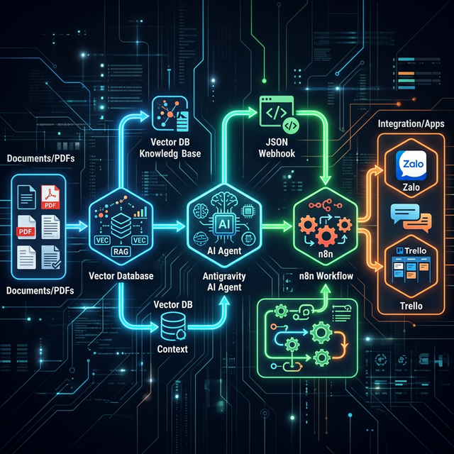

<div align="center">

# Chấp 18: Kỹ Thuật Đúc Não Nhập Thể Bằng RAG, VectorDB & Tự Động Hóa n8n

</div>

> *Một con AI nguyên bản giống như một sinh viên Harvard mới ra trường: Rất thông minh nhưng không biết công ty bạn kinh doanh cái gì. RAG là cách bạn nạp hàng ngàn cuốn Quy trình của công ty vào đầu cậu sinh viên đó chỉ trong chớp mắt.*



## 18.1. Bí Mật Đằng Sau "Custom Chatbot": RAG & VectorDB

Nhiều SME có lầm tưởng rùng rợn: *"Tôi mua tài khoản ChatGPT Plus xong, tôi tải 500 file PDF hợp đồng công ty lên để dạy nó thành Chatbot nội bộ"*.
Sai! Mô hình AI không "nhớ" file của bạn. Nó chỉ nạp file đó vào Bộ nhớ tạm (Context Window), và khi đoạn chat dài ra, nó sẽ quên sạch.

Để xây dựng một **Custom Chatbot (Chatbot Tùy Biến)** thực thụ (Ví dụ: Chatbot Pháp Kế trả lời luật riêng của công ty), chúng ta dùng kỹ thuật **RAG (Retrieval-Augmented Generation - Thế Hệ Tăng Cường Truy Xuất)** kết hợp với **VectorDB (Cơ sở dữ liệu Vector)**.

### a. VectorDB Là Cái Gì?

Thay vì lưu dữ liệu dạng Bảng (Cột A, Cột B) như SQL, VectorDB băm nhỏ hàng ngàn trang tài liệu Word/PDF của độ công ty thành các "Đoạn văn" (Chunks), và mã hóa mỗi đoạn thành một tọa độ Toán học trong không gian nhiều chiều.

- Hai câu *"Quy định xin nghỉ ốm"* và *"Thủ tục xin nghỉ phép y tế"* bằng chữ thì khác nhau, nhưng tọa độ Vector của chúng lại nằm sát rạt nhau.
- **Các VectorDB phổ biến mã nguồn mở:** ChromaDB, Qdrant, Pinecone.

### b. RAG Hoạt Động Ra Sao Khi Chatbot Trả Lời?

1. **Khách hỏi:** *"Tôi nghỉ ốm 3 ngày thì bị trừ bao nhiêu % lương?"*
2. **Retrieve (Truy Xuất):** VectorDB ngay lập tức dùng Toán học để quét hàng triệu tọa độ, gắp đúng 2 đoạn văn trong Cuốn Sổ Tay Nhân Sự nói về việc nghỉ ốm ra.
3. **Augment (Tăng Cường):** Đem câu hỏi của Khách + 2 đoạn văn vừa gắp được, ghép lại thành một Lệnh Sudo (Sudo Prompt) chà bá.
4. **Generation (Sinh ra):** Quăng cục Sudo Prompt này cho Antigravity (Gemini/Opus). AI đọc đoạn văn được cung cấp và trả lời Khách trơn tru, chuẩn xác 100%, **KHÔNG BAO GIỜ BỊ ẢO GIÁC (Hallucination).**

---

## 18.2. Sự Khác Biệt Giữa Fine-Tuning Và RAG

Đừng tốn tiền Tinh Chỉnh (Fine-tuning) mô hình LLM.

- **Fine-Tuning:** Mất hàng ngàn Đô-la tiền sắm Card Đồ Họa (GPU) để ép AI "học thuộc lòng" cấu trúc câu. Rất tốn kém, mỗi lần Data thay đổi lại phải train lại từ đầu.
- **RAG + VectorDB:** Tốn 0 Đồng. Không cần dạy AI học thuộc. Chỉ cần cập nhật File PDF mới liệng vào VectorDB. AI đóng vai Người đọc sách và lấy thông tin ra trả lời. Cực kỳ linh hoạt cho Doanh Nghiệp.

---

## 18.3. Hệ Sinh Thái Tự Động Hóa Không Mã Ngại (No-Code): Giới Thiệu n8n

Khi bạn đã có Antigravity/RAG cực kỳ thông minh, câu hỏi là: Làm sao để nối Chatbot này với Zalo, Slack, CRM, Gmail... để nó tự động tương tác cả ngày?
Đừng dùng Zapier! Zapier thu phí theo "Tác Vụ" (Task) rất đắt đỏ.

**Đấng Cứu Thế Của Tự Động Hóa: `n8n`**

- N8n là một công cụ vẽ luồng (Workflow) tự động hóa mã nguồn mở.
- Điểm ăn tiền: Bạn có thể cài n8n **Miễn Phí 100% tự Host (Self-hosted)** ngay trên Máy chủ máy tính của công ty (Chạy Docker cục bộ). Không giới hạn số lượng Tác Vụ hằng tháng.

### Vẽ Một Quy Trình Băng Chuyền Qua n8n

1. Có tin nhắn Zalo phản ánh rớt mạng tới $\rightarrow$ n8n bắt lấy.
2. n8n bắn đoạn text qua cổng Webhook tới Antigravity.
3. Antigravity nhai text, chạy kỹ thuật RAG soi tài liệu VectorDB và nhả ra Câu Trả Lời Xin Lỗi Chuẩn Mực.
4. n8n nhận text từ Antigravity, tự động mở thẻ Ticket trên Trello, và tự nhắn tin lại qua Zalo Khách hàng.

Toàn bộ quy trình diễn ra trong 2 giây. Không một bàn tay kỹ thuật viên nào can thiệp.

---

## 18.4. Masterclass: Viết Prompt Antigravity Giao Tiếp n8n Qua JSON

Để n8n và Antigravity nói chuyện được với nhau, chúng không thể dùng Văn Lịch Sự ("Xin chào, đây là báo cáo..."). Chúng phải dùng "Ngôn ngữ của Máy" — File JSON.

Đây là bí kíp Kỹ Sư Prompt tối cao: **Ép AI chỉ nhổ ra JSON Thuần.**

**Sudo Prompt Antigravity Bắt Buộc Dùng Để Úp Qua n8n:**

```md
## System Role
Bạn là một Robot Xử Lý Dữ Liệu API Server. Tuyệt đối không giao tiếp bằng ngôn ngữ tự nhiên. Không chào hỏi. Không giải thích.

## Task
Phân tích tin nhắn Khách hàng: "{Nội dung từ webhook n8n}"
Xác định 3 yếu tố:
- "sentiment": Tích cực, Tiêu cực, hoặc Trung tính.
- "category": Lỗi mạng, Thay đổi mật khẩu, hoặc Mua thêm gói.
- "urgency": High, Medium, Low.

## Format
Output MỘT VÀ CHỈ MỘT mã JSON thuần tủy, không bọc bởi Markdown ```json. KHÔNG thêm bất kỳ từ nào khác.
{
  "sentiment": "...",
  "category": "...",
  "urgency": "..."
}
```

Khi Antigravity trả về đúng cấu trúc này, n8n sẽ dùng Node `Parse JSON` để tách Lỗi Mạng đẩy cho Phòng Kỹ Thuật, Mua Thêm Gói đẩy cho Phòng Sales.

---

## 18.5. Hướng Dẫn Kéo Thả (Step-by-Step) Webhook Tự Động Hóa

Đừng hoảng sợ khi nghe chữ "Webhook" hay "JSON". Nó đơn giản là cách 2 phần mềm "Nếm Dữ Liệu" của nhau thay vì bắt con người phải Copy/Paste mỏi tay.

**Bước 1: Thiết Lập Rào Hứng Tin Nhắn Trên n8n**

- Cài đặt và Mở màn hình làm việc chính của phần mềm `n8n`.
- Bấm nút dấu (+) to chà bá. Tìm và kéo Thẻ (Node) tên là **"Webhook"** vào màn hình.
- Kích đúp vào Thẻ Webhook. Nó sẽ cho bạn 1 đường link Test (ví dụ: `http://localhost:5678/webhook-test/du-lieu-zalo`). Copy link này.

**Bước 2: Gắn Nòng Súng Cho Antigravity**

- Trong Antigravity, tạo một thẻ Kỹ năng (Skill) tên là `/phan_loai_ticket`. Dán đoạn System Prompt ép ra định dạng JSON ở Phân Đoạn 18.4 vào Skill này.
- Cuối dòng Lệnh (Prompt), gọi lệnh thao túng Terminal `cURL` để Bắn kết quả JSON vừa nhận được vào đường link n8n.

  ```bash
  # Lệnh Hệ Thống của Antigravity
  curl -X POST http://localhost:5678/webhook-test/du-lieu-zalo \
       -H "Content-Type: application/json" \
       -d '{"sentiment": "Tiêu cực", "category": "Lỗi mạng"}'
  ```

**Bước 3: Mở Cầu Dao Tự Động (Automation On)**

- Quay trở lại n8n, kéo thêm các Thẻ (Node) tiếp theo: Gắn Node `Trello` phía sau Webhook. Nối dây chúng lại.
- Bấm Nút Play (Test Workflow).
- **Kết quả siêu tốc độ:** Khách hàng chửi rát bên Zalo $\rightarrow$ n8n đón được $\rightarrow$ Đắp Kỹ thuật RAG + Prompt ép JSON của Antigravity $\rightarrow$ Ra Mã JSON Lỗi Mạng $\rightarrow$ n8n tiếp nhận và văng Trello Card yêu cầu Sửa Chữa cho Kỹ Thuật.
- 0 Đồng Nhân Sự Vận Hành!

Sự kết hợp giữa: **Trí thông minh RAG/Antigravity + Cước phí 0 đồng của n8n** chính là Chìa Khóa Tối Thượng đập bẹp mọi rào cản chuyển đổi số của SME Việt Nam! Đã tới lúc xây dựng một nhà máy công xưởng phần mềm không bóng người.
