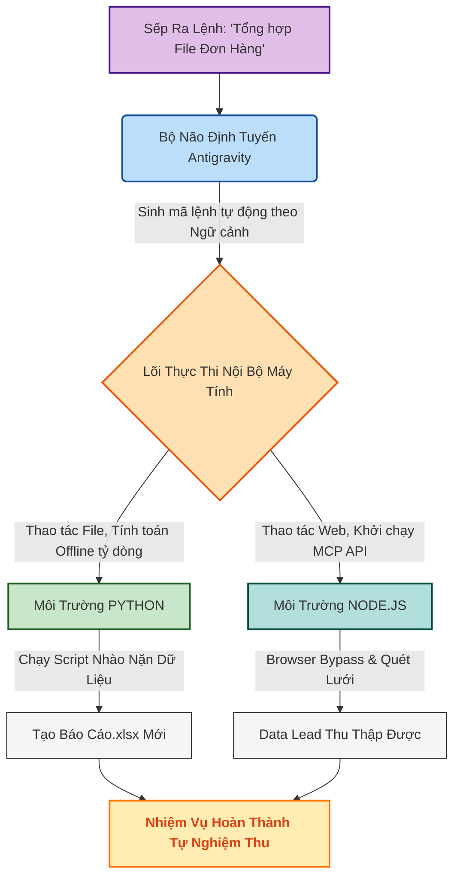

# Phụ Lục Đặc Biệt: Hướng Dẫn "Tay Ngang" Cài Đặt Môi Trường Tự Động Hóa (Python & Node.js)

*(Cẩm nang dành cho CEO và Nhân sự không chuyên IT)*

---

## 1. Mở Đầu: Quyền Năng Tự Trị Nằm Ở Đâu?

> [!IMPORTANT]
> **Antigravity không phải là một ChatGPT thứ hai.** ChatGPT chỉ biết "nói chuyện", còn Antigravity có "tay chân" (Agents) để trực tiếp thao tác trên máy tính của bạn. Nhưng để "tay chân" đó cử động được, máy tính của bạn cần được cài đặt Hệ thần kinh vận động. Đó chính là **Python** và **Node.js**.

### Tại sao Antigravity bắt buộc phải có Python và Node.js?

Khác với các phần mềm truyền thống (như Word hay Excel) đã được lập trình sẵn mọi nút bấm, **Agentic AI (Antigravity) hoạt động bằng cách TỰ SINH RA MÃ LỆNH (Code) tại thời gian thực** để giải quyết mọi yêu cầu đột ngột của bạn.

Khi bạn ra lệnh: *"Hãy đọc 100 file Excel này và gộp lại"*, AI sẽ lập tức viết ra một thuật toán xử lý dữ liệu. Nhưng hệ điều hành Windows hoặc MacOS nguyên bản **bị mù** và không thể hiểu được đoạn mã mà AI vừa viết. Chúng cần các "Thông dịch viên" chuyên nghiệp:

1. **🐍 Python (Kẻ Hủy Diệt Số Liệu):**
   - **Nó là gì?** Ngôn ngữ lập trình mạnh nhất thế giới về Xử lý dữ liệu (Data) và Trí tuệ nhân tạo (AI).
   - **Nhiệm vụ:** Khi Antigravity cần nhào nặn hàng triệu dòng Excel, chạy đối soát kế toán, chỉnh sửa ảnh cục bộ, hay thao tác File PDF... Python chính là "cỗ máy cày" nhận lệnh từ AI và nghiền nát dữ liệu trên ổ cứng của bạn (Local processing).

2. **🟢 Node.js (Siêu Nhện Kết Nối):**
   - **Nó là gì?** Môi trường thực thi (Runtime) Javascript diệu kì, giúp ngôn ngữ web chạy trực tiếp trên Máy tính cá nhân.
   - **Nhiệm vụ:** Khi Antigravity cần Mở trình duyệt ẩn tự động (Cào data Shopee), kết nối Máy chủ, gọi API ngoại vi, hay thiết lập Cầu nối Hệ thống MCP (Model Context Protocol)... Node.js chính là "xúc tu" giúp AI vươn ra ngoài Internet và giao tiếp với Server thế giới.

### ⚙️ Sơ Đồ Kiến Trúc Hệ Thống (System Design Flow)

> [!NOTE]
> Đừng hoảng sợ! Việc cài đặt này chỉ diễn ra **1 LẦN DUY NHẤT** trong đời cái máy tính đó. Thao tác cài đặt giống hệt như việc bạn tải và bấm "Next" để cài Zalo. Sếp không cần học viết Code Python hay Node, Sếp chỉ cần cài Nền Móng để AI dùng nó làm nô bộc cho Sếp.

---

## 2. Cài Đặt Không Gian Python (Kẻ Hủy Diệt Dữ Liệu)

### Đối Với Người Dùng WINDOWS

**Bước 1: Tải bộ cài đặt**

- Mở trình duyệt, truy cập trang chủ: `https://python.org/downloads/`
- Bấm vào nút màu vàng to đùng: **"Download Python 3.xxx"** (Phiên bản mới nhất).

**Bước 2: CÀI ĐẶT (GHI NHỚ NÚT CHECKBOX SINH TỬ)**

- Mở file `.exe` vừa tải về lên.
- 🚨 **CẢNH BÁO CAO ĐỘ:** Ở màn hình Cài đặt Đầu tiên CỰC KỲ QUAN TRỌNG. Bạn NHÌN XUỐNG DƯỚI CÙNG sẽ thấy một ô vuông nhỏ ghi chữ:
  `[✓] Add Python 3.x to PATH` => **BẮT BUỘC PHẢI TÍCH (CHECK) VÀO Ô NÀY!** (Nếu quên tích, máy tính sẽ mù, AI sẽ không gọi được Python).
- Sau khi Tích vào ô đó, bấm chữ **"Install Now"** ở trên. Chờ thanh chạy đầy. Bấm Finish.

### Đối Với Người Dùng MAC (Apple/MacBook)

**Bước 1: Tải bộ cài**

- Tương tự, vào `https://python.org/downloads/mac-osx/` tải bản gốc `.pkg` cho MacOS. Hoặc cài tự động qua Homebrew.
- Bấm cài đặt "Tiếp tục" -> "Đồng ý" -> Cấp mật khẩu máy tính.
- MacOS tự động nhận diện Biến Môi trường nên Không cần lo vụ Add PATH như Windows.

---

## 3. Cài Đặt Động Cơ Node.js (Siêu Nhện Cào Dữ Liệu)

Sau khi có Python, máy bạn đã tính toán rất giỏi. Giờ cài thêm Hệ thần kinh Đa Liệu Web.

**Bước 1: Tải bộ cài đặt từ Trang Chủ**

- Vào Web: `https://nodejs.org/`
- Màn hình hiện ra 2 nút màu xanh lá cây. HÃY BẤM VÀO NÚT CÓ CHỮ: **"LTS (Recommended For Most Users)"** (Bản ổn định nhất). Tuyệt đối Đừng tải bản "Current" vì dễ dính Lỗi Mới.

**Bước 2: Cài Đặt Node.js**

- **Windows:** Mở file `.msi` vừa tải. Cứ bấm `Next` liên tục. Mọi thông số Default (Mặc định) đều đã tối ưu. (Phần mềm này Tự động Thêm PATH cho Windows nên sếp không cần thao tác tay). Bấm Install.
- **Mac:** Mở file `.pkg` và cài đặt bình thường qua dòng lệnh cài đặt Mac App.

---

## 4. Kiểm Chuẩn Sức Mạnh (Lễ Đăng Quang Máy Tính)

Máy tính của Sếp đã lột xác! Làm sao để biết 2 Động cơ này đã Nổ Máy thành công trong Hệ điều hành? Sếp chỉ cần dùng Antigravity hoặc Mở bảng Đen Terminal.

**Hành động Thích Đáng Nhất:**
Mở Chatbox của Antigravity, Ra lệnh bằng giọng điệu Vua Chúa:
> *"Em Antigravity, Mở hộ anh cái Terminal. Gõ lệnh kiểm tra `python --version` và `node --version` xem máy tính anh đã Có đủ Hai Nền tảng em yêu cầu chưa nhé?"*

Nếu Màn hình Antigravity báo về:

- `Python 3.12.x` (Hoặc lớn hơn).
- `Current Node v20.x` (Hoặc lớn hơn).

**=> CHÚC MỪNG SẾP!**
Cỗ Máy Laptop Cổ Lỗ Sĩ của Sếp giờ đây đã trở thành Trạm Rẽ Sóng Máy Chủ Không Gian Số. Sếp có thể Kéo thả Hàng Vạn File Excel, hay Bắt nó Dựng Cổng Nhận Webhook Từ Bây giờ, Nó Sẽ Nuốt Trọn Không Còn Nghẹn Cổ Nữa!

---
*(Phụ Lục này được thiết kế Đính Kèm Cú Cuốn Sách Khép Giờ Cuối Cùng. Xin giữ kỹ như Chìa khóa vào phòng Máy Chủ).*
